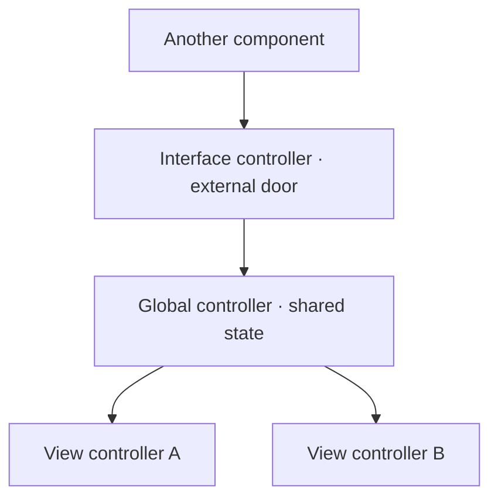

Controllers are the **active** parts of a Web Dynpro application: they determine how the user interacts with it. Sounds obvious, but most design problems in WD come from not being clear about which controller does what, and from dumping everything into the view controller because it's the first one you meet.

## The three controllers that matter

Inside a Web Dynpro component several controller instances coexist, each with its associated context:

- **View controller**: every view has exactly one. It processes the user's actions in that view. It lives, at minimum, while the view is visible in the browser.
- **Global controller (component controller)**: every component has at least one, visible to all the other controllers in the component. It's the natural home for shared state.
- **Interface controller**: every component has exactly one, and it's global. It's visible **inside and outside** the component. It's the door through which one component calls another.



The practical reading: data used by a single view lives in that view's context; data shared by several views moves up to the global controller; data another component must see is exposed through the interface controller. Not one level higher than necessary.

## Hook methods: the interface with the framework

Every controller ships with standard hook methods that **cannot be deleted** and that the framework calls in a fixed order within the phase model. They start empty; you fill them only if you need to step into that phase:

- `WDDOINIT` / `WDDOEXIT`: initialization and cleanup. The place to instantiate the model or load initial data.
- `WDDOBEFOREACTION` / `WDDOAFTERACTION`: validations before and after firing an action (view controller only).
- `WDDOMODIFYVIEW`: the **only** place where dynamic modification of UI controls is allowed.
- `WDDOBEFORENAVIGATION` / `WDDOPOSTPROCESSING`: validation before navigating and cleanup just before rendering.

```abap
" View controller WDDOINIT: instantiate the model and preload
METHOD wddoinit.
  DATA lo_node TYPE REF TO if_wd_context_node.

  " The assistance class (model) is already available via wd_assist
  DATA(lt_customers) = wd_assist->get_active_customers( ).

  lo_node = wd_context->get_child_node( 'CUSTOMER' ).
  lo_node->bind_table( lt_customers ).
ENDMETHOD.
```

Dropping heavy code into `WDDOMODIFYVIEW` because "it works there" is a classic antipattern: that method runs on every render and it hits your performance without mercy.

> The view controller is for reacting to the screen, not for being the brain of the application. The brain is the model; the controller only orchestrates it.

With the controllers clear, the next link is movement: how events and actions flow from a click all the way to a view change. That's the next post.
