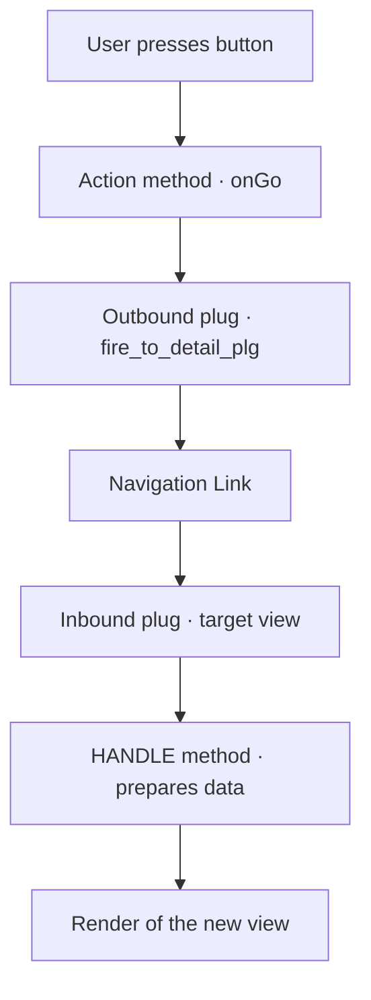

In Web Dynpro nothing happens by magic. When the user presses a button, there's a precise chain of steps between the click and the result on screen. The developer who knows that chain debugs in minutes; the one who doesn't pokes blindly and prays. Let's make the flow visible.

## From action to navigation

A UI element like a button has an **action** assigned to it. When it fires, the framework runs that action's handler method in the view controller. If the outcome is a screen change, the navigation mechanism kicks in, and it's not a simple "open another view":

- **Outbound plug**: always the starting point of a navigation. It's fired from any method of the view controller.
- **Inbound plug**: the point through which a view is entered. When called, the framework runs its handler method `HANDLE<name>`, created automatically.
- **Navigation link**: connects an outbound plug of one view with an inbound plug of another. Each outbound plug creates exactly one link; an inbound plug can be driven by several outbound plugs.



## How it's fired in code

Firing an outbound plug is explicit and typed. For each outbound plug, the `IF_<VIEW>` interface is extended with a `FIRE_<name>_PLG` method, to which you can also pass parameters:

```abap
" ONGO action method in the list view controller
METHOD onactiongo.
  DATA lo_node TYPE REF TO if_wd_context_node.
  DATA lv_vbeln TYPE vbeln.

  lo_node = wd_context->get_child_node( 'ORDERS' ).
  lo_node->get_attribute(
    EXPORTING name  = 'VBELN'
    IMPORTING value = lv_vbeln ).

  " Navigate to the detail view passing the selected order
  wd_this->fire_to_detail_plg( iv_vbeln = lv_vbeln ).
ENDMETHOD.
```

`WD_THIS` is always the automatic reference to the view controller's own interface. No magic paths: the plug is a method, with a signature and a contract.

## The phase model rules

All of this happens inside the **phase model**, the sequence the framework walks on every request. Before an action fires, `WDDOBEFOREACTION` lets you validate; the user's input is checked (types, dictionary conversions) and **data with errors is not transported to the context**. Only when everything checks out does navigation run. That's why a failed validation doesn't navigate: it's not a bug, it's the design.

> Debugging Web Dynpro without the phase model in your head is like debugging a pipeline without knowing the order of the stages. The flow isn't optional: it's the map.

We now have views that talk to each other. The next step in maturity is to stop reinventing and start reusing: reusable components and component usage, in the next post.
