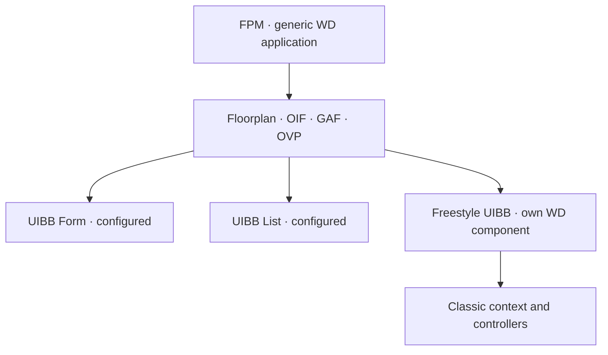

There comes a moment in every large Web Dynpro project when each developer draws their views their own way, wires up their navigation and places the buttons wherever they see fit. The result is twenty applications that behave in twenty different ways. **Floorplan Manager (FPM)** exists precisely to kill that problem.

## What FPM is and what it isn't

FPM isn't a brand-new framework that replaces Web Dynpro. It's a **Web Dynpro application** that acts as a generic frame: instead of programming every view and every navigation plug by hand, you assemble the application from configurable blocks and predefined screen patterns.

- **Floorplan**: the application template (for example OIF for objects, GAF for guided processes with a roadmap, OVP for overview pages).
- **UIBB (UI Building Block)**: the blocks that fill the floorplan. The standard ones (Form, List) are configured without code; the *Freestyle UIBBs* are normal Web Dynpro components that you program.
- **Configuration versus coding**: much of the layout and navigation is defined in configuration, not in ABAP.



The important part: underneath FPM there's still context, controllers, hook methods and binding. Everything you learned about classic WD **still holds**; FPM just puts order on top.

## Where you actually touch code

In a freestyle UIBB you implement the feeder interface or work with your component's model exactly as before. The business logic still lives where it should: in the assistance class or in delegated classes.

```abap
" In a freestyle UIBB, the model is consumed just like in classic WD
METHOD get_data.
  DATA(lt_items) = wd_assist->read_purchase_items( iv_ebeln = mv_ebeln ).

  DATA lo_node TYPE REF TO if_wd_context_node.
  lo_node = wd_context->get_child_node( 'ITEMS' ).
  lo_node->bind_table( lt_items ).
ENDMETHOD.
```

The advantage isn't writing less ABAP: it's that **navigation, layout and behavior are consistent** across applications without depending on each person's discipline.

## The uncomfortable question: FPM, classic WD or Fiori

Let's be honest about the real context. Web Dynpro (classic and with FPM) is still very much alive across hundreds of on-premise S/4HANA systems, and it will be for years. But SAP is betting on Fiori/UI5 as its strategic UX layer. The sensible decision isn't dogmatic:

- **Stay on WD/FPM** if it's an internal back-office app, with expert users, on a stable on-premise system and with no mobile or consumer-experience requirements.
- **Standardize with FPM** if you have many scattered WD applications: you unify before migrating and you cut the cost of the future jump.
- **Migrate to Fiori** when the app is end-user facing, needs real mobile or responsive, or you're heading toward S/4HANA Cloud and Clean Core, where WD stops being the strategic direction.

> Migrating to Fiori because it's the done thing isn't architecture: it's fashion. Staying in Web Dynpro out of comfort isn't either. The right answer depends on the user, the channel and where your system is heading, not on whichever framework is trending.

That closes the Web Dynpro ABAP series: from MVC to the context, from events to reuse, and from FPM to the migration decision. The technology isn't dead; it's mature. And a mature technology is mastered, not feared.
