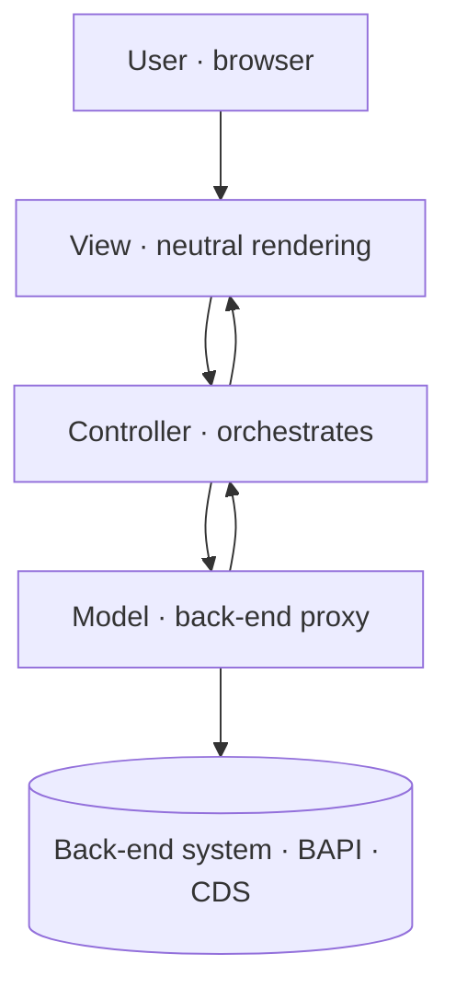

Plenty of people still treat Web Dynpro ABAP as a classic dynpro with a new coat of paint. That's where the trouble starts. Web Dynpro isn't a presentation layer: it's a framework that **enforces** a strict separation between the user interface and the business logic, and that enforcement is exactly what saves the project three years later.

## What the framework actually separates

The Web Dynpro ABAP model is built entirely on the Model-View-Controller paradigm. This isn't a style recommendation: the framework splits the application into three pieces with clearly defined interfaces between them.

- **Model**: encapsulates the back-end interface. It acts as a proxy that isolates the application from the data and the communication technology. The app shouldn't care how the system is reached.
- **View**: defines a neutral rendering of the business data. Neutral is the key word: it doesn't compute, it doesn't decide, it displays.
- **Controller**: manages the interaction between view and model, formats the data to be shown and decides which view comes next.



## The detail almost everyone ignores

The MVC paradigm separates the parts of the code that **produce** data from the parts that **consume** it. Sounds clean until you notice that many units of a real program need to do both at once. SAP doesn't deny that duality: it organizes it. Inside a Web Dynpro component, some units only consume data while others produce and consume. The discipline is knowing which is which before you write the first line.

## Where the model lives

The most common mistake is stuffing business logic into the view controller. Any ABAP class can be the model, but the clean route is the **assistance class**, which inherits from `CL_WD_COMPONENT_ASSISTANCE` and is instantiated automatically when the component is called:

```abap
" In any controller method, the model is one step away
DATA(lo_model) = wd_assist.

DATA lt_orders TYPE ztt_sales_order.
lt_orders = lo_model->get_orders_for_customer( iv_customer = lv_kunnr ).

" The view only receives cooked data; it doesn't know where it came from
wd_context->get_child_node( 'ORDERS' )->bind_table( lt_orders ).
```

When the model is simple, the logic lives in the assistance class itself. When it grows, the assistance class only orchestrates and delegates to specialized ABAP classes. Never the other way around.

> If your view controller reads database tables, you're no longer doing MVC: you're doing a classic dynpro with extra ceremony.

Web Dynpro is still very much alive across hundreds of on-premise S/4HANA systems, and understanding its MVC isn't nostalgia: it's what lets you maintain it without fear and decide, with judgment, when to migrate to Fiori. Next post: we take apart the piece that makes all of this possible, the context.
