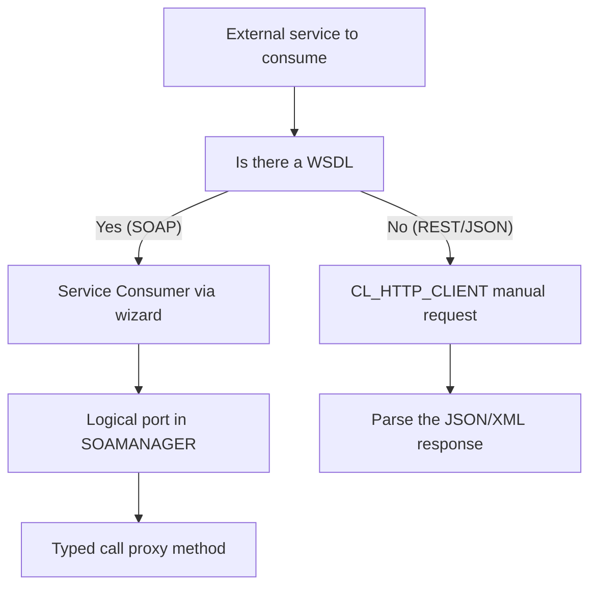

When SAP isn't the one exposing but the one calling, we're talking about a **Web Service Consumer**: consuming an external provider's business logic from your ABAP environment. And here there's a fork that defines the quality of your integration: generated proxy or hand-rolled HTTP.

## The two paths, and they're not equivalent

- **Service proxy (SOAP)**: from a URL or a WSDL file, a wizard automatically generates all the structures and objects you need. At runtime, the client proxy handles speaking SOAP with the provider. You work with typed ABAP methods and structures, not raw XML.
- **Direct HTTP with `CL_HTTP_CLIENT`**: when there's no WSDL (typical in REST, JSON or XML), you build the request by hand, header included, with all the required configuration. More control, more responsibility.



## The piece everyone forgets: the logical port

Consuming SOAP with a proxy doesn't end when you activate the wizard-generated class. Two objects are missing that people take for granted and shouldn't:

- The **Service Consumer**: the enterprise service SAP generates (via wizard) that produces the ABAP class implementing the standard consumption interfaces.
- The **logical port**: the channel the communication travels through between the exposed service and your request. It's created in **SOAMANAGER**, from the same WSDL, and that's where you assign (or leave blank) the communication user.

> Without a logical port, your proxy compiles, activates and calls nothing. It's the most frequent silent failure when consuming SOAP: the code is perfect, the communication doesn't exist.

## When there's no WSDL: raw HTTP

For REST (JSON or XML) there's no contract to import, so you lean on `CL_HTTP_CLIENT` and the `IF_HTTP_CLIENT` interface:

```abap
DATA(lv_url) = |https://api.external.com/v1/flights|.

cl_http_client=>create_by_url(
  EXPORTING url    = lv_url
  IMPORTING client = DATA(lo_http_client) ).

lo_http_client->request->set_method( 'GET' ).
lo_http_client->request->set_header_field(
  name  = 'Accept'
  value = 'application/json' ).

lo_http_client->send( ).
lo_http_client->receive( ).

DATA(lv_json) = lo_http_client->response->get_cdata( ).
lo_http_client->close( ).
```

Every REST request is self-contained: neither client nor server remembers the previous one, all the needed information travels in the call itself. That's the strength of the approach, and also why parsing the response is on you.

The simple rule: **there's a WSDL and you need strong typing, use the proxy with its logical port; no WSDL or it's REST, drop to `CL_HTTP_CLIENT`**.

Next post, what separates a toy consumer from a production one: error and fault handling.
