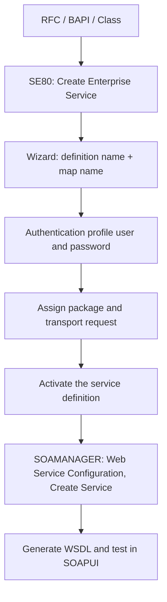

Exposing SAP functionality so an external system (SAP or not) can consume it is called a **Web Service Provider**. The part almost nobody explains well is that there are three different starting points, and picking the wrong one shapes all your later maintenance.

## Three doors to the same goal

- **From an RFC**: a function module flagged as *Remote-Enabled (RFC)*. It has importing, exporting, changing parameters and exceptions. This is the path when you already have your custom logic in a function module.
- **From a BAPI**: SAP standard interfaces, defined as RFC, dialog-free and stable across upgrades. If `BAPI_FLIGHT_GETLIST` already does what you need, don't reinvent the logic: publish it.
- **From an ABAP class (proxy)**: here the flow reverses. From a WSDL, the wizard generates a class implementing an interface with a method that has an `INPUT` parameter (receives the request) and an `OUTPUT` one (returns the response). You only fill in the logic.

> The rule that saves rework: if the logic already exists as a released BAPI, you expose it. You don't copy it. A provider wrapping a standard BAPI survives upgrades untouched.

## The real flow, no screenshots



On the RFC function you right-click and choose **Create -> Enterprise Service**. The wizard asks for the definition name, suggests ticking *map name*, you select authentication (user and password), assign package and transport request, and activate. Then in **SOAMANAGER**, tab *Service Administration* and section *Web Service Configuration*, you find the definition, click *Create Service*, define security and generate the WSDL to test it.

## The format detail that breaks integrations

Data sent over XML must respect the patterns SAP defines. The classic case: a date travels as **YYYY-MM-DD**, not as ABAP's internal format nor the consumer's locale. Ignoring this is the number one cause of "the service responds but the other system can't parse the date".

A function module ready to be a provider starts this simple:

```abap
FUNCTION zfm_multiplicacion_user.
*"----------------------------------------------------------------------
*"*"Local interface:
*"  IMPORTING
*"     VALUE(IV_FACTOR_1) TYPE I
*"     VALUE(IV_FACTOR_2) TYPE I
*"  EXPORTING
*"     VALUE(EV_RESULTADO) TYPE I
*"----------------------------------------------------------------------
  ev_resultado = iv_factor_1 * iv_factor_2.
ENDFUNCTION.
```

Notice the **pass by value** (`VALUE(...)`) on importing and exporting: it's a requirement for the service to serialize parameters correctly. A parameter passed by reference here is an integration that fails at runtime without telling you why.

In the next post we cross to the other side: consuming an external service from ABAP with a consumer proxy.
