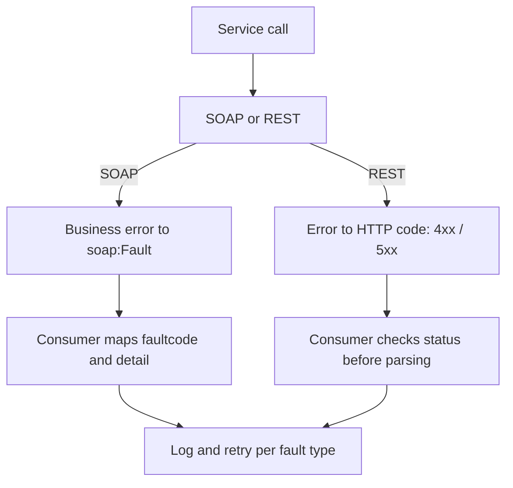

The difference between a demo integration and a production one isn't in the happy path. It's in what happens when something fails. And in ABAP Web Services there are two very different worlds of errors: the **SOAP Fault** and the **HTTP status code**. Mixing them, or ignoring them, is the recipe for silent failure.

## The fourth element of the SOAP envelope

A SOAP message is made of four parts: **envelope, header, body and fault**. Everyone uses the first three. The `fault` is the one almost nobody leverages, and it's exactly the one that standardizes the error inside the contract itself.

When a SOAP provider fails, you don't return an empty body or loose text: you return a structured fault the consumer knows how to interpret because it's part of the WSDL:

```xml
<soap:Fault>
  <faultcode>soap:Server</faultcode>
  <faultstring>Divisor cannot be zero</faultstring>
  <detail>
    <error>
      <code>ZDIV_ZERO</code>
      <message>Division by zero is not allowed</message>
    </error>
  </detail>
</soap:Fault>
```

> A service that returns HTTP 200 with a hand-written error body isn't fault-tolerant: it's a trap. The consumer thinks all went well and keeps processing garbage. The fault exists so the error travels inside the contract, not outside it.

## Two worlds of error, one design



In SOAP the business error goes into the `fault`. In REST, the error travels in the protocol's own verb: a 4xx says "you got it wrong", a 5xx says "I got it wrong". The golden rule of the REST consumer: **check the HTTP code before you try to parse the body**. Parsing the body of a 500 as if it were valid JSON is how logs fill up with useless dumps.

## On the ABAP consumer side

Consuming via `CL_HTTP_CLIENT`, the status doesn't surface as an exception: you have to ask for it. This is the minimal pattern every serious consumer should have:

```abap
lo_http_client->send( ).
lo_http_client->receive( ).

lo_http_client->response->get_status(
  IMPORTING
    code   = DATA(lv_code)
    reason = DATA(lv_reason) ).

IF lv_code >= 400.
  " do not parse the body as a valid response
  MESSAGE |Service returned { lv_code }: { lv_reason }| TYPE 'E'.
ELSE.
  DATA(lv_body) = lo_http_client->response->get_cdata( ).
  " process the valid response
ENDIF.

lo_http_client->close( ).
```

And don't forget the `close( )`: every HTTP client you leave open is a connection that isn't released. In a batch that calls the service a thousand times, that's an incident waiting to happen.

In the next post, the layer that hardens all of this: security, communication users and authentication profiles.
