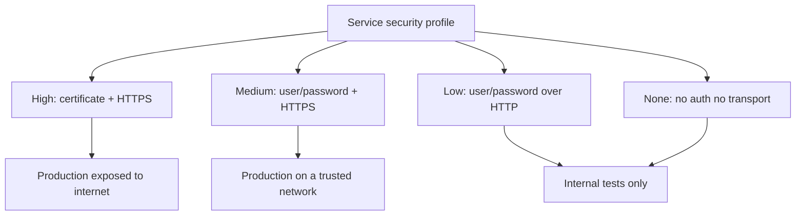

Publishing a Web Service is the easy part. Publishing it without opening a security hole in the ERP is the part that sets a professional apart. And it starts with a decision many make without thinking: **which user authenticates the call**.

## The communication user exists for a reason

A communication user (**type "C"**) lets an external system interact with SAP **without a graphical interface**: it cannot log in via SAP GUI, it only makes calls to functions, BAPIs, Web Services and specific functionality. That's exactly what you need for an integration.

The classic mistake is using a **dialog user (type "A")** for the service. That user is meant for a person in front of a screen, with multiple logons verified. Lending it to an integration means handing an external system a full interactive identity. The types that matter:

- **Dialog "A"**: person with SAP GUI. Not for integrations.
- **System "B"**: internal background processes (ALE, workflow, TMS). No GUI login.
- **Communication "C"**: external systems without GUI. **The right one for Web Services.**
- **Service "S"** and **Reference "L"**: specific cases, minimal authorizations or inheritance only.

> A communication user gets roles and profiles like any other. The difference is that here "least privilege" isn't advice: it's the only thing standing between your service and an incident. A scoped role in PFCG, only the objects the service needs to execute.

## The four authentication and transport profiles

When you create the service in SAP you pick a profile that combines authentication and transport guarantee. Choosing wrong here means exposing credentials in the clear over the network.

- **High**: authentication with certificate and transport guarantee (HTTPS). The standard for a service exposed to the internet.
- **Medium**: user and password over HTTPS. Acceptable on a trusted network.
- **Low**: user and password over HTTP. Credentials travel unencrypted: internal tests only.
- **None**: no authentication, no secure transport. In production this is negligence.

## Layers that add up, not replace each other

A service's security isn't a checkbox. It stacks: authentication of the requester by the provider, a signature inside the WSDL to guarantee data integrity, authorization that grants or denies access to specific methods, and encryption with **SSL/HTTPS** for end-to-end privacy. On top of that, the ICF API allows virus scanning through the VSI interface by selecting the matching profile.

And don't forget: **ICF** services are inactive by default **on purpose**. A service activated needlessly is a risk, because it's reachable directly over HTTP. Activate only what you use.

In the next post we close the loop: SOAMANAGER, the gateways, and why the hosts file can take down a perfectly coded service.
