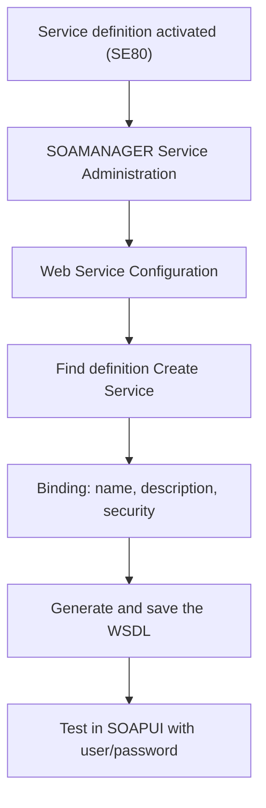

A costly misunderstanding in SAP projects: believing that activating a service definition already makes it consumable from outside. It doesn't. The definition is the "what". The published endpoint is the "where". And what builds the "where" for SOAP services is **SOAMANAGER**.

## What SOAMANAGER actually does

SOAMANAGER is the transaction that manages the gateways and logical ports, and generates the **WSDL** for SOAP services. In other words: it enables communication between external systems and SAP. Without going through it, your definition exists in the system but nobody outside can reach it.

The publishing flow, on the provider side:



In *Service Administration*, section *Web Service Configuration*, you find the definition, click *Create Service*, provide name, description and binding data, select security and generate the WSDL. That WSDL is the URL you hand to the consumer. On the consumer side, the same transaction creates the **logical port** from the provider's WSDL.

## The silent killer: the hosts file

Here's the detail that costs entire afternoons. SOAMANAGER's operation **depends on the server's hosts file**. If the host where SAP lives doesn't declare its domain, the services (standard or custom) don't come up correctly and the WSDL comes out with unreachable URLs.

> A perfectly coded service, activated, with impeccable security, can fail to respond because of one missing line in an operating-system text file. When the WSDL generates a host nobody resolves, don't look for the bug in your ABAP: check the hosts file.

And not only on the server side: the system that will send requests to SAP **also** needs to resolve the server's domain. Communication is a matter of two endpoints that can see each other.

## SOAMANAGER, WSADMIN and the transactions still hanging around

You'll see systems with **WSADMIN** and **WSCONFIG** still active. Don't use them for anything new: they stay alive only until migrating configurations from SAP NetWeaver 6.40 to 7.0, and definitions created in the modern ABAP environment **are not visible** in them. For new SOAP services, SOAMANAGER. Period.

A boundary note so you don't confuse tools: SOAMANAGER is the SOAP world with WSDL. REST services are published through **SICF**, hanging a sub-element off a virtual host and putting your class (the one implementing `IF_HTTP_EXTENSION`) in the *Handler List*. And **SAP Gateway** is another thing entirely: OData-based RESTful infrastructure to expose backend data. Three doors, three transactions, no shortcuts:

```abap
" A REST handler is registered in SICF, not in SOAMANAGER.
" The class must implement IF_HTTP_EXTENSION:
CLASS zcl_rest_handler DEFINITION PUBLIC CREATE PUBLIC.
  PUBLIC SECTION.
    INTERFACES if_http_extension.
ENDCLASS.

CLASS zcl_rest_handler IMPLEMENTATION.
  METHOD if_http_extension~handle_request.
    server->response->set_cdata( |{ "status": "ok" }| ).
    server->response->set_status( code = 200 reason = 'OK' ).
  ENDMETHOD.
ENDCLASS.
```

With this we close the ABAP Web Services series: from the SOAP vs REST concept to the service published, consumed, hardened and deployed. Robust integration isn't magic; it's knowing which transaction does what, and skipping neither the logical port nor the hosts file.
