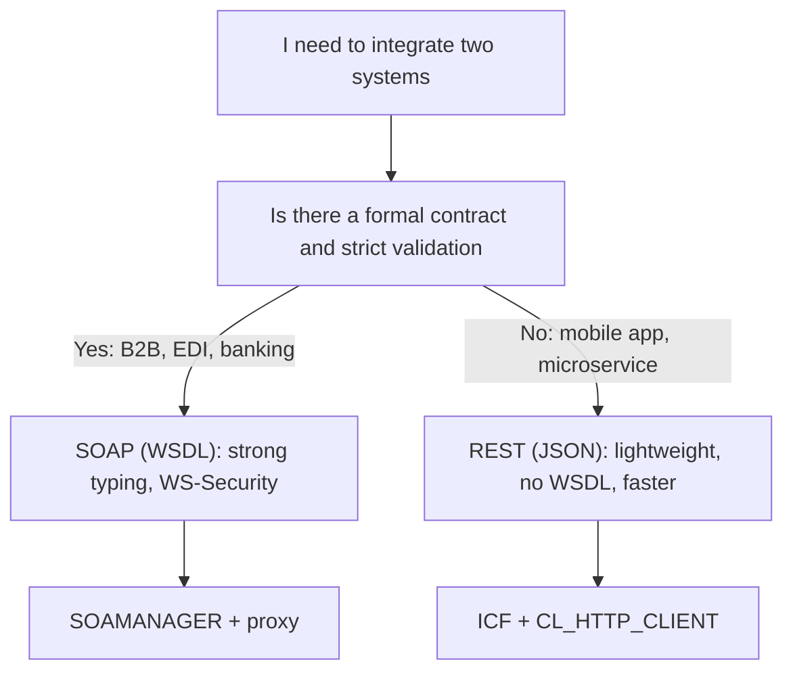

Every time someone says "SOAP is old, move to REST", they skip the right question. SOAP and REST don't compete in the same category: **SOAP is a protocol, REST is an architectural pattern**. You can even run REST on top of SOAP as the underlying layer. Confusing that is the root of half the bad integration decisions in SAP projects.

## What each one actually is, no marketing

- **SOAP** (Simple Object Access Protocol): exchanges XML messages with a formal contract described in a **WSDL** file. That contract defines operations, structures and types. The client knows exactly what to send and receive before the first call.
- **REST** (RESTful): exposes resources over HTTP using the protocol's own verbs (GET, POST, PUT, DELETE). Returns JSON or XML. It requires no WSDL and no XML envelope. Lightweight infrastructure, small messages.

The practical difference shows in the payload itself. A SOAP message in ABAP travels wrapped in its XML envelope:

```xml
<asx:abap version="1.0" xmlns:asx="http://www.sap.com/abapxml">
  <asx:values>
    <TEXT>SOAP in ABAP</TEXT>
  </asx:values>
</asx:abap>
```

The same data in REST with JSON weighs a fraction and reads effortlessly:

```json
{
  "TEXT": "JSON in ABAP"
}
```

## The decision criterion



- Pick **SOAP** when the scenario demands an ironclad contract: B2B integrations, financial systems, reliable and secure messaging, cases where strong typing and WS-Security are worth their weight in bandwidth.
- Pick **REST** when volume and agility come first: mobile apps, tablets, PCs, Smart TVs. SAP itself points to it when you need to handle larger volumes of data than SOAP moves comfortably.

> SOAP needs more bandwidth because each message carries a lot of information inside. That's not a flaw: it's the price of a contract that won't break. The question isn't which is better, but which one pays its cost in your scenario.

## In ABAP they coexist, they don't compete

The interesting part is that SAP gives you both paths natively. A SOAP provider is born from an RFC function module, a BAPI or a class, and it's published with a WSDL from **SOAMANAGER**. A REST service is built with a class implementing `IF_HTTP_EXTENSION` and activated in **SICF**, no WSDL involved. Same stack, two different tools.

The expensive mistake is dogmatic: standing up a WSDL and a heavy proxy to expose three fields to a mobile app, or improvising an XML parser by hand when the scenario was screaming for SOAP's typed contract.

In the next post we build a real SOAP provider from scratch: from the BAPI to the published service, step by step.
