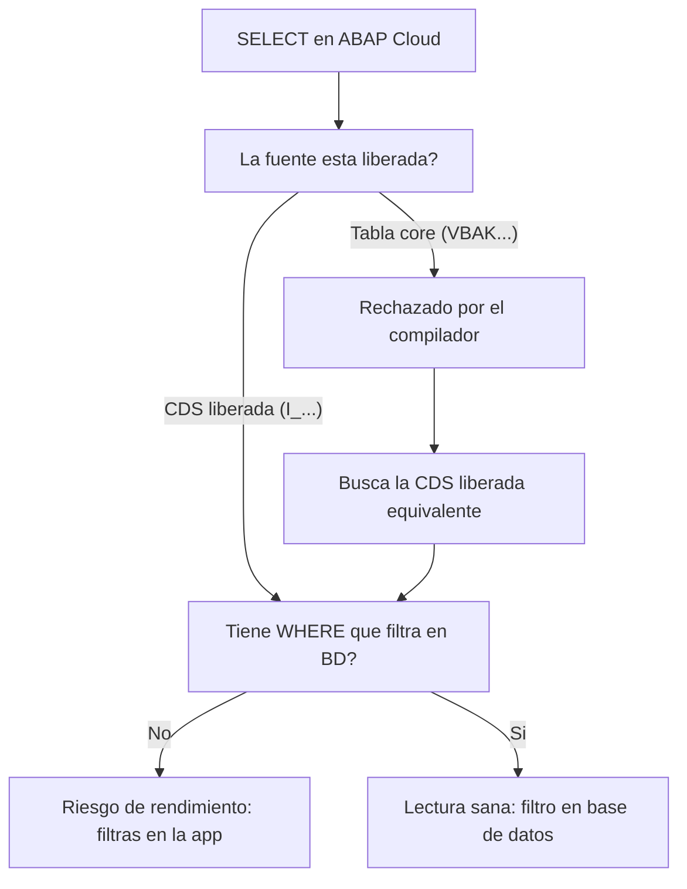

Un desarrollador que viene del ABAP clasico abre su primer objeto en ABAP Cloud, escribe un `SELECT` de toda la vida y el compilador se lo tacha. Primera reaccion: "esto es mas restrictivo". Segunda reaccion, unas semanas despues: "esto me esta salvando de mis propios malos habitos". Vamos a ver que cambia de verdad.

## El SQL no cambia; lo que cambia es a que puedes apuntar

La sintaxis de `SELECT` es la misma que conoces: `result`, `FROM`, `INTO`/`APPENDING`, `WHERE`, `GROUP BY`, `HAVING`, `ORDER BY`. Ahi no hay sorpresas. Lo que cambia es el catalogo de fuentes legales:

- **No lees tablas transparentes del core directamente**. `VBAK`, `MARA` y compania dejan de ser puertas validas. La puerta es la CDS liberada equivalente (`I_...`).
- **La gestion del mandante deja de ser tu problema**. En clasico jugabas con `CLIENT SPECIFIED` y consultas al campo de mandante; en Cloud eso esta cerrado salvo casos muy concretos y el sistema gestiona el mandante por ti.
- **El lenguaje es restringido**: solo compila contra lo que SAP libera. El `SELECT` que apunta a algo no liberado ni siquiera pasa el chequeo de sintaxis.

> El ABAP clasico te dejaba disparar a cualquier tabla. ABAP Cloud te obliga a disparar a un contrato. La diferencia se nota tres upgrades despues, cuando tu codigo sigue vivo.

## Lo que sigue igual (y sigue importando)

No todo son prohibiciones. Las buenas practicas de siempre no solo siguen validas, ahora son casi obligatorias:

- **WHERE siempre**. Aunque sea opcional en la sintaxis, restringir el conjunto en la capa de aplicacion en vez de en la base de datos es un pecado de rendimiento. El filtrado va en el `WHERE`, no en un `LOOP` posterior.
- **Lee a tabla interna de una vez**, no fila a fila con `APPEND` dentro de un bucle. Una unica seleccion compensa de sobra el coste de memoria.
- **Vigila `SY-SUBRC` y `SY-DBCNT`**. Siguen siendo tu fuente de verdad: 0 hay datos, 4 conjunto vacio, y `SY-DBCNT` te da las filas leidas.



## El antes y el despues, en codigo

Asi filtrabas en clasico, trayendo de mas y descartando en memoria (mal):

```abap
" Anti-patron: trae todo y filtra en la aplicacion
SELECT * FROM sflight INTO TABLE @DATA(lt_all).
LOOP AT lt_all INTO DATA(ls) WHERE currency = 'USD'.
  " ... procesar
ENDLOOP.
```

Y asi en ABAP Cloud, con el filtro donde tiene que estar y una fuente valida:

```abap
" El filtro va en el WHERE: la base de datos hace el trabajo
SELECT carrid, connid, price, currency
  FROM i_flight
  WHERE currency = 'USD'
  INTO TABLE @DATA(lt_usd).

IF sy-subrc = 0.
  " sy-dbcnt trae el numero de filas leidas
  cl_demo_output=>write( |Filas: { sy-dbcnt }| ).
ENDIF.
```

Mismo resultado de negocio, pero el segundo no arrastra el bus de datos entero al servidor de aplicacion y apunta a un contrato estable.

## Deja de verlo como una jaula

La reaccion instintiva ("me quitan libertad") es la equivocada. Lo que ABAP Cloud te quita son precisamente los accesos que te acoplaban al core y las lecturas que reventaban en produccion con volumen. El SQL restringido no es un castigo: es el chequeo de Clean Core convertido en compilador.

En el proximo post: como envolver el codigo legacy que no puedes reescribir todavia, para consumirlo desde ABAP Cloud sin arrastrar sus pecados a tu capa nueva.
