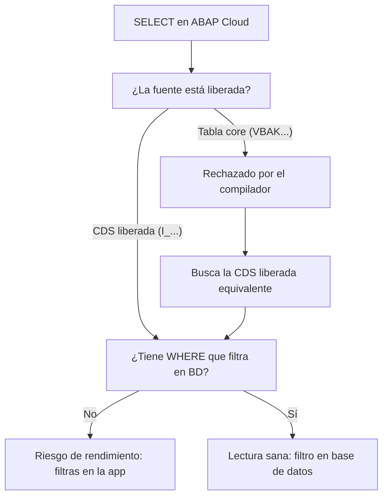

Un desarrollador que viene del ABAP clásico abre su primer objeto en ABAP Cloud, escribe un `SELECT` de toda la vida y el compilador se lo tacha. Primera reacción: "esto es más restrictivo". Segunda reacción, unas semanas después: "esto me está salvando de mis propios malos hábitos". Vamos a ver qué cambia de verdad.

## El SQL no cambia; lo que cambia es a qué puedes apuntar

La sintaxis de `SELECT` es la misma que conoces: `result`, `FROM`, `INTO`/`APPENDING`, `WHERE`, `GROUP BY`, `HAVING`, `ORDER BY`. Ahí no hay sorpresas. Lo que cambia es el catálogo de fuentes legales:

- **No lees tablas transparentes del core directamente**. `VBAK`, `MARA` y compañía dejan de ser puertas válidas. La puerta es la CDS liberada equivalente (`I_...`).
- **La gestión del mandante deja de ser tu problema**. En clásico jugabas con `CLIENT SPECIFIED` y consultas al campo de mandante; en Cloud eso está cerrado salvo casos muy concretos y el sistema gestiona el mandante por ti.
- **El lenguaje es restringido**: solo compila contra lo que SAP libera. El `SELECT` que apunta a algo no liberado ni siquiera pasa el chequeo de sintaxis.

> El ABAP clásico te dejaba disparar a cualquier tabla. ABAP Cloud te obliga a disparar a un contrato. La diferencia se nota tres upgrades después, cuando tu código sigue vivo.

## Lo que sigue igual (y sigue importando)

No todo son prohibiciones. Las buenas prácticas de siempre no solo siguen válidas, ahora son casi obligatorias:

- **WHERE siempre**. Aunque sea opcional en la sintaxis, restringir el conjunto en la capa de aplicación en vez de en la base de datos es un pecado de rendimiento. El filtrado va en el `WHERE`, no en un `LOOP` posterior.
- **Lee a tabla interna de una vez**, no fila a fila con `APPEND` dentro de un bucle. Una única selección compensa de sobra el coste de memoria.
- **Vigila `SY-SUBRC` y `SY-DBCNT`**. Siguen siendo tu fuente de verdad: 0 hay datos, 4 conjunto vacío, y `SY-DBCNT` te da las filas leídas.


```mermaid
flowchart TD
 A["SELECT en ABAP Cloud"] --> B["¿La fuente está liberada?"]
 B -->|"Tabla core (VBAK...)"| C["Rechazado por el compilador"]
 B -->|"CDS liberada (I_...)"| D["¿Tiene WHERE que filtra en BD?"]
 D -->|No| E["Riesgo de rendimiento: filtras en la app"]
 D -->|Sí| F["Lectura sana: filtro en base de datos"]
 C --> G["Busca la CDS liberada equivalente"]
 G --> D
```

## El antes y el después, en código

Así filtrabas en clásico, trayendo de más y descartando en memoria (mal):

```abap
" Anti-patron: trae todo y filtra en la aplicacion
SELECT * FROM sflight INTO TABLE @DATA(lt_all).
LOOP AT lt_all INTO DATA(ls) WHERE currency = 'USD'.
  " ... procesar
ENDLOOP.
```

Y así en ABAP Cloud, con el filtro donde tiene que estar y una fuente válida:

```abap
" El filtro va en el WHERE: la base de datos hace el trabajo
SELECT carrid, connid, price, currency
  FROM i_flight
  WHERE currency = 'USD'
  INTO TABLE @DATA(lt_usd).

IF sy-subrc = 0.
  " sy-dbcnt trae el numero de filas leidas
  cl_demo_output=>write( |Filas: { sy-dbcnt }| ).
ENDIF.
```

Mismo resultado de negocio, pero el segundo no arrastra el bus de datos entero al servidor de aplicación y apunta a un contrato estable.

## Deja de verlo como una jaula

La reacción instintiva ("me quitan libertad") es la equivocada. Lo que ABAP Cloud te quita son precisamente los accesos que te acoplaban al core y las lecturas que reventaban en producción con volumen. El SQL restringido no es un castigo: es el chequeo de Clean Core convertido en compilador.

En el próximo post: cómo envolver el código legacy que no puedes reescribir todavía, para consumirlo desde ABAP Cloud sin arrastrar sus pecados a tu capa nueva.
