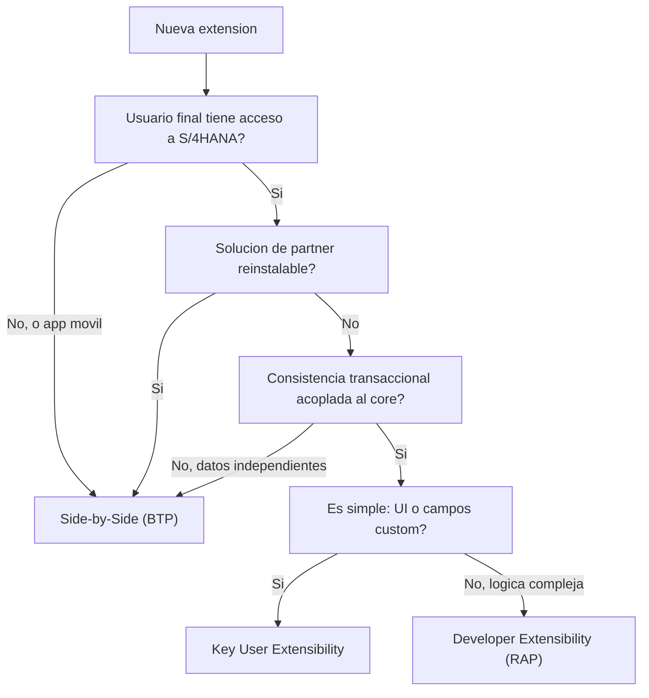

En Clean Core insistimos en el "que" (extender solo por interfaces estables). Este post va del "donde". Porque en S/4HANA Cloud una extension puede vivir en tres sitios distintos, y la mitad de los problemas de mantenimiento nacen de haber elegido el sitio equivocado sin darse cuenta de que habia una eleccion.

## Los tres niveles, sin jerga

SAP agrupa las extensiones en dos categorias grandes, y dentro salen tres opciones de trabajo:

- **Key User Extensibility (on stack)**: el experto de negocio adapta el sistema con herramientas Fiori: campos personalizados, custom business objects, logica con BAdIs y ABAP restringido, queries analiticos. Sin Eclipse, sin transportes clasicos.
- **Developer Extensibility (on stack)**: el desarrollador extiende dentro de la pila ABAP desde Eclipse ADT, con RAP, CDS liberadas, APIs liberadas y puntos de extension BAdI. Es ABAP for Cloud Development puro.
- **Side-by-Side (BTP)**: el desarrollo corre en paralelo, en la Business Technology Platform, con RAP o CAP, y habla con S/4HANA solo por APIs. No toca la pila ABAP del core.

Y por debajo de todo esto conviene tener claros los niveles de ABAP que SAP define:

- **Tier 1, ABAP for Cloud Development**: el modelo cloudready, el unico que sobrevive limpio a los upgrades.
- **Tier 2, APIs desde el ABAP clasico**: expones funcionalidad on-premise hacia la nube de forma controlada.
- **Tier 3, ABAP clasico**: modificaciones profundas en el nucleo. Potente y peligroso, se retira poco a poco.

## La jerarquia importa (y casi nadie la respeta)

SAP no pone estas opciones al mismo nivel. Hay un orden de prioridad, y es una recomendacion con consecuencias tecnicas:

1. Primero **Key User**. Si lo puede resolver un experto de negocio con Fiori, no metas un desarrollador.
2. Luego **Developer**. Si la logica es compleja pero pertenece al core, va en la pila con RAP.
3. Al final **Side-by-Side**, que depende del escenario: aplicaciones para usuarios sin acceso a S/4HANA, soluciones de partner reinstalables, o cargas independientes de la infraestructura.

> La pregunta no es "como programo esto", sino "quien deberia programarlo y donde". Cuando esa pregunta se salta, el codigo acaba en Tier 3 por inercia y el upgrade pasa la factura.

## El arbol de decision, resumido



## Un ejemplo de Developer Extensibility

Cuando cae en Tier 1 con logica de negocio, el patron es una clase que implementa una interfaz de BAdI liberada, no una modificacion del estandar:

```abap
CLASS zcl_check_credit_limit DEFINITION
  PUBLIC
  FINAL
  CREATE PUBLIC.
  PUBLIC SECTION.
    " El punto de extension es un BAdI liberado por SAP
    INTERFACES if_badi_sales_order_check.
ENDCLASS.

CLASS zcl_check_credit_limit IMPLEMENTATION.
  METHOD if_badi_sales_order_check~validate.
    " Solo se consumen CDS y APIs liberadas: nada de SELECT a VBAK
    SELECT SINGLE credit_limit
      FROM i_customercreditlimit          "#EC released CDS
      WHERE customer = @iv_customer
      INTO @DATA(lv_limit).

    IF iv_net_amount > lv_limit.
      APPEND VALUE #( type = 'E' text = 'Limite de credito superado' )
        TO et_messages.
    ENDIF.
  ENDMETHOD.
ENDCLASS.
```

Fijate: es Developer Extensibility (logica compleja, en el core) pero respeta Tier 1 (solo CDS liberadas, punto de extension estable). Nivel y disciplina son cosas distintas y las dos importan.

## El error que se paga en el upgrade

El fallo tipico no es tecnico, es de encuadre: alguien resuelve con Developer Extensibility algo que un key user habria hecho en veinte minutos, o mete en el core una logica que era candidata perfecta a Side-by-Side. Funciona el dia de la demo. El dia del upgrade, cada nivel mal elegido es una linea en la cola de regresion.

En el proximo post: como saber, en frio, si la clase o la CDS que vas a llamar esta liberada de verdad (la usage list y el estado de release), porque de eso depende que tu Developer Extensibility siga siendo Clean Core.
