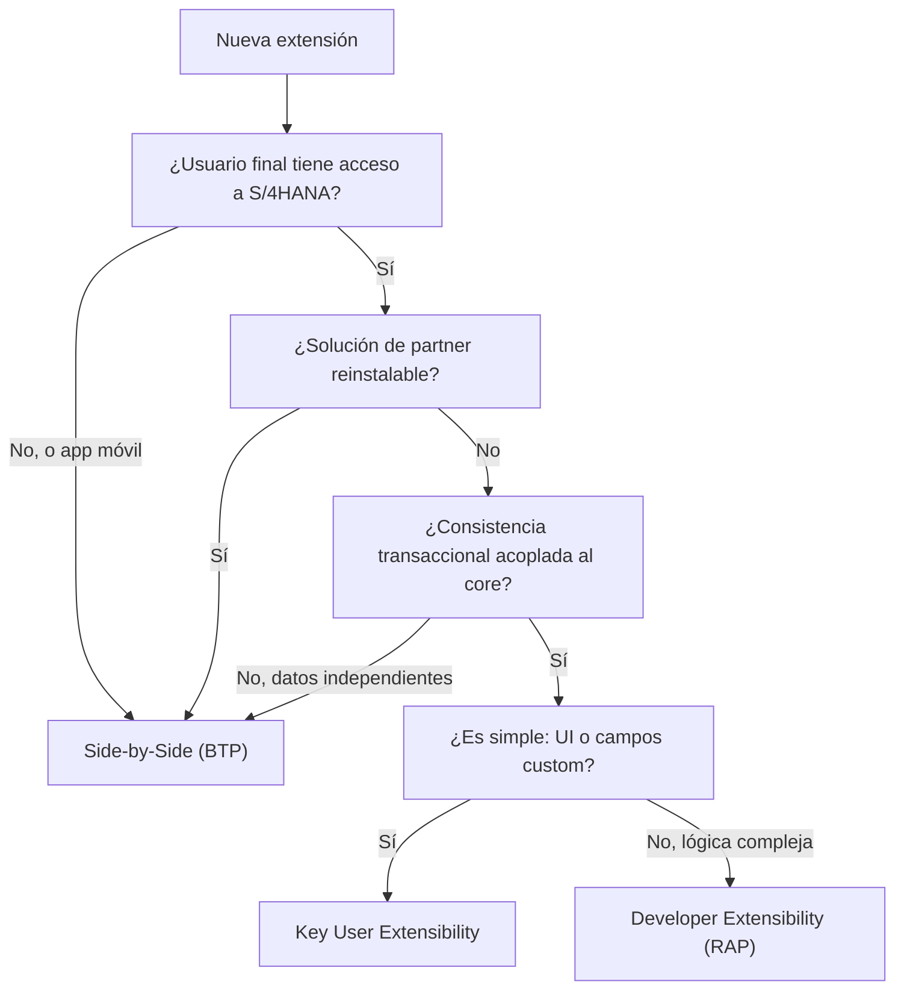

En Clean Core insistimos en el "qué" (extender solo por interfaces estables). Este post va del "dónde". Porque en S/4HANA Cloud una extensión puede vivir en tres sitios distintos, y la mitad de los problemas de mantenimiento nacen de haber elegido el sitio equivocado sin darse cuenta de que había una elección.

## Los tres niveles, sin jerga

SAP agrupa las extensiones en dos categorías grandes, y dentro salen tres opciones de trabajo:

- **Key User Extensibility (on stack)**: el experto de negocio adapta el sistema con herramientas Fiori: campos personalizados, custom business objects, lógica con BAdIs y ABAP restringido, queries analíticos. Sin Eclipse, sin transportes clásicos.
- **Developer Extensibility (on stack)**: el desarrollador extiende dentro de la pila ABAP desde Eclipse ADT, con RAP, CDS liberadas, APIs liberadas y puntos de extensión BAdI. Es ABAP for Cloud Development puro.
- **Side-by-Side (BTP)**: el desarrollo corre en paralelo, en la Business Technology Platform, con RAP o CAP, y habla con S/4HANA solo por APIs. No toca la pila ABAP del core.

Y por debajo de todo esto conviene tener claros los niveles de ABAP que SAP define:

- **Tier 1, ABAP for Cloud Development**: el modelo cloudready, el único que sobrevive limpio a los upgrades.
- **Tier 2, APIs desde el ABAP clásico**: expones funcionalidad on-premise hacia la nube de forma controlada.
- **Tier 3, ABAP clásico**: modificaciones profundas en el núcleo. Potente y peligroso, se retira poco a poco.

## La jerarquía importa (y casi nadie la respeta)

SAP no pone estas opciones al mismo nivel. Hay un orden de prioridad, y es una recomendación con consecuencias técnicas:

1. Primero **Key User**. Si lo puede resolver un experto de negocio con Fiori, no metas un desarrollador.
2. Luego **Developer**. Si la lógica es compleja pero pertenece al core, va en la pila con RAP.
3. Al final **Side-by-Side**, que depende del escenario: aplicaciones para usuarios sin acceso a S/4HANA, soluciones de partner reinstalables, o cargas independientes de la infraestructura.

> La pregunta no es "cómo programo esto", sino "quién debería programarlo y dónde". Cuando esa pregunta se salta, el código acaba en Tier 3 por inercia y el upgrade pasa la factura.

## El árbol de decisión, resumido


```mermaid
flowchart TD
 Start["Nueva extensión"] --> Q1["¿Usuario final tiene acceso a S/4HANA?"]
 Q1 -->|No, o app móvil| SBS["Side-by-Side (BTP)"]
 Q1 -->|Sí| Q2["¿Solución de partner reinstalable?"]
 Q2 -->|Sí| SBS
 Q2 -->|No| Q3["¿Consistencia transaccional acoplada al core?"]
 Q3 -->|No, datos independientes| SBS
 Q3 -->|Sí| Q4["¿Es simple: UI o campos custom?"]
 Q4 -->|Sí| KU["Key User Extensibility"]
 Q4 -->|No, lógica compleja| DEV["Developer Extensibility (RAP)"]
```

## Un ejemplo de Developer Extensibility

Cuando cae en Tier 1 con lógica de negocio, el patrón es una clase que implementa una interfaz de BAdI liberada, no una modificación del estándar:

```abap
CLASS zcl_check_credit_limit DEFINITION
  PUBLIC
  FINAL
  CREATE PUBLIC.
  PUBLIC SECTION.
    " El punto de extension es un BAdI liberado por SAP
    INTERFACES if_badi_sales_order_check.
ENDCLASS.

CLASS zcl_check_credit_limit IMPLEMENTATION.
  METHOD if_badi_sales_order_check~validate.
    " Solo se consumen CDS y APIs liberadas: nada de SELECT a VBAK
    SELECT SINGLE credit_limit
      FROM i_customercreditlimit          "#EC released CDS
      WHERE customer = @iv_customer
      INTO @DATA(lv_limit).

    IF iv_net_amount > lv_limit.
      APPEND VALUE #( type = 'E' text = 'Limite de credito superado' )
        TO et_messages.
    ENDIF.
  ENDMETHOD.
ENDCLASS.
```

Fíjate: es Developer Extensibility (lógica compleja, en el core) pero respeta Tier 1 (solo CDS liberadas, punto de extensión estable). Nivel y disciplina son cosas distintas y las dos importan.

## El error que se paga en el upgrade

El fallo típico no es técnico, es de encuadre: alguien resuelve con Developer Extensibility algo que un key user habría hecho en veinte minutos, o mete en el core una lógica que era candidata perfecta a Side-by-Side. Funciona el día de la demo. El día del upgrade, cada nivel mal elegido es una línea en la cola de regresión.

En el próximo post: cómo saber, en frío, si la clase o la CDS que vas a llamar está liberada de verdad (la usage list y el estado de release), porque de eso depende que tu Developer Extensibility siga siendo Clean Core.
