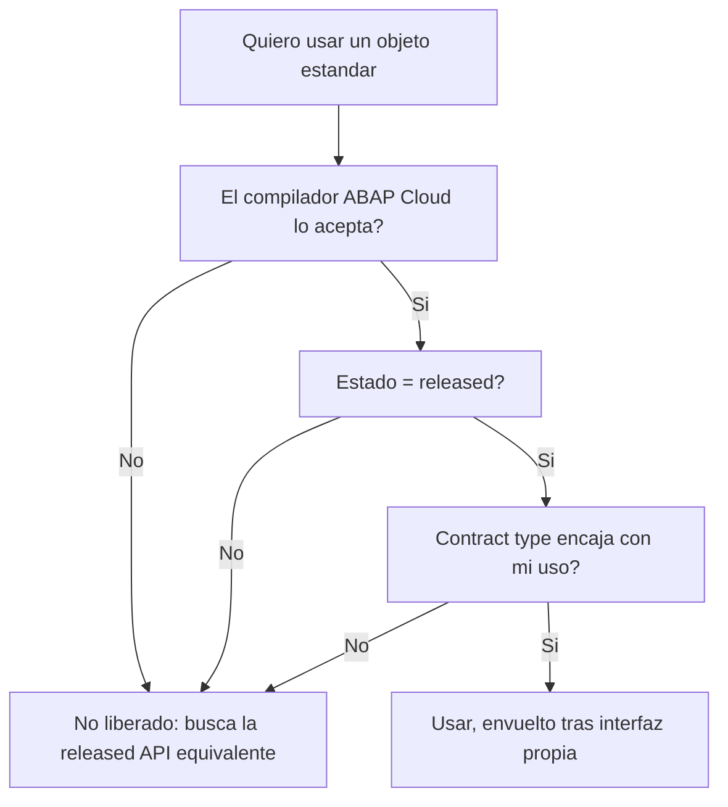

Ya hemos dicho que en Clean Core solo consumes objetos liberados. Suena facil hasta que estas delante de una clase `CL_...` que hace exactamente lo que necesitas y no sabes si puedes tocarla. Este post va de esa comprobacion concreta, la que separa una suposicion de una certeza.

## "Existe" no es "esta liberado"

En un sistema on-premise clasico podias llamar a casi cualquier cosa que compilara. En ABAP for Cloud Development eso se acabo: el lenguaje esta restringido y solo ves los objetos que SAP ha marcado como usables. Que un objeto aparezca no significa que este liberado para tu escenario. La liberacion es un contrato con tres piezas:

- **El estado de release**: released o no released. Sin release, estas fuera del contrato.
- **El contract type**: para que uso lo libera SAP. No es lo mismo "use system-internally" que "use as remote API".
- **La estabilidad garantizada**: SAP se compromete a no romper la firma de lo liberado entre releases. De lo no liberado no promete nada.

## Como se comprueba de verdad

No adivines por el prefijo del nombre. Comprueba. En ADT tienes tres caminos que se complementan:

1. **El propio compilador de ABAP Cloud**: si escribes contra algo no liberado, la comprobacion de sintaxis del lenguaje restringido te lo marca al instante. Es tu primera red.
2. **El release contract del objeto**: en las propiedades del objeto (o en su cabecera) ves si esta released y con que contract type. Ahi decides si tu uso encaja.
3. **La usage list (donde se usa)**: te dice quien consume ese objeto. Sirve para el camino inverso: si vas a extender algo, saber quien depende de ello antes de tocarlo.

> "Compila" no es "esta liberado", y "esta liberado" no es "liberado para lo que yo quiero". Son tres puertas distintas y hay que pasar las tres.



## Un ejemplo que falla y otro que pasa

El primero compila en on-premise y revienta en ABAP Cloud, porque `VBAK` no es un objeto liberado para acceso directo:

```abap
" NO liberado en ABAP for Cloud Development: el compilador lo rechaza
SELECT SINGLE * FROM vbak
  WHERE vbeln = @iv_order
  INTO @DATA(ls_header).
```

El segundo usa la CDS liberada equivalente, que si es un contrato estable:

```abap
" Liberada como released CDS: contrato estable entre upgrades
SELECT SINGLE salesorder, soldtoparty, totalnetamount
  FROM i_salesorder
  WHERE salesorder = @iv_order
  INTO @DATA(ls_header).
```

La diferencia no es de estilo: es que el primero puede romperse en cualquier feature pack sin aviso y el segundo no.

## El habito que te ahorra el retrabajo

Antes de teclear el nombre de cualquier objeto estandar, para y responde tres preguntas: esta released, con que contract type, y encaja con lo que voy a hacer. Treinta segundos. Si la respuesta a alguna es "no", casi siempre existe una released API equivalente; y si de verdad no existe, ese es tu caso legitimo para documentar una excepcion, no para saltarte el contrato en silencio.

En el proximo post bajamos al detalle de ABAP SQL en ABAP Cloud: que cambia respecto al clasico cuando el lenguaje deja de dejarte hacer lo que antes hacias sin pensar.
