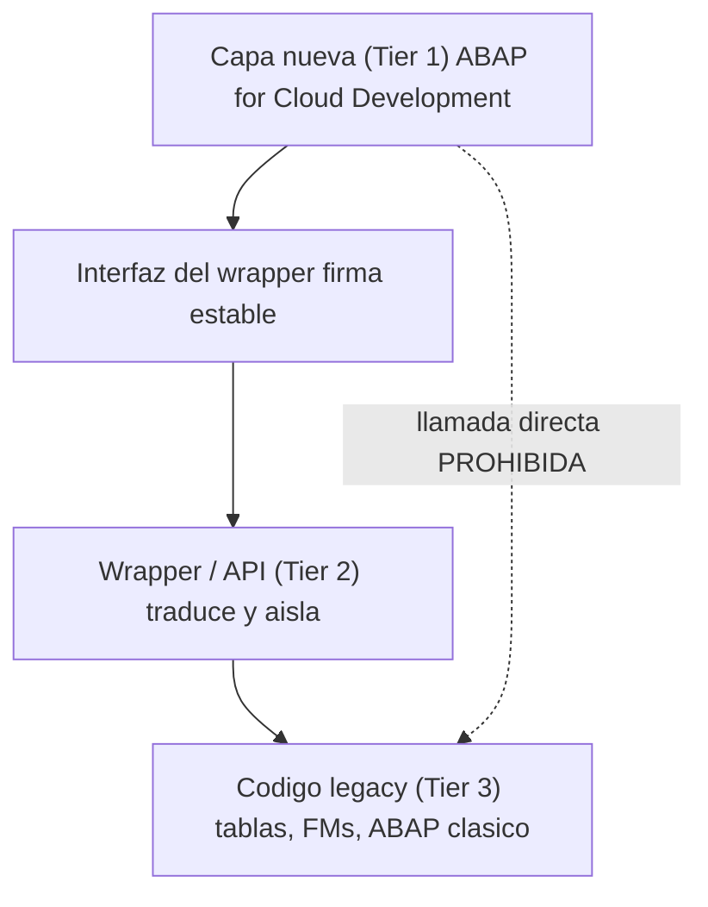

Ningun proyecto real empieza en verde. Tienes una base de ABAP clasico que funciona, que nadie va a reescribir este trimestre, y a la vez tienes que construir la capa nueva en ABAP Cloud. La tentacion es o bien tirar todo abajo (imposible) o bien llamar al legacy directamente desde lo nuevo (veneno). Hay una tercera via, y tiene nombre: wrappers.

## El problema en una frase

El codigo clasico usa cosas que en ABAP Cloud no existen: acceso directo a tablas, function modules no liberados, sentencias del lenguaje sin restringir. Si lo llamas a pelo desde tu capa cloud, arrastras todo eso a tu codigo nuevo y lo primero que ocurre es que ni compila. Y aunque compilara por algun puente, habrias acoplado tu capa limpia a lo mas fragil del sistema.

## Los niveles de ABAP te dan la pista

SAP ya definio como convive lo viejo con lo nuevo, y encaja aqui:

- **Tier 1, ABAP for Cloud Development**: tu capa nueva, limpia, cloudready.
- **Tier 2, APIs desde el ABAP clasico**: el puente. Expones la funcionalidad legacy como una API estable y controlada.
- **Tier 3, ABAP clasico**: el codigo viejo, que se queda donde esta, sin tocar.

La estrategia de wrappers es, ni mas ni menos, materializar el Tier 2: envolver el Tier 3 tras una interfaz que el Tier 1 pueda consumir sin enterarse de lo que hay detras.

> Un wrapper bien hecho es una promesa: "prometo que mi capa nueva solo conoce esta firma, y el dia que reescriba lo de dentro no se entera nadie".



## El patron, en dos piezas

Primero, la interfaz: es el unico contrato que tu capa cloud conoce. Nada de tipos del legacy asomando por aqui, solo tipos limpios de tu dominio.

```abap
INTERFACE zif_customer_credit
  PUBLIC.
  TYPES: BEGIN OF ty_credit,
           customer     TYPE i_customer-customer,
           credit_limit TYPE p LENGTH 15 DECIMALS 2,
         END OF ty_credit.

  METHODS get_credit
    IMPORTING iv_customer      TYPE i_customer-customer
    RETURNING VALUE(rs_credit) TYPE ty_credit.
ENDINTERFACE.
```

Segundo, la implementacion del wrapper: aqui, y solo aqui, vive el contacto con lo viejo. Si manana ese calculo pasa a una released API, cambias esta clase y nadie mas se entera.

```abap
CLASS zcl_customer_credit DEFINITION
  PUBLIC FINAL CREATE PUBLIC.
  PUBLIC SECTION.
    INTERFACES zif_customer_credit.
ENDCLASS.

CLASS zcl_customer_credit IMPLEMENTATION.
  METHOD zif_customer_credit~get_credit.
    " El acceso al legacy queda AISLADO tras esta firma.
    " Hoy via una remote API / RFC liberado; manana lo que sea.
    DATA(lo_legacy) = NEW zcl_legacy_credit_facade( ).
    rs_credit = VALUE #(
      customer     = iv_customer
      credit_limit = lo_legacy->read_limit( iv_customer ) ).
  ENDMETHOD.
ENDCLASS.
```

Fijate en lo que NO hay en la capa nueva: ni un `SELECT` a una tabla clasica, ni un `CALL FUNCTION` a un modulo no liberado. Todo eso vive detras de `zcl_legacy_credit_facade`, en un solo punto.

## Las reglas que hacen que esto funcione

- **Una sola puerta**. El legacy se toca en un unico lugar por dominio. Si aparece un segundo sitio, el wrapper ha fallado.
- **Tipos de tu dominio en la firma**, no estructuras del legacy. La interfaz no debe delatar lo que hay detras.
- **Los errores se traducen**. Un `sy-subrc` o un mensaje tecnico del legacy se convierten en el error de tu dominio antes de cruzar la frontera.
- **El wrapper es desechable a proposito**. Su valor esta en poder tirarlo el dia que exista la released API sin tocar a sus consumidores.

## Lo que ganas

Con esta capa, la migracion deja de ser un big bang y se vuelve incremental: reescribes el interior de un wrapper cuando toca, no cuando el proyecto entero lo exige. Tu capa cloud nace limpia desde el dia uno, aunque por debajo siga latiendo veinte anos de ABAP clasico. Eso es, en la practica, como se hace Clean Core en un sistema que no empezo limpio.

Con esto cerramos la serie de ABAP Cloud: del modelo de extensibilidad a la comprobacion de release, del SQL restringido a la convivencia con el legacy. El hilo comun es siempre el mismo: extiende por contratos, no por acoplamiento.
