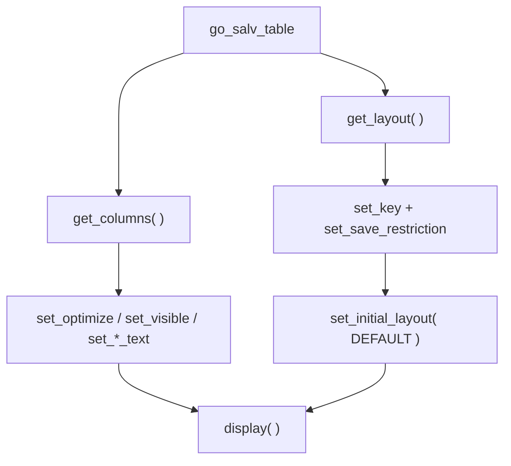

Debajo de todo ALV hay tres cosas que deciden si el listado es usable: **que columnas se ven y como se llaman** (catalogo), **como se presenta** (layout) y **si el usuario puede guardar su vista** (variantes). Con la familia clasica esto eran estructuras planas rellenadas a mano. Con SALV son objetos que pides al ALV y a los que hablas. La diferencia se nota.

## Columnas: pedir el objeto y configurar

En `CL_SALV_TABLE`, las columnas son un objeto `cl_salv_columns_table`. Optimizas anchos, ocultas tecnicas y renombras, todo con metodos claros y captura de excepcion si la columna no existe.

```abap
FORM change_salv_columns.
  DATA: lo_columns    TYPE REF TO cl_salv_columns_table,
        lo_sng_column TYPE REF TO cl_salv_column.

  lo_columns = go_salv_table->get_columns( ).
  lo_columns->set_optimize( abap_true ).

  TRY.
      lo_sng_column = lo_columns->get_column( columnname = 'MANDT' ).
      lo_sng_column->set_visible( if_salv_c_bool_sap=>false ).
    CATCH cx_salv_not_found.
  ENDTRY.

  TRY.
      lo_sng_column = lo_columns->get_column( columnname = 'MATRICULA' ).
      lo_sng_column->set_long_text(   'Placa Auto' ).
      lo_sng_column->set_medium_text( 'Placa Auto' ).
      lo_sng_column->set_short_text(  'Placa Auto' ).
    CATCH cx_salv_not_found.
  ENDTRY.
ENDFORM.
```

`set_optimize` ajusta los anchos al contenido; `set_visible( false )` esconde `MANDT` y los flags tecnicos; los tres `set_*_text` cubren los tres largos de cabecera que SAP usa segun el ancho disponible. Nada de recorrer un `lvc_t_fcat` a mano.



## Layout y variantes: que el usuario guarde su vista

Una variante es la vista que el usuario configura (columnas, orden, filtros) y espera reencontrar. En SALV se gestiona con `cl_salv_layout`: defines una clave de guardado, autorizas el guardado y opcionalmente cargas una variante por defecto.

```abap
FORM change_salv_layout.
  DATA: lo_salv_layout TYPE REF TO cl_salv_layout,
        ls_key         TYPE salv_s_layout_key,
        lv_variant     TYPE slis_vari.

  lo_salv_layout = go_salv_table->get_layout( ).

  ls_key-report        = sy-repid.
  ls_key-logical_group = 'ALQ'.
  lo_salv_layout->set_key( ls_key ).

  lo_salv_layout->set_save_restriction( if_salv_c_layout=>restrict_none ).

  lv_variant = 'DEFAULT'.
  lo_salv_layout->set_initial_layout( lv_variant ).
ENDFORM.
```

Tres decisiones que importan:

- **`set_key`** liga las variantes a este programa y a un grupo logico (`ALQ`), de modo que el mismo report puede tener juegos de variantes distintos por contexto.
- **`set_save_restriction( restrict_none )`** permite guardar variantes de usuario y globales; hay valores mas restrictivos si no quieres que cada usuario cree las suyas.
- **`set_initial_layout`** arranca el ALV ya con la vista `DEFAULT`, sin que el usuario tenga que seleccionarla.

## El error clasico del catalogo generado

Cuando trabajas con ALV Grid en lugar de SALV, el catalogo se suele generar con `LVC_FIELDCATALOG_MERGE` a partir de una estructura del diccionario, y luego se retoca campo a campo:

```abap
CALL FUNCTION 'LVC_FIELDCATALOG_MERGE'
  EXPORTING
    i_structure_name = 'ZCO_VEHICULOS'
  CHANGING
    ct_fieldcat      = gt_fieldcat
  EXCEPTIONS
    OTHERS           = 3.

LOOP AT gt_fieldcat ASSIGNING <ls_fieldcat>.
  CASE <ls_fieldcat>-fieldname.
    WHEN 'MARCA'.     <ls_fieldcat>-f4availabl = abap_true.
    WHEN 'MATRICULA'. <ls_fieldcat>-hotspot    = abap_true.
  ENDCASE.
ENDLOOP.
```

Funciona, pero es exactamente el tipo de codigo plano que SALV te ahorra. Generas y retocas, generas y retocas; y cada campo nuevo en la estructura es otro `WHEN` que se te olvida.

> El catalogo no es un detalle de presentacion: es el contrato entre tus datos y lo que el usuario ve. En SALV ese contrato es codigo tipado; en la version clasica, una estructura que hay que vigilar.

Con esto cerramos la serie de ALV. El hilo conductor ha sido siempre el mismo: `CL_SALV_TABLE` como estandar moderno para listados, `CL_GUI_ALV_GRID` cuando de verdad necesitas editar, y en ambos casos, objetos y eventos en lugar de estructuras planas y callbacks.
