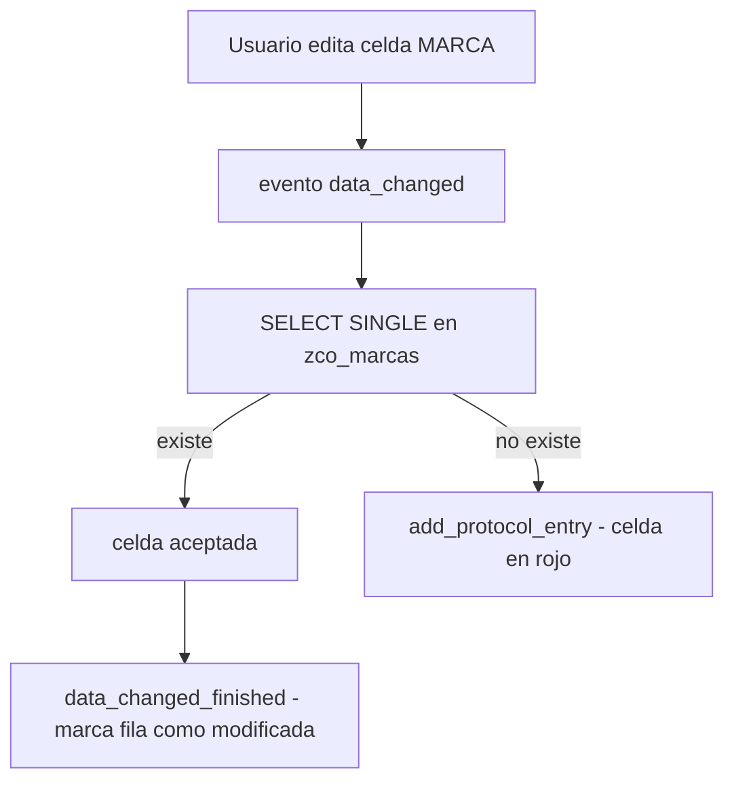

Aqui es donde `CL_SALV_TABLE` se queda corto y hay que bajar a `CL_GUI_ALV_GRID`. Un ALV editable no es solo poner celdas en modo escritura: es **validar lo que el usuario teclea, ofrecerle ayudas y persistir solo lo correcto**. Y todo eso pasa por eventos. Vamos al patron real.

## Validar al vuelo: el evento data_changed

Cada vez que el usuario modifica una celda, el grid dispara `data_changed`. Ahi recorres las celdas cambiadas (`mt_good_cells`), lees el valor y decides si es valido. Si no lo es, no lanzas un dump: registras el error en el protocolo del propio ALV.

```abap
METHOD handle_data_changed.
  DATA: ls_data_changed TYPE lvc_s_modi,
        lv_marca        TYPE zlo_marca.

  LOOP AT er_data_changed->mt_good_cells INTO ls_data_changed.
    CASE ls_data_changed-fieldname.
      WHEN 'MARCA'.
        er_data_changed->get_cell_value(
          EXPORTING
            i_row_id    = ls_data_changed-row_id
            i_fieldname = ls_data_changed-fieldname
          IMPORTING
            e_value     = lv_marca ).

        SELECT SINGLE marca FROM zco_marcas
          INTO lv_marca
          WHERE marca EQ lv_marca.
        IF sy-subrc NE 0.
          er_data_changed->add_protocol_entry(
            EXPORTING
              i_msgid     = 'ZCO_MSG'
              i_msgty     = 'E'
              i_msgno     = '000'
              i_msgv1     = text-m01
              i_msgv2     = lv_marca
              i_fieldname = ls_data_changed-fieldname
              i_row_id    = ls_data_changed-row_id ).
        ENDIF.
    ENDCASE.
  ENDLOOP.
ENDMETHOD.
```

`add_protocol_entry` es la pieza clave: marca la celda en rojo y muestra el mensaje en el protocolo estandar del ALV, sin sacar al usuario del contexto. La marca no existe en `zco_marcas` -> error visible, edicion no confirmada.



## Ayuda de busqueda propia: el evento onf4

Para las celdas editables conviene ofrecer una F4 a medida. Se declara la columna con `f4availabl = abap_true` en el catalogo y se implementa `onf4`, que rellena los valores y los devuelve al grid via `er_event_data`:

```abap
METHOD handle_onf4.
  DATA: lt_marcas     TYPE TABLE OF zco_marcas,
        lt_return_tab TYPE TABLE OF ddshretval,
        ls_return_tab TYPE ddshretval,
        ls_modify_data TYPE lvc_s_modi.
  FIELD-SYMBOLS <lt_modify_data> TYPE lvc_t_modi.

  CASE e_fieldname.
    WHEN 'MARCA'.
      SELECT marca FROM zco_marcas INTO TABLE lt_marcas WHERE marca NE space.
      CALL FUNCTION 'F4IF_INT_TABLE_VALUE_REQUEST'
        EXPORTING
          retfield    = 'MARCA'
          dynpprog    = sy-repid
          dynpnr      = sy-dynnr
          dynprofield = 'MARCA'
          value_org   = 'S'
        TABLES
          value_tab   = lt_marcas
          return_tab  = lt_return_tab.
      READ TABLE lt_return_tab INTO ls_return_tab INDEX 1.
      IF sy-subrc EQ 0.
        ls_modify_data-row_id    = es_row_no-row_id.
        ls_modify_data-fieldname = e_fieldname.
        ls_modify_data-value     = ls_return_tab-fieldval.
        ASSIGN er_event_data->m_data->* TO <lt_modify_data>.
        APPEND ls_modify_data TO <lt_modify_data>.
      ENDIF.
  ENDCASE.
  er_event_data->m_event_handled = abap_true.
ENDMETHOD.
```

No olvides el `er_event_data->m_event_handled = abap_true`: le dice al grid que tu ya has gestionado la F4 y que no aplique la estandar.

## Persistir solo lo bueno

Marcas las filas tocadas en `data_changed_finished` (con un flag propio, aqui `bbdd`), y al pulsar "Guardar" recorres solo esas y haces `MODIFY`:

```abap
WHEN 'A_SAVE'.
  LOOP AT gt_vehiculos INTO ls_vehiculos WHERE bbdd EQ abap_true.
    MOVE-CORRESPONDING ls_vehiculos TO ls_bbdd_vehiculos.
    APPEND ls_bbdd_vehiculos TO lt_bbdd_vehiculos.
  ENDLOOP.
  IF sy-subrc EQ 0.
    MODIFY zco_vehiculos FROM TABLE lt_bbdd_vehiculos.
    IF sy-subrc EQ 0.
      MESSAGE s001(zco_msg).
    ENDIF.
  ENDIF.
```

> Un ALV editable sin validacion en data_changed no es una comodidad: es una via directa para meter basura en la base de datos.

En el proximo post cerramos la serie con lo que sostiene todo esto: el catalogo de campos, el layout y las variantes que el usuario guarda y espera reencontrar.
