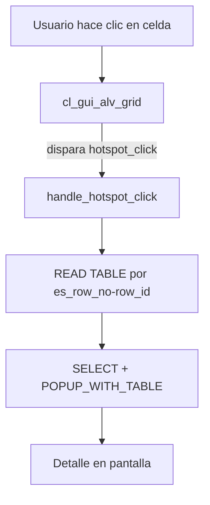

Un listado que solo se mira es la mitad del trabajo. La otra mitad es responder al clic: navegar a un detalle, abrir un popup, disparar una acción. En ALV Grid eso se hace con **eventos y handlers**, no con subrutinas cableadas por nombre. Y ese es exactamente el motivo por el que el modelo orientado a objetos gana.

## El patrón: clase receptora + SET HANDLER

La interacción en `CL_GUI_ALV_GRID` sigue siempre el mismo esquema: una clase local declara métodos `FOR EVENT ... OF cl_gui_alv_grid`, y tú enlazas esa clase al grid con `SET HANDLER`.

```abap
CLASS lcl_event_receiver DEFINITION.
  PUBLIC SECTION.
    METHODS handle_hotspot_click FOR EVENT hotspot_click
      OF cl_gui_alv_grid
      IMPORTING e_column_id
                e_row_id
                es_row_no.

    METHODS handle_double_click FOR EVENT double_click
      OF cl_gui_alv_grid
      IMPORTING e_column
                e_row
                es_row_no.
ENDCLASS.
```

Cada evento entrega en `IMPORTING` justo lo que necesitas: la columna clicada, el número de fila, el identificador de línea. Nada de leer variables globales para saber dónde ha pinchado el usuario.

## Enlazar los handlers

Una vez creada la instancia receptora, `SET HANDLER` conecta cada método con el grid concreto. Se hace una sola vez, cuando el grid ya existe.

```abap
FORM set_handlers .
  IF go_event_receiver IS NOT BOUND.
    CREATE OBJECT go_event_receiver.
    SET HANDLER:
      go_event_receiver->handle_hotspot_click FOR go_alv_grid,
      go_event_receiver->handle_double_click  FOR go_alv_grid,
      go_event_receiver->handle_user_command  FOR go_alv_grid.
  ENDIF.
ENDFORM.
```


```mermaid
flowchart TB
  U["Usuario hace clic en celda"] --> G["cl_gui_alv_grid"]
  G -->|"dispara hotspot_click"| H["handle_hotspot_click"]
  H --> R["READ TABLE por es_row_no-row_id"]
  R --> A["SELECT + POPUP_WITH_TABLE"]
  A --> V["Detalle en pantalla"]
```

## Un hotspot útil: de fila a detalle

El hotspot convierte una celda en un enlace. Se marca en el catálogo de campos (`hotspot = abap_true`) y el evento hace el resto. Aquí, al pinchar la matrícula de un vehículo, buscamos su contrato de cliente y lo mostramos en un popup:

```abap
METHOD handle_hotspot_click.
  DATA: lt_clientes  TYPE STANDARD TABLE OF zco_clientes,
        ls_vehiculos TYPE gty_vehiculos.

  CASE e_column_id.
    WHEN 'MATRICULA'.
      READ TABLE gt_vehiculos INTO ls_vehiculos INDEX es_row_no-row_id.
      IF sy-subrc EQ 0.
        SELECT * FROM zco_clientes
          INTO TABLE lt_clientes
          WHERE matricula EQ ls_vehiculos-matricula
            AND cntr_type EQ 'C'.
        IF sy-subrc EQ 0.
          CALL FUNCTION 'POPUP_WITH_TABLE'
            EXPORTING
              endpos_col   = 160
              endpos_row   = 15
              startpos_col = 20
              startpos_row = 10
              titletext    = text-p01
            TABLES
              valuetab     = lt_clientes
            EXCEPTIONS
              break_off    = 1
              OTHERS       = 2.
        ELSE.
          MESSAGE s002(zco_msg) DISPLAY LIKE 'E'.
        ENDIF.
      ENDIF.
  ENDCASE.
ENDMETHOD.
```

El `es_row_no-row_id` te da la fila exacta; el `READ TABLE ... INDEX` recupera el registro; y a partir de ahí es lógica de negocio normal. El double-click funciona igual, pero recibe `e_column` y `e_row` en lugar de los `*_id`.

## El detalle que salva depuraciones

Un handler enlazado que nunca se dispara casi siempre tiene la misma causa: el `SET HANDLER` se ejecutó antes de existir el grid, o se registró para la instancia equivocada. El evento va ligado a un objeto concreto (`FOR go_alv_grid`), no a la clase en abstracto.

> Los eventos no son magia: son un contrato tipado entre el control y tu código. Si respetas el contrato, la interacción se vuelve trivial.

En el próximo post: la barra de herramientas y las funciones propias, para que el usuario tenga botones que hacen lo que tu negocio necesita.
