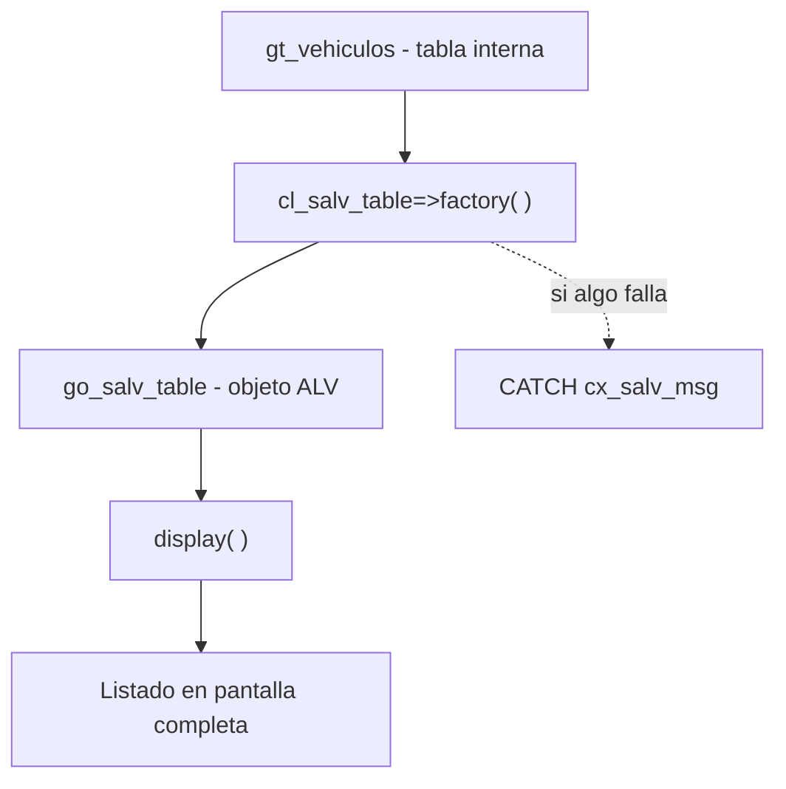

Hay una prueba que separa las APIs bien disenadas de las que no: **cuanto codigo necesitas para el caso mas simple**. Con `CL_SALV_TABLE`, mostrar una tabla interna en pantalla es literalmente dos llamadas. Ni catalogo de campos, ni callbacks, ni parametros interminables.

## El minimo absoluto

Tienes tus datos en una tabla interna. Quieres verlos. Esto es todo:

```abap
FORM instance_salv.
  DATA lx_salv_msg TYPE REF TO cx_salv_msg.
  TRY.
      cl_salv_table=>factory(
        IMPORTING
          r_salv_table = go_salv_table
        CHANGING
          t_table      = gt_vehiculos ).
    CATCH cx_salv_msg INTO lx_salv_msg.
      WRITE lx_salv_msg->get_text( ).
  ENDTRY.
ENDFORM.

FORM display_salv.
  go_salv_table->display( ).
ENDFORM.
```

Con una referencia declarada en el TOP, `DATA go_salv_table TYPE REF TO cl_salv_table`, ya tienes un ALV completo: columnas deducidas del diccionario, ordenacion, filtro, exportacion a hoja de calculo y la barra estandar entera, sin escribir una sola linea de configuracion.

## Que hace `factory` por ti

El metodo estatico `factory` es el corazon del asunto. Recibe la tabla en `CHANGING` (por referencia, no copia) y te devuelve el objeto ALV en `r_salv_table`. A partir de ahi, todo se pide al objeto.



Fijate en el `TRY ... CATCH cx_salv_msg`: no es adorno. `factory` puede fallar (por ejemplo, si la tabla no es apta) y lo comunica con una excepcion de clase, no con un `sy-subrc` que se te olvida comprobar. Eso ya es una mejora de robustez respecto a la familia REUSE_ALV.

## De pantalla completa a container

El mismo `factory` sirve para incrustar el ALV en un control de pantalla. Solo cambia un parametro: le pasas el container.

```abap
cl_salv_table=>factory(
  EXPORTING
    r_container  = go_custom_container
  IMPORTING
    r_salv_table = go_salv_table
  CHANGING
    t_table      = gt_vehiculos ).
```

Sin `r_container` tienes pantalla completa; con el, el listado vive dentro de tu `CL_GUI_CUSTOM_CONTAINER` (por ejemplo, en la mitad inferior de un splitter). La API es la misma; solo decides donde se pinta.

## Por que esto importa

- **Menos superficie de error**: no hay catalogo manual que se desincronice con la estructura.
- **Cambio barato**: anadir una columna a la tabla la anade al ALV, gratis.
- **Legible**: quien lea el codigo dentro de dos anos entiende `factory` y `display` sin manual.

> Si tu listado de solo lectura necesita mas de quince lineas de plumbing, probablemente estas usando la API equivocada.

En el proximo post damos el salto a la interaccion: eventos y hotspots, cuando el usuario deja de mirar y empieza a hacer clic.
