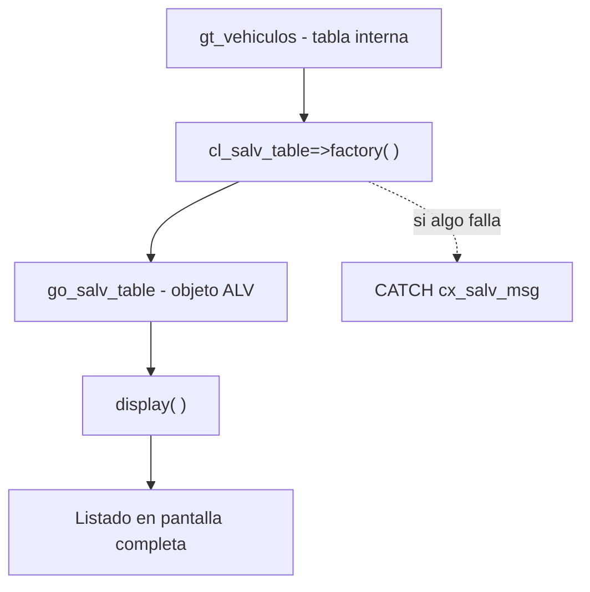

Hay una prueba que separa las APIs bien diseñadas de las que no: **cuánto código necesitas para el caso más simple**. Con `CL_SALV_TABLE`, mostrar una tabla interna en pantalla es literalmente dos llamadas. Ni catálogo de campos, ni callbacks, ni parámetros interminables.

## El mínimo absoluto

Tienes tus datos en una tabla interna. Quieres verlos. Esto es todo:

```abap
FORM instance_salv.
  DATA lx_salv_msg TYPE REF TO cx_salv_msg.
  TRY.
      cl_salv_table=>factory(
        IMPORTING
          r_salv_table = go_salv_table
        CHANGING
          t_table      = gt_vehiculos ).
    CATCH cx_salv_msg INTO lx_salv_msg.
      WRITE lx_salv_msg->get_text( ).
  ENDTRY.
ENDFORM.

FORM display_salv.
  go_salv_table->display( ).
ENDFORM.
```

Con una referencia declarada en el TOP, `DATA go_salv_table TYPE REF TO cl_salv_table`, ya tienes un ALV completo: columnas deducidas del diccionario, ordenación, filtro, exportación a hoja de cálculo y la barra estándar entera, sin escribir una sola línea de configuración.

## Qué hace `factory` por ti

El método estático `factory` es el corazón del asunto. Recibe la tabla en `CHANGING` (por referencia, no copia) y te devuelve el objeto ALV en `r_salv_table`. A partir de ahí, todo se pide al objeto.


```mermaid
flowchart TB
  A["gt_vehiculos - tabla interna"] --> B["cl_salv_table=>factory( )"]
  B --> C["go_salv_table - objeto ALV"]
  C --> D["display( )"]
  D --> E["Listado en pantalla completa"]
  B -.->|"si algo falla"| X["CATCH cx_salv_msg"]
```

Fíjate en el `TRY ... CATCH cx_salv_msg`: no es adorno. `factory` puede fallar (por ejemplo, si la tabla no es apta) y lo comunica con una excepción de clase, no con un `sy-subrc` que se te olvida comprobar. Eso ya es una mejora de robustez respecto a la familia REUSE_ALV.

## De pantalla completa a container

El mismo `factory` sirve para incrustar el ALV en un control de pantalla. Solo cambia un parámetro: le pasas el container.

```abap
cl_salv_table=>factory(
  EXPORTING
    r_container  = go_custom_container
  IMPORTING
    r_salv_table = go_salv_table
  CHANGING
    t_table      = gt_vehiculos ).
```

Sin `r_container` tienes pantalla completa; con él, el listado vive dentro de tu `CL_GUI_CUSTOM_CONTAINER` (por ejemplo, en la mitad inferior de un splitter). La API es la misma; solo decides dónde se pinta.

## Por qué esto importa

- **Menos superficie de error**: no hay catálogo manual que se desincronice con la estructura.
- **Cambio barato**: añadir una columna a la tabla la añade al ALV, gratis.
- **Legible**: quien lea el código dentro de dos años entiende `factory` y `display` sin manual.

> Si tu listado de solo lectura necesita más de quince líneas de plumbing, probablemente estás usando la API equivocada.

En el próximo post damos el salto a la interacción: eventos y hotspots, cuando el usuario deja de mirar y empieza a hacer clic.
