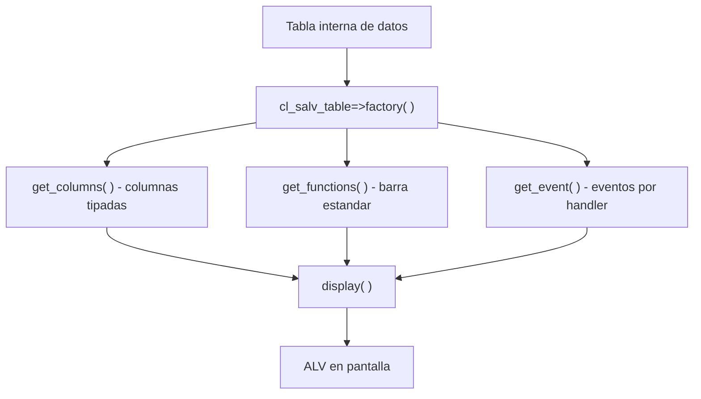

Casi todo programa clasico de reporting en SAP acaba pintando una tabla. Y durante veinte anos la respuesta fue la misma: `REUSE_ALV_GRID_DISPLAY` o `REUSE_ALV_LIST_DISPLAY`. Funcionan, se conocen de memoria y estan en todos los proyectos. El problema no es que fallen: es que **te obligan a llevar el peso del modelo tu mismo**.

## El coste oculto de la familia REUSE_ALV

Mira lo que hay que preparar antes de ver una sola linea en pantalla con la funcion clasica: un catalogo de campos rellenado a mano, campo a campo.

```abap
FORM build_field_cat .
  DATA ls_fieldcat TYPE slis_fieldcat_alv.

  ls_fieldcat-fieldname = 'CARRID'.
  ls_fieldcat-seltext_l = 'Airline Code'.
  ls_fieldcat-key       = abap_true.
  APPEND ls_fieldcat TO gt_fieldcat.
  CLEAR ls_fieldcat.

  ls_fieldcat-fieldname = 'CONNID'.
  ls_fieldcat-key       = abap_true.
  ls_fieldcat-seltext_l = 'Flight Number'.
  APPEND ls_fieldcat TO gt_fieldcat.
  " ... y asi con cada columna
ENDFORM.

FORM display_alv_list .
  CALL FUNCTION 'REUSE_ALV_LIST_DISPLAY'
    EXPORTING
      i_callback_program = sy-repid
      it_fieldcat        = gt_fieldcat
    TABLES
      t_outtab           = gt_flights
    EXCEPTIONS
      program_error      = 1
      OTHERS             = 2.
ENDFORM.
```

Es funcional, pero fijate en la deuda: interfaz procedural, catalogo manual, callbacks por nombre de FORM (`i_callback_program`), y manejo de excepciones por numero. Cada interaccion (user command, top-of-page) es otra subrutina cableada por convencion, no por contrato.

## Lo que cambia con CL_SALV_TABLE

`CL_SALV_TABLE` invierte el planteamiento. Tu le das una tabla interna, y la clase deduce el catalogo de campos del diccionario. Nada de rellenar `slis_t_fieldcat_alv` a mano.

```abap
FORM instance_salv.
  DATA lx_salv_msg TYPE REF TO cx_salv_msg.
  TRY.
      cl_salv_table=>factory(
        IMPORTING
          r_salv_table = go_salv_table
        CHANGING
          t_table      = gt_vehiculos ).
    CATCH cx_salv_msg INTO lx_salv_msg.
      WRITE lx_salv_msg->get_text( ).
  ENDTRY.
ENDFORM.
```

Esas seis lineas hacen lo que antes eran cincuenta. Y el resto (columnas, layout, funciones, eventos) se configura con objetos tipados (`get_columns( )`, `get_functions( )`, `get_event( )`), no con estructuras planas.



## La comparacion sin adornos

- **Catalogo de campos**: REUSE_ALV lo pide a mano (o via `LVC_FIELDCATALOG_MERGE`); SALV lo genera solo desde el tipo de la tabla.
- **Interfaz**: REUSE_ALV es procedural y con callbacks por nombre; SALV es orientado a objetos y con excepciones de clase (`cx_salv_msg`).
- **Mantenimiento**: en REUSE_ALV cada opcion nueva es un parametro mas en una firma enorme; en SALV pides el objeto responsable y le hablas.
- **Curva**: REUSE_ALV parece mas rapido el primer dia; SALV gana desde el segundo cambio.

> REUSE_ALV no esta roto. Simplemente te hace pagar en cada linea el precio de no tener un modelo de objetos detras.

## Cuando SALV no llega

Seamos honestos: `CL_SALV_TABLE` es la eleccion por defecto para **listados de solo lectura**. Si necesitas celdas editables de verdad, ahi sigue mandando `CL_GUI_ALV_GRID`, que da control total sobre edicion y validacion. Pero para el 80% de los reportes que se escriben (mostrar datos, ordenar, filtrar, exportar), SALV es el estandar moderno y no hay motivo para volver a la familia REUSE_ALV.

En el proximo post: un ALV completo con `CL_SALV_TABLE` en diez lineas, para que veas hasta donde llega lo minimo.
