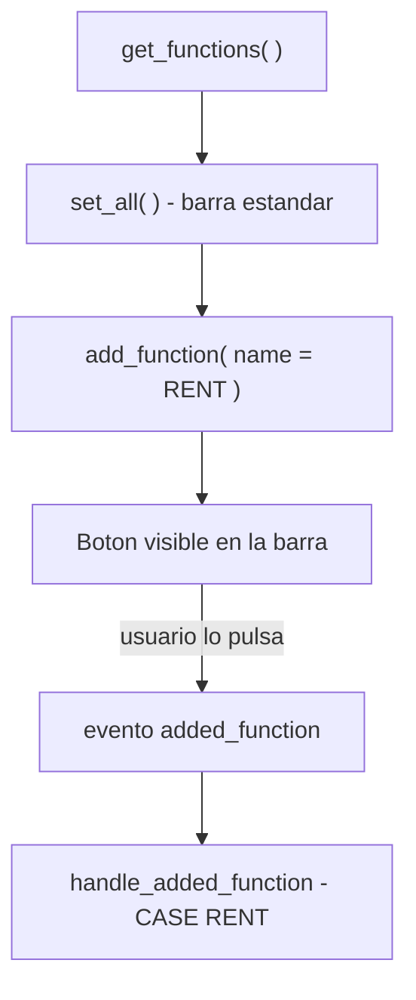

Un ALV trae gratis ordenar, filtrar, sumar y exportar. Pero tu negocio casi siempre necesita algo mas: un boton "Generar contrato", un "Guardar cambios", un "Enviar a aprobacion". Ahi es donde entra la **funcion propia**. Y otra vez, SALV y ALV Grid lo resuelven de forma distinta; conviene saber cual usar.

## En SALV: pide el objeto de funciones y anade

Con `CL_SALV_TABLE`, la barra de herramientas es un objeto (`cl_salv_functions_list`) que pides al ALV. Primero activas las funciones estandar, luego anades las tuyas.

```abap
FORM set_salv_functions.
  DATA: lo_functions TYPE REF TO cl_salv_functions_list,
        lv_name      TYPE salv_de_function,
        lv_icon      TYPE string,
        lv_tooltip   TYPE string.

  lo_functions = go_salv_table->get_functions( ).
  lo_functions->set_all( ).

  lv_name    = 'RENT'.
  lv_icon    = icon_rental_agreement.
  lv_tooltip = 'Contrato de renta'.

  TRY.
      lo_functions->add_function(
        EXPORTING
          name     = lv_name
          icon     = lv_icon
          tooltip  = lv_tooltip
          position = if_salv_c_function_position=>right_of_salv_functions ).
    CATCH cx_salv_existing.
    CATCH cx_salv_wrong_call.
  ENDTRY.
ENDFORM.
```

`set_all( )` habilita la barra completa de fabrica; `add_function` coloca tu boton a la derecha de las funciones estandar. El `TRY ... CATCH` no es opcional: la clase avisa por excepcion si el nombre ya existe (`cx_salv_existing`) o la llamada es incorrecta (`cx_salv_wrong_call`).

## Recoger la pulsacion: el evento added_function

Anadir el boton es la mitad. Falta reaccionar cuando el usuario lo pulsa. En SALV eso llega por el evento `added_function` de `cl_salv_events_table`.

```abap
CLASS lcl_salv_event DEFINITION.
  PUBLIC SECTION.
    METHODS handle_added_function FOR EVENT added_function
      OF cl_salv_events_table
      IMPORTING e_salv_function.
ENDCLASS.

CLASS lcl_salv_event IMPLEMENTATION.
  METHOD handle_added_function.
    CASE e_salv_function.
      WHEN 'RENT'.
        " logica de negocio del boton Contrato
    ENDCASE.
  ENDMETHOD.
ENDCLASS.
```

Y el enlace, con el patron de siempre: pides el objeto de eventos y registras el handler.

```abap
FORM set_salv_events.
  DATA lo_events TYPE REF TO cl_salv_events_table.
  IF go_salv_event IS NOT BOUND.
    CREATE OBJECT go_salv_event.
    lo_events = go_salv_table->get_event( ).
    SET HANDLER go_salv_event->handle_added_function FOR lo_events.
  ENDIF.
ENDFORM.
```



## En ALV Grid: el evento toolbar

Si trabajas con `CL_GUI_ALV_GRID` (por ejemplo, porque necesitas edicion), la barra se construye en el evento `toolbar`, anadiendo tu boton a la tabla `mt_toolbar`:

```abap
METHOD handle_toolbar.
  DATA ls_toolbar TYPE stb_button.
  ls_toolbar-function  = 'A_SAVE'.
  ls_toolbar-quickinfo = 'Save'.
  ls_toolbar-icon      = '@F_SAVE@'.
  APPEND ls_toolbar TO e_object->mt_toolbar.
ENDMETHOD.
```

La pulsacion se recoge luego en `handle_user_command` mirando `e_ucomm`. Es mas manual que SALV, pero te da control total sobre la barra.

## Cual usar

- **Listado de solo lectura con acciones puntuales**: SALV con `add_function`. Menos codigo, excepciones tipadas.
- **Grid editable o barra muy personalizada**: `CL_GUI_ALV_GRID` con el evento `toolbar`.

> Un boton propio sin manejador es un boton que engana al usuario. Anadir la funcion y registrar el evento son una sola tarea, no dos.

En el proximo post entramos en terreno delicado: el ALV editable, donde el usuario ya no solo lee, sino que escribe, y hay que validar.
