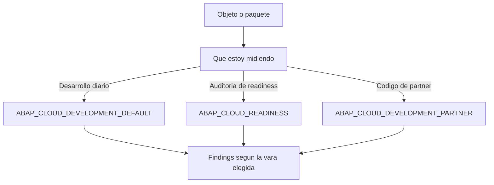

Ejecutar el ATC sin pensar en la variante es como pesarte en una báscula que no sabes si mide en kilos o en libras. La **variante de chequeo** define exactamente qué reglas se aplican, y elegir la equivocada te da o bien una falsa sensación de tranquilidad o bien un muro de miles de hallazgos que nadie va a tocar.

## Las variantes que importan

Cuando lanzas `ABAP Test Cockpit with…` sobre un objeto, ADT te deja elegir variante con `Browse`. El truco práctico: escribe `abap_` para ver las que crean los administradores. Tres son las que se repiten en cualquier proyecto S/4HANA:

- **ABAP_CLOUD_DEVELOPMENT_DEFAULT**: la variante por defecto. Comprobación completa y detallada, con reglas básicas más las adicionales para asegurar que el código personalizado es compatible con el desarrollo en la nube. Es la que quieres para el día a día.
- **ABAP_CLOUD_READINESS**: verificación básica de preparación para la nube. Comprueba lo esencial, uso de APIs liberadas, tipos de objeto permitidos en el entorno cloud. Es la variante de auditoría, no la de desarrollo.
- **ABAP_CLOUD_DEVELOPMENT_PARTNER**: pensada para socios que construyen aplicaciones y servicios en la nube; añade comprobaciones extra de buenas prácticas y estándares.



## Elegir variante en la práctica

Clic derecho sobre el objeto, `Run As`, `ABAP Test Cockpit with…`. Por defecto viene marcada `ABAP_CLOUD_DEVELOPMENT_DEFAULT`. Con `Browse` cambias a la que necesites:

```abap
" No es una sentencia ABAP: es la logica de decision
" DEFAULT  -> escribo codigo nuevo, quiero el chequeo mas estricto
" READINESS -> audito codigo existente antes de migrar a ABAP Cloud
" PARTNER   -> entrego un addon y debo cumplir estandares de socio
```

Elegir bien la variante es la mitad del trabajo. La otra mitad es no ahogarte en el histórico.

## La baseline: la parte que casi nadie configura

Cuando arrancas el ATC sobre un sistema con años de código, el primer resultado es demoledor: miles de findings acumulados. Si tratas todo eso como trabajo pendiente inmediato, el equipo se rinde el primer día y el ATC pasa a ignorarse.

La estrategia correcta es fijar una **baseline**: aceptas el estado actual como línea de partida y a partir de ahí el foco es que **el código nuevo no empeore la métrica**. Los hallazgos históricos se abordan por prioridad y de forma planificada, no en bloque.

- Sin baseline, cada ejecución mezcla la deuda de diez años con lo que tocaste ayer.
- Con baseline, ves lo que **tú** introdujiste y lo corriges antes de transportar.

> Una variante mal elegida miente. Una ejecución sin baseline abruma. Las dos cosas terminan igual: con el equipo ignorando el ATC.

En el próximo post: cómo integrar el ATC en el flujo diario con exenciones y pragmas, sin que se convierta en un trámite del final.
