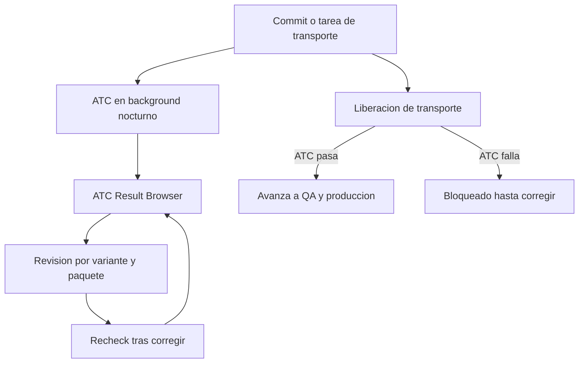

Un ATC que solo corre cuando un desarrollador se acuerda de pulsar `Ctrl + Shift + F2` es un ATC opcional. Y la calidad opcional es la que no ocurre. El objetivo real es que el chequeo se dispare solo, de forma sistemática, sin depender de la voluntad de nadie. El ATC trae las piezas para eso; solo hay que ordenarlas.

## Las tres piezas de un ATC continuo

- **Ejecución en background**: las verificaciones se programan por la noche o en procesos batch sobre múltiples paquetes, sin bloquear a nadie.
- **ATC Result Browser**: la vista que recoge esas ejecuciones programadas, categorizadas por variante, con errores, advertencias e infos, nombre de serie y fecha. Es el panel de control de la calidad del proyecto.
- **Puerta de calidad en el transporte**: el ATC se integra en la liberación de órdenes y puede permitir o bloquear la migración según el resultado del chequeo.

Esas tres piezas juntas son, en la práctica, integración continua para ABAP: verificación automática, resultados centralizados y un gate que impide que lo defectuoso avance.



## El ciclo en el Result Browser

El flujo diario del equipo no es lanzar el ATC a mano, sino leer los resultados que ya corrieron de noche. Desde el `ATC Result Browser`:

- `Go to Details` o doble clic te lleva al hallazgo directamente en el editor.
- `Analyze Result in ATC Problems View` lo abre en la vista tradicional para trabajarlo.
- `Recheck` vuelve a ejecutar la misma variante tras tu corrección, para confirmar que quedó resuelto.

Ese `Recheck` es el equivalente ABAP a volver a lanzar el build tras un fix: cierras el ciclo sin cambiar de herramienta ni de vara de medir.

## El gate donde de verdad se juega

La verificación de órdenes de transporte es lo que convierte al ATC de recomendación en control. Lanzas el chequeo sobre la orden o la tarea, igual que sobre un objeto:

```abap
" Conceptual: la orden de transporte agrupa varios objetos
" ATC sobre la orden -> evalua todos de una vez con la variante gobernada
" Rojos presentes -> el gate bloquea la liberacion
" Cero rojos -> la orden avanza a QA

" El caso que el gate atrapa antes de produccion:
DATA lv_result TYPE i.
lv_result = 1 / lv_divisor.   " division sin control de cero
```

Ese error no rompe la compilación, rompe producción. El gate del ATC es la última oportunidad barata de pararlo.

> La integración continua en ABAP no es un servidor Jenkins pintado de nuevo. Es el ATC ejecutándose de noche, el Result Browser como panel y el transporte como gate. Simple, y casi nadie lo activa.

Con esto cerramos la serie de ATC: de por qué sustituye al Code Inspector a cómo lo conviertes en un control continuo que trabaja mientras tú duermes.
