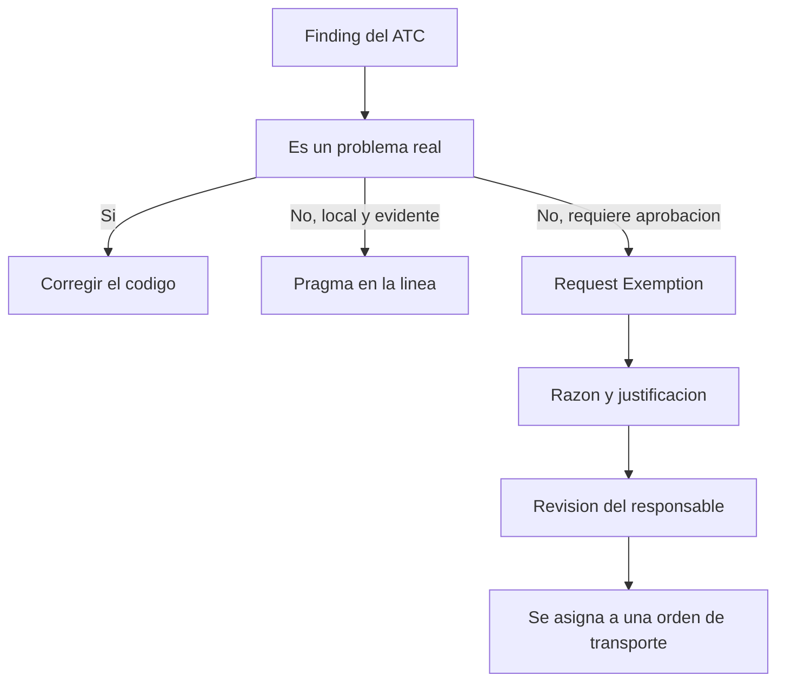

El ATC solo sirve si corre mientras escribes, no cuando ya no hay marcha atrás. Y en cuanto lo integras en el día a día aparece la pregunta incómoda: **¿qué hago con el hallazgo que sé que es un falso positivo?**. Hay tres respuestas, y elegir la correcta es lo que separa un código honesto de uno que esconde deuda.

## Tres formas de silenciar un hallazgo

- **Pseudocomentarios**: directivas de programa heredadas del Code Inspector. En su mayoría están obsoletos y reemplazados por pragmas, pero siguen siendo relevantes en algunos escenarios del inspector.
- **Pragmas**: directivas modernas que ocultan advertencias tanto del compilador como de la comprobación extendida. Son la forma recomendada hoy.
- **Exemptions (exenciones)**: aprueban un finding **sin tocar el código**, con una justificación revisada y aprobada por un responsable.

La regla mental: pragma o pseudocomentario cuando la excepción es local y evidente en la línea; exención cuando necesitas trazabilidad y aprobación formal.



## Pragmas y pseudocomentarios en código

El pseudocomentario va detrás de la sentencia con `"#EC`. El pragma va con `##`:

```abap
" Pseudocomentario heredado: SUBRC sin evaluar de forma intencionada
SELECT FROM sflight FIELDS *
  WHERE currency EQ 'USD'
  INTO TABLE @DATA(t_source).   "#EC CI_SUBRC

" Pragma moderno: la variable se declara a proposito aunque no se use aun
MESSAGE 'Message Text' INTO DATA(lv_message) ##NEEDED.
```

¿No recuerdas el pragma equivalente a un pseudocomentario viejo? SAP trae el programa **ABAP_SLIN_PRAGMAS**, que usa la tabla `SLIN_DESC` para mapear equivalencias. Los pragmas disponibles viven en `TRPRAGMA` y `TRPRAGMAT`.

## El proceso de exención

Para un hallazgo que no vas a corregir pero necesita constar, en `ATC Problems` o `ATC Result Browser` seleccionas `Request Exemption`. Eliges una razón (falso positivo u otra), escribes una justificación y la solicitud se asigna automáticamente a una orden de transporte. Queda registrado quién la pidió, la fecha de validez y quién la aprobó. Si el mismo usuario que la crea la aprueba, el campo de aprobador queda en blanco, y eso es exactamente lo que un buen gobierno de calidad no debería permitir de forma rutinaria.

- Corrige siempre que puedas: es lo único que reduce deuda de verdad.
- Exime solo lo que un revisor firmaría delante del cliente.
- Nunca uses un pragma para tapar un problema crítico de rendimiento o seguridad.

> Un pragma bien puesto documenta una decisión. Un pragma mal puesto entierra un bug. El ATC no sabe la diferencia; tú sí.

En el próximo post: cómo usar el ATC para preparar código heredado de cara a ABAP Cloud.
