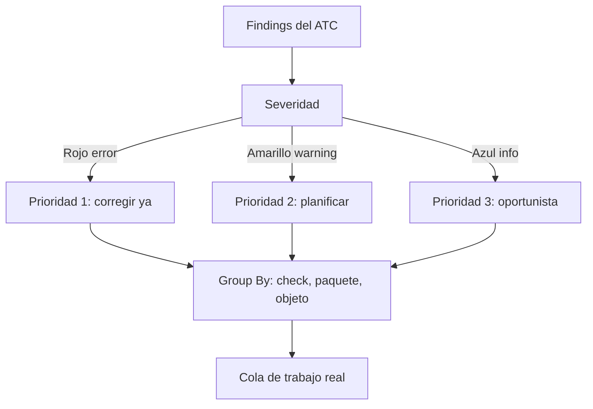

La primera vez que lanzas el ATC sobre un paquete grande, la reacción natural es cerrar la ventana. Miles de puntos rojos, amarillos y azules. La trampa es pensar que todo eso es trabajo pendiente. No lo es: es una lista sin priorizar, y priorizarla es la única forma de que el ATC sea útil en lugar de deprimente.

## Los tres colores y qué significan

El ATC clasifica cada hallazgo por severidad, y el color no es decorativo:

- **Rojo (error)**: problemas graves que impactan directamente en el funcionamiento. Prioridad uno, siempre.
- **Amarillo (warning)**: advertencias. No son una amenaza inmediata, pero conviene resolverlas para cumplir estándares.
- **Azul (info)**: informativo. Mejora la calidad, rara vez urge.

Importante: ninguno de estos impide que el código se ejecute. El ATC no mide si el programa funciona hoy, mide si te va a doler mañana, en rendimiento, seguridad o compatibilidad.



## Agrupar para ver patrones, no líneas

Una lista plana de tres mil findings esconde el hecho de que a lo mejor son diez problemas repetidos mil veces. El ATC permite agrupar: clic derecho sobre cualquier hallazgo, `Group By`, y eliges el criterio (por check, por paquete, por objeto). De repente ese muro se convierte en cinco categorías atacables.

```abap
" Antes: 400 findings identicos de acceso directo a tabla
" Group By check -> 1 patron, 1 decision, correccion masiva

" El patron a erradicar:
SELECT SINGLE * FROM mara INTO @DATA(ls_mara)
  WHERE matnr = @lv_matnr.

" La correccion que aplicas de forma sistematica:
SELECT SINGLE matnr, mtart, meins FROM i_product
  WHERE product = @lv_matnr
  INTO @DATA(ls_product).
```

Agrupar convierte "corregir 400 cosas" en "tomar 1 decisión y aplicarla 400 veces". Es la diferencia entre semanas y horas.

## La estrategia que sí escala

- **Baseline primero**: congela el histórico, para que cada ejecución te muestre lo que introduces tú, no la deuda de diez años.
- **Rojos sin excepción**: los errores se corrigen antes de transportar. No hay negociación.
- **Amarillos por lote**: agrupados por patrón y planificados, no atacados al azar.
- **Azules oportunistas**: cuando ya tocas el objeto por otra razón.

> Priorizar no es hacer menos calidad. Es dejar de tratar un info azul con la misma urgencia que un error rojo, que es como se muere de agotamiento cualquier iniciativa de calidad.

En el próximo post: cómo llevar el ATC a un pipeline de CI para que la calidad no dependa de que alguien se acuerde de ejecutarlo.
