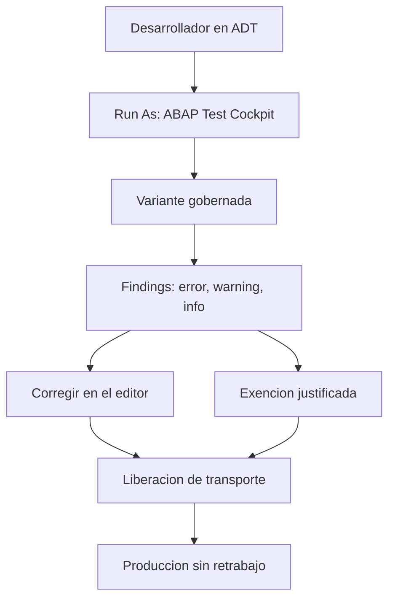

Todavía hay equipos que abren la SE80, lanzan un Code Inspector, miran la lista y siguen a lo suyo. El **ABAP Test Cockpit (ATC)** existe justamente para que eso deje de ser un ritual manual y pase a ser parte del flujo. No es marketing: es un cambio de modelo mental sobre dónde vive la calidad.

## Qué es el ATC de verdad

El ATC es una herramienta para comprobar la calidad del código en entornos ABAP. Ejecuta chequeos automáticos y configurables sobre objetos individuales, paquetes completos y órdenes de transporte, siempre basándose en **variantes** que definen los administradores. Vive dentro de ADT en Eclipse, con sus vistas propias: **ATC Problems**, **ATC Results**, **ATC Exemptions** y el **ATC Result Browser**.

La diferencia con el viejo Code Inspector no es cosmética:

- **Variantes gobernadas**: los administradores fijan una variante estándar (por ejemplo `ABAP_CLOUD_DEVELOPMENT_DEFAULT`) y todo el equipo mide con la misma vara.
- **Alcance masivo**: chequea un objeto, un paquete entero o una orden de transporte con la misma acción.
- **Exenciones con justificación**: un hallazgo que no vas a corregir se aprueba con una razón revisable, no se ignora en silencio.
- **Puerta de calidad en el transporte**: el ATC se integra en la liberación de órdenes y puede bloquear la migración si el código no pasa.



## Lanzarlo cuesta un atajo

Sobre una clase o un programa, clic derecho, `Run As`, `ABAP Test Cockpit`, o directamente `Ctrl + Shift + F2`. Se ejecuta la variante por defecto y la vista te lista los puntos a corregir con su descripción, línea, tipo de objeto y check. A la derecha aparece el detalle y la recomendación.

Los hallazgos del ATC no impiden que el código se ejecute. Apuntan a otra cosa: mantenibilidad, rendimiento, seguridad y compatibilidad futura. Es exactamente el tipo de deuda que no explota en la demo y sí en el upgrade.

```abap
SELECT FROM sflight FIELDS *
  WHERE currency EQ 'USD'
  INTO TABLE @DATA(t_source).   "#EC CI_SUBRC
```

Ese `"#EC CI_SUBRC` es un pseudocomentario heredado precisamente del Code Inspector: le dice al chequeo que ese `SUBRC` sin evaluar es intencionado. El ATC entiende ese legado, pero te empuja hacia pragmas modernos.

## Por qué el cambio importa

- El Code Inspector era una foto puntual que sacabas cuando te acordabas.
- El ATC es un proceso continuo, con variante común, ejecución en background y trazabilidad de exenciones.

> La calidad no es una lista que revisas el viernes antes de transportar. Es un control que el sistema aplica por ti, con la misma regla para todo el equipo.

En el próximo post: cómo se eligen las variantes de chequeo y por qué necesitas una baseline antes de tocar código heredado.
