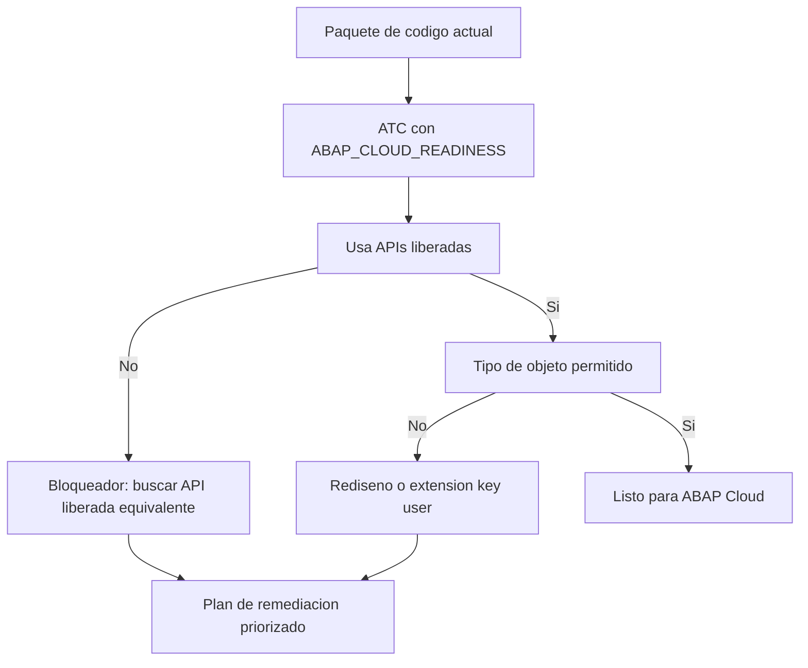

Migrar a ABAP Cloud sin medir antes es firmar un cheque en blanco. La buena noticia: el ATC ya trae el instrumento para saber qué de tu código está listo para la nube y qué te va a frenar. Se llama **ABAP_CLOUD_READINESS** y es la diferencia entre planificar y rezar.

## Qué comprueba la variante de readiness

`ABAP_CLOUD_READINESS` es una verificación básica de preparación para la nube. No es la variante de desarrollo diario; su trabajo es auditar. Comprueba lo esencial para el entorno cloud:

- **Uso de APIs liberadas**: si tu código llama a algo no liberado por SAP, en ABAP Cloud simplemente no lo tendrás.
- **Tipos de objeto permitidos**: no todo tipo de objeto existe o está permitido en el modelo de desarrollo cloud.
- **Construcciones del lenguaje compatibles** con ABAP for Cloud Development.

La idea es lanzar esta variante sobre paquetes completos y obtener un inventario real de bloqueadores, no una intuición.



## Del hallazgo al plan

El ATC no migra por ti; te da el mapa. Un patrón típico que la variante de readiness marca es el acceso directo a tablas estándar que en ABAP Cloud debe pasar por una API o una CDS liberada:

```abap
" Rojo en ABAP_CLOUD_READINESS: acceso directo a tabla estandar
SELECT FROM vbak FIELDS vbeln, erdat
  INTO TABLE @DATA(lt_orders).

" Verde: consumir la CDS liberada equivalente
SELECT FROM i_salesorder FIELDS salesorder, creationdate
  INTO TABLE @DATA(lt_orders_cloud).
```

El primer bloque funciona en tu ECC o S/4 clásico y muere en ABAP Cloud. El segundo respeta el contrato de estabilidad. La variante de readiness es la que te separa uno del otro antes de que sea tarde.

## Cómo lo usamos en un proyecto de migración

- Lanzar `ABAP_CLOUD_READINESS` en background sobre todos los paquetes custom.
- Revisar los resultados en el `ATC Result Browser`, agrupados por check y por paquete.
- Clasificar: lo que tiene API liberada equivalente (cambio mecánico) frente a lo que exige rediseño o una extensión key user.
- Priorizar por volumen y criticidad, no por orden alfabético.

> La variante de readiness no hace la migración más rápida. Hace que sepas cuánto cuesta antes de comprometerte, que es justo lo que falta en la mayoría de estimaciones.

En el próximo post: cómo priorizar los hallazgos del ATC para no ahogarte entre rojos, amarillos y azules.
