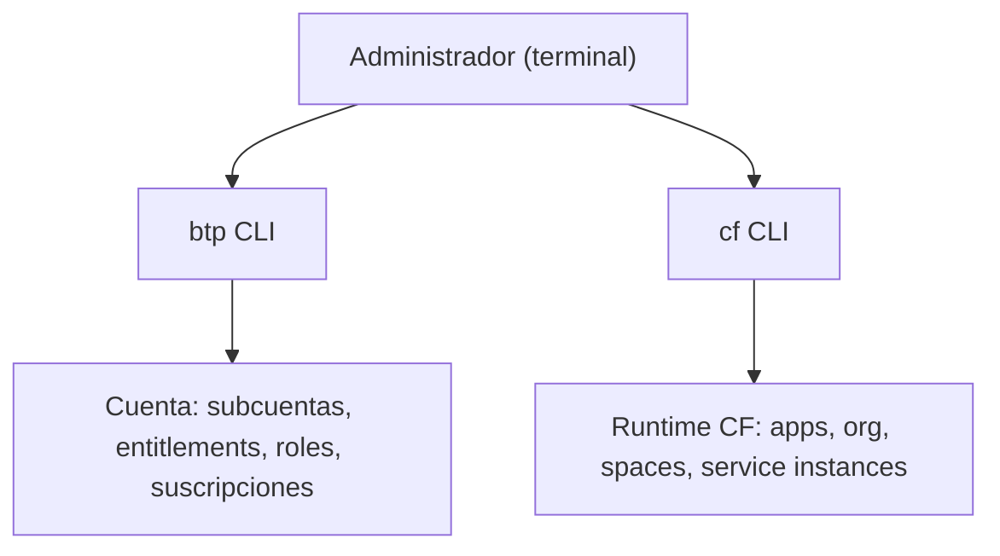

El BTP Cockpit es una interfaz gráfica excelente para explorar la plataforma y hacer una configuración puntual. Pero nada de lo que haces en el Cockpit queda reflejado en un script, ni se repite igual entre entornos, ni se revisa en un pull request. Para gobernanza de verdad, la terminal no es opcional.

## Dos CLIs, dos ámbitos

Aquí hay una confusión habitual que conviene fijar de entrada:

- **btp CLI**: administra la **cuenta**. Global account, directorios, subcuentas, entitlements, colecciones de roles, suscripciones. Es la herramienta del administrador de plataforma.
- **cf CLI**: administra el **runtime de Cloud Foundry**. Apps, instancias de servicio, organizaciones, espacios y usuarios dentro de una subcuenta con CF habilitado. La CLI de CF ejecuta llamadas REST contra la instancia de Cloud Foundry.

Todos los proveedores de Cloud Foundry usan **la misma cf CLI**, no solo SAP: es un estándar de código abierto. Eso significa que lo que aprendes aquí es transferible.



## cf CLI: el flujo mínimo

Antes de tocar nada, te conectas y fijas el objetivo (org y space). Trabajar sin `target` claro es la receta para desplegar en el sitio equivocado:

```bash
# Fijar el endpoint del API de la region
cf api https://api.cf.eu10.hana.ondemand.com

# Conectar
cf login -u usuario@empresa.com

# Ver y fijar organizacion y espacio de destino
cf target -o MI_ORG -s DEV

# Listar organizaciones y espacios disponibles
cf orgs
cf spaces

# Operar sobre aplicaciones
cf apps
cf logs MI_APP --recent
cf restart MI_APP
```

## Por qué esto es gobernanza, no comodidad

El valor de la CLI no es escribir más rápido. Es que **todo queda reproducible y auditable**:

1. Un script de aprovisionamiento crea la misma subcuenta con los mismos entitlements en DEV, QA y PROD, sin desviaciones humanas.
2. La separación administrativa de Cloud Foundry deja que administradores y desarrolladores trabajen en paralelo sobre la misma org.
3. Cada comando puede vivir en un repositorio, revisarse y ejecutarse en un pipeline. El Cockpit, no.

Comandos que conviene tener a mano en el día a día con cf CLI: `cf routes` para ver rutas, `cf domains` para dominios, `cf create-user` y `cf delete-user` para gestión de usuarios de plataforma, y `cf copy-source` para promocionar el código de una app a otra sin volver a compilar.

> El clic en el Cockpit se olvida en cuanto cierras la pestana. El comando en un script sigue documentando, un ano despues, exactamente que se aprovisiono y por que.

En el próximo post: subscriptions y service instances, los dos tipos de recurso que administrarás con estas mismas herramientas.
