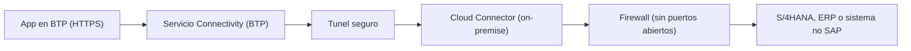

La pregunta llega en todos los proyectos: "necesito que mi app en BTP hable con el S/4HANA on-premise, abro un puerto del firewall y ya". No. Abrir un puerto por cada servicio, exponiendo sistemas internos directamente a internet, es exactamente lo que **no** se hace. La plataforma tiene un mecanismo mejor y más seguro.

## Cloud Connector: el túnel, no la puerta

El **SAP Cloud Connector** es un agente **on-premise** que actúa como proxy, estableciendo un túnel seguro entre tu red interna y la subcuenta de BTP. Una vez configurado, **solo** los productos SAP Cloud o las apps que hayas desplegado en la plataforma pueden alcanzar los sistemas internos. Y con control granular: decides qué sistemas y qué recursos concretos quedan expuestos, nada más.

Sus características clave:

- Enlace entre apps de BTP y sistemas locales, SAP y no SAP.
- Recuperación automática de conexiones rotas y registros de auditoría del tráfico entrante.
- Configuraciones de alta disponibilidad para escenarios críticos.



## Destinations: la configuración de la conexión

Un **destination** define cómo una app o servicio de BTP se conecta a un sistema externo: nombre único, tipo (protocolo), URL, credenciales y parámetros. Se gestionan desde el menú **Connectivity** del Cockpit, donde puedes crear, editar, importar destinos y certificados, y renovar la confianza.

Hay tres tipos principales:

- **HTTP**: comunicación por HTTP/HTTPS. Para consumir una API REST, un servicio OData o un S/4HANA on-premise.
- **RFC**: configuración para hablar con un sistema ABAP local vía Remote Function Call, usando el Java Connector (JCo).
- **Correo (mail)**: para especificar un proveedor SMTP y enviar o recibir correos desde un servicio BTP.

## Las propiedades que de verdad usarás

Un destination HTTP hacia un S/4HANA rara vez funciona sin las propiedades adicionales correctas. Un ejemplo de destination bien tipado hacia un catálogo de servicios ABAP:

```json
{
  "Name": "S4H_ONPREM",
  "Type": "HTTP",
  "URL": "http://s4host.corp:8000",
  "ProxyType": "OnPremise",
  "Authentication": "BasicAuthentication",
  "sap-client": "100",
  "sap-language": "ES",
  "WebIDEEnabled": "true",
  "WebIDEUsage": "odata_abap,dev_abap",
  "HTML5.DynamicDestination": "true"
}
```

Fíjate en tres decisiones:

1. `ProxyType: OnPremise` es lo que enruta la petición por el Cloud Connector en vez de salir a internet.
2. `sap-client` y `sap-language` son obligatorias para sistemas S/4HANA: sin ellas, el logon falla o cae en el mandante equivocado.
3. `WebIDEUsage: odata_abap,dev_abap` habilita el catálogo de servicios y el despliegue en el repositorio ABAP desde Business Application Studio.

> Abrir un puerto es rapido hoy y una brecha de seguridad manana. El tunel del Cloud Connector cuesta una configuracion y te ahorra el incidente.

En el próximo post: administrar todo esto desde la terminal con la btp CLI, sin depender del Cockpit.
