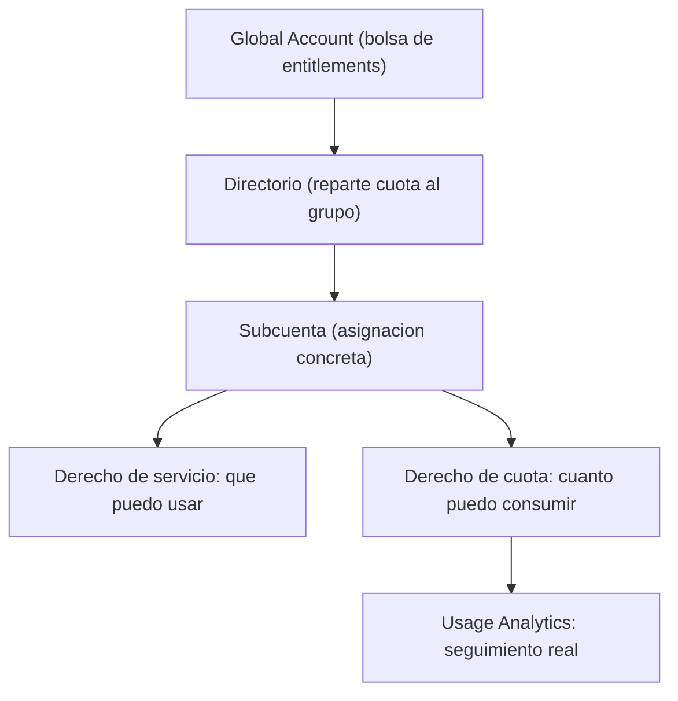

Tener una global account no significa que puedas usar nada todavía. Significa que SAP te ha entregado un saco de **derechos y cuotas** que tú, y solo tú, tienes que repartir. Ese reparto es la palanca de control de gasto más importante de toda la plataforma, y casi nadie la trata con el respeto que merece.

## Los dos tipos de derecho

En el apartado **Entitlements** del BTP Cockpit se define qué recursos y servicios están autorizados dentro de la plataforma. Hay dos categorías, y confundirlas es el primer error:

- **Derechos de servicio**: definen el **acceso** a servicios concretos (runtime de Cloud Foundry, herramientas de desarrollo, capacidades de integración). Especifican qué funciones y planes puedes usar.
- **Derechos de cuota**: definen los **límites de consumo** de esos servicios. Memoria, almacenamiento, uso de CPU, número de instancias. Es el techo de gasto real.

La distinción importa: tener el derecho de servicio activo no cuesta nada; agotar la cuota sí. El control de costes vive en la cuota, no en el servicio.



## El flujo de reparto, de arriba abajo

Los entitlements bajan por la jerarquía. La global account los recibe; los directorios los reparten a nivel de grupo; las subcuentas reciben su asignación concreta. Cuando existe un directorio en medio, la administración de cuotas y derechos de las subcuentas **también se hace en el directorio**. Eso es exactamente lo que convierte la jerarquía del post anterior en una herramienta de presupuesto y no en un dibujo.

Y para cerrar el círculo, el apartado **Usage Analytics** te deja monitorear qué se consume de verdad:

- Uso de servicio: instancias en ejecución, memoria, almacenamiento, llamadas API.
- Uso de aplicaciones personalizadas desplegadas.
- Métricas de Cloud Foundry: CPU, memoria, tiempo de actividad por app.

## Gobernanza desde el día 1

Con la btp CLI el reparto deja de ser clics y pasa a ser un script auditable:

```bash
# Ver los entitlements asignados a una subcuenta
btp list accounts/entitlement --subaccount <SUBACCOUNT_ID>

# Asignar un servicio con su plan y su cuota a una subcuenta
btp assign accounts/entitlement \
  --to-subaccount <SUBACCOUNT_ID> \
  --for-service hana-cloud \
  --plan hana \
  --amount 1
```

Nuestra disciplina en cada proyecto:

1. Reparte cuota **explícitamente** por subcuenta. Nunca dejes producción con "todo lo disponible": esa es la factura sorpresa.
2. Reserva un plan gratuito para pruebas cuando exista (algunos servicios ofrecen 90 dias), pero no lo confundas con el plan productivo.
3. Revisa Usage Analytics antes de que lo haga Finanzas, no despues.

> El entitlement que no repartes hoy con criterio es el sobrecoste que descubres a fin de mes sin saber de qué subcuenta salio.

En el próximo post: el modelo de roles y usuarios, donde el control de acceso se vuelve tan granular como el de cuotas.
