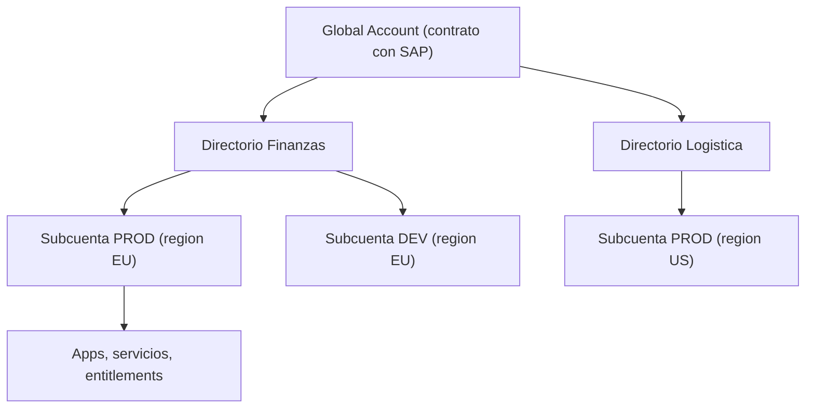

La mayoría de los desastres de gobernanza en SAP BTP no vienen de un servicio mal configurado. Vienen de **no haber decidido, antes de crear la primera subcuenta, cómo se organiza la jerarquía de cuentas**. Y cuando llega la primera auditoría de costes o el primer incidente de seguridad, ya es tarde para reordenar.

## Los tres niveles que importan

- **Global account**: es el contrato con SAP. Aquí llegan los **derechos y cuotas** (entitlements) y aquí se decide el modelo comercial: basado en consumo o basado en suscripción. No consume recursos por sí misma; los reparte.
- **Directorios**: una capa **opcional** de agrupación. Sirve para organizar subcuentas por proyecto, equipo, departamento o empresa. Un directorio puede contener otros directorios y subcuentas, formando una jerarquía real.
- **Subcuentas**: aquí ocurre todo lo operativo. Se suscriben aplicaciones, se despliegan servicios y se administra el acceso. Cada subcuenta es **independiente** en región, administradores y tipo de licencia.

La regla de oro: **la subcuenta es la unidad de aislamiento**. Región, usuarios y entitlements se deciden ahí. Si mezclas producción y pruebas en la misma subcuenta, no tienes una frontera, tienes un accidente esperando.



## Por qué los directorios no son opcionales de verdad

SAP los llama opcionales, y lo son técnicamente. Pero en cuanto tienes más de tres o cuatro subcuentas, gestionar entitlements plano se vuelve inmanejable. El directorio te permite **repartir cuotas y derechos** a nivel de grupo y delegar administración. Cada directorio, como cada global account y cada subcuenta, exige al menos un usuario administrador.

Con la btp CLI la jerarquía es inspeccionable y reproducible desde la terminal, no un dibujo que solo vive en el Cockpit:

```bash
# Ver la estructura completa de la global account
btp get accounts/global-account --show-hierarchy

# Listar directorios y subcuentas
btp list accounts/subaccount

# Crear una subcuenta dedicada por entorno, con su region
btp create accounts/subaccount \
  --display-name "Finanzas-PROD" \
  --region eu10 \
  --subdomain finanzas-prod
```

Nuestra recomendación práctica al arrancar cualquier proyecto:

1. Un directorio por dominio funcional o unidad de negocio, no por capricho organizativo.
2. Subcuentas separadas por **entorno** (DEV, QA, PROD), nunca compartidas.
3. La región se elige por dónde están los usuarios finales y por el proveedor de infraestructura (Azure, GCP, AWS, Alibaba), y **no se cambia**: es inmutable por subcuenta.

## El error que verás en todos los proyectos

Una única subcuenta gigante donde conviven desarrollo, pruebas y producción, con todos los administradores viendo todo. Funciona el primer mes y es imposible de auditar el día que Finanzas pregunta cuánto cuesta cada proyecto.

> Diseñar la jerarquía cuesta una tarde hoy. No diseñarla cuesta rehacer toda la seguridad y la facturación cuando el proyecto ya está en producción.

En el próximo post: cómo los entitlements y las cuotas convierten esta jerarquía en un presupuesto que no se desborda.
