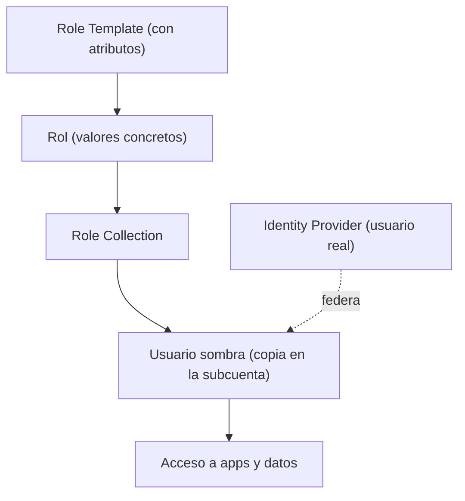

En SAP BTP no asignas permisos a usuarios. Nunca directamente. Entre el permiso y la persona hay una cadena de tres eslabones que existe por una razón de seguridad muy concreta, y quien la ignora acaba con un modelo de accesos imposible de auditar.

## La cadena: plantilla, rol, colección

- **Role template (plantilla de rol)**: el punto de partida predefinido. Trae los atributos que controlan el acceso a datos. Solo debes crear roles **a partir de plantillas**.
- **Rol**: un conjunto concreto de permisos, instanciado desde una plantilla. Aquí se fijan los valores de los atributos.
- **Role collection (colección de roles)**: agrupa uno o varios roles. Es lo que **se asigna** a usuarios o grupos.

La regla de oro: **asignas colecciones, no roles sueltos**. Y esas colecciones se asignan a **usuarios sombra**, no a la identidad real.



## Qué es un usuario sombra y por qué existe

Todos los usuarios se almacenan en un **Identity Provider** (SAP ID por defecto, o uno personalizado). Cuando haces una acción sobre un usuario, BTP crea una **copia local**: el usuario sombra. Las colecciones de roles se asignan a esa copia, no al usuario original. Así los datos de identidad quedan protegidos en el IdP.

Detalle que importa en RGPD: cuando un empleado deja la empresa, a veces hay que **eliminar el usuario sombra** para cumplir con protección de datos. Si no sabías que existía, no lo estás limpiando.

## Colecciones predefinidas y atributos

BTP trae colecciones que **no se pueden modificar ni borrar**. Las que se usan a diario:

- `Global Account Administrator`, `Subaccount Administrator`, `Directory Administrator`: acceso administrativo por nivel.
- `Connectivity and Destination Administrator`, `Cloud Connector Administrator`: para conectividad.
- Las variantes `Viewer`: solo lectura.

Lo potente viene con los **atributos de rol**, que habilitan autorizaciones basadas en instancia: un usuario solo ve un subconjunto de datos (por país, por centro de almacén). Pueden ser:

1. **Estáticos**: el valor se fija al asignar el rol en la colección.
2. **De IdP personalizado**: el valor lo aporta el proveedor de identidad.
3. **Sin restricción**: no hace falta valor concreto.

Y desde la btp CLI, asignar una colección a un usuario es una línea reproducible, no un clic irrepetible:

```bash
# Listar las colecciones de roles de una subcuenta
btp list security/role-collection --subaccount <SUBACCOUNT_ID>

# Asignar una coleccion de roles a un usuario
btp assign security/role-collection "Subaccount Administrator" \
  --to-user admin@empresa.com \
  --subaccount <SUBACCOUNT_ID>
```

> El modelo de tres eslabones parece burocracia hasta la primera auditoria. Ahi descubres que asignar permisos directos era la deuda tecnica mas cara de todo el proyecto.

En el próximo post: destinations y conectividad, donde estos usuarios y roles se cruzan con los sistemas on-premise.
