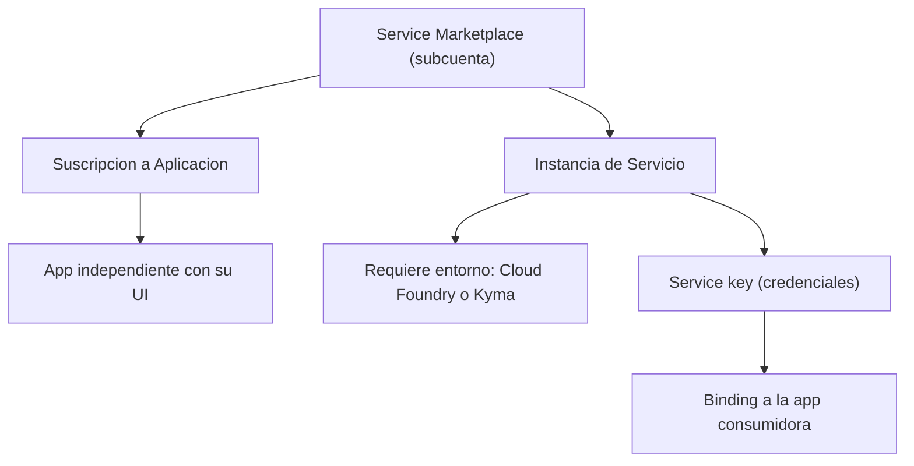

En el Service Marketplace de una subcuenta hay dos cosas que parecen iguales y no lo son: **aplicaciones que se suscriben** e **instancias de servicio que se crean**. Elegir mal entre ellas es el origen silencioso de la mitad de los problemas de arquitectura y cuota en BTP. Vamos a separarlas de una vez.

## Aplicaciones (subscriptions)

Una **aplicación** en BTP es un servicio **independiente** que se ejecuta **sin** necesidad de un entorno de ejecución adicional ni de otro servicio. La mayoría trae su propia interfaz que abres y usas directamente. Suelen consumir cuotas limitadas. Ejemplos: SAP Business Application Studio, SAP Build Apps, el ABAP Environment.

Te **suscribes** a ellas. En el apartado **Instances and Subscriptions** de la subcuenta ves qué suscripciones están asignadas.

## Instancias de servicio (service instances)

Una **instancia de servicio** es un recurso que **sí requiere un entorno adicional** (Cloud Foundry o Kyma) para funcionar. Son un conjunto de capacidades que consumes vía API o vía enlaces (bindings). Se crean desde el Cockpit o desde la cf CLI.

Lo que hay que tener claro al crearlas:

- Primero eliges el **plan de servicio** adecuado. Algunos ofrecen un plan gratuito para probar durante un tiempo limitado, por ejemplo 90 dias.
- Al crear la instancia se genera una **clave de instancia** (service key) que la app usa para acceder al servicio.
- Sirven para conectar y extender aplicaciones, propias, de SAP o de terceros, y para acceder a datos, análisis o IA.



## Crear una instancia desde la cf CLI

Como cierre de la serie, así se instancia y se enlaza un servicio desde terminal, reproducible y auditable:

```bash
# Ver los servicios y planes disponibles en el marketplace
cf marketplace

# Crear una instancia de servicio con su plan
cf create-service xsuaa application mi-xsuaa

# Generar una service key para inspeccionar credenciales
cf create-service-key mi-xsuaa mi-key

# Enlazar la instancia a una aplicacion desplegada
cf bind-service MI_APP mi-xsuaa
cf restart MI_APP
```

## La decisión que evita el retrabajo

La pregunta correcta antes de tocar el marketplace no es "¿qué servicio quiero?" sino "**¿es una app que se suscribe o un servicio que se instancia y se enlaza?**". De esa respuesta dependen el plan, la cuota que gastas y si necesitas un entorno CF o Kyma detrás.

> Suscribirse a lo que habia que instanciar, o al reves, no falla el dia de la demo. Falla el dia que intentas escalar y descubres que la arquitectura estaba mal desde el marketplace.

Con esto cerramos la serie de administración de SAP BTP: jerarquía, entitlements, roles, conectividad, CLI y servicios. Gobernanza desde el día 1, no como parche.
