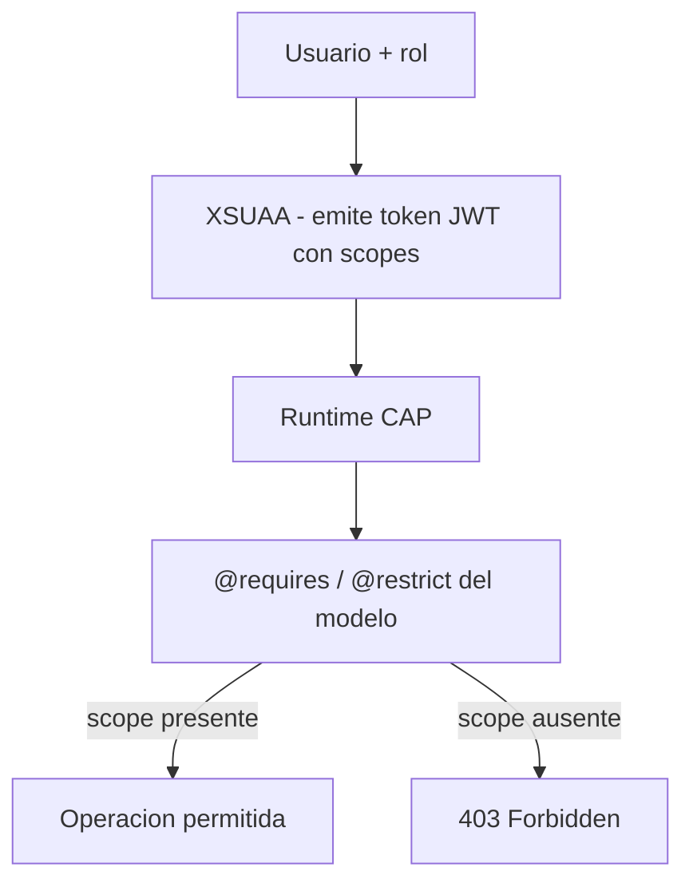

La peor forma de proteger un servicio CAP es la que se ve en demasiados proyectos: un `if (req.user.is('admin'))` desperdigado por los handlers. Se olvida uno, y ya tienes un agujero. CAP hace lo contrario: **la autorizacion se declara en el modelo con anotaciones**, y el runtime la aplica en todas las operaciones sin que escribas un solo `if`.

## Las dos piezas: quien eres y que puedes

- **Autenticacion (quien eres)**: la resuelve **XSUAA**, el servicio de BTP que emite y valida el token JWT. CAP no gestiona usuarios; confia en el token.
- **Autorizacion (que puedes)**: la declaras en CDS con `@requires` y `@restrict`. El runtime compara los **scopes** del token contra la anotacion.



## Declarar permisos en el modelo, no en el codigo

La seguridad vive junto a la entidad que protege. Aqui `Products` exige un usuario autenticado, y solo el rol `Admin` puede escribir:

```cds
service CatalogService @(requires: 'authenticated-user') {

  entity Products @(restrict: [
    { grant: 'READ',            to: 'authenticated-user' },
    { grant: ['CREATE','UPDATE','DELETE'], to: 'Admin' }
  ]) as projection on com.logali.Products;

  entity Reviews @(readonly) as projection on com.logali.ProductReview;
}
```

Lo potente es que esto no es documentacion: es ejecutable. El runtime bloquea un DELETE de quien no tenga el rol `Admin`, en todas las rutas, sin que toques un handler. Un `if` olvidado no puede pasar porque no hay `if`.

## El xs-security.json: donde el rol se hace scope

XSUAA no entiende "roles" a secas; entiende **scopes** y **role templates**. El `xs-security.json` es el puente entre el nombre de rol de tu anotacion y lo que el token lleva dentro:

```json
{
  "xsappname": "products-catalog",
  "scopes": [
    { "name": "$XSAPPNAME.Admin", "description": "Administrador del catalogo" }
  ],
  "role-templates": [
    { "name": "Admin", "scope-references": [ "$XSAPPNAME.Admin" ] }
  ]
}
```

El `Admin` de tu `@restrict` casa con el role template `Admin`, que referencia el scope `$XSAPPNAME.Admin`. Ese scope viaja en el JWT que emite XSUAA. Si el trio (anotacion, role template, scope) no cuadra, el usuario correcto recibe un 403 y te vuelves loco buscando el fallo en el codigo, donde no esta.

## El error que cuesta una tarde de depuracion

Poner el `@restrict` en el modelo y olvidar el scope en `xs-security.json`, o desplegar sin rebindear XSUAA. El servicio deniega todo y no hay traza util en Node, porque el rechazo ocurre en la capa de autorizacion declarativa, no en tu logica. Antes de tocar codigo, revisa siempre que el rol de la anotacion existe como scope y esta asignado.

> En CAP la seguridad es parte del modelo, no un adorno del handler. Si tu autorizacion depende de que nadie olvide un `if`, no tienes autorizacion, tienes suerte.

Con esto cerramos la serie de CAP: del modelo CDS a los permisos, el mismo principio en todo, declara lo que se puede declarar y programa solo lo que no.
