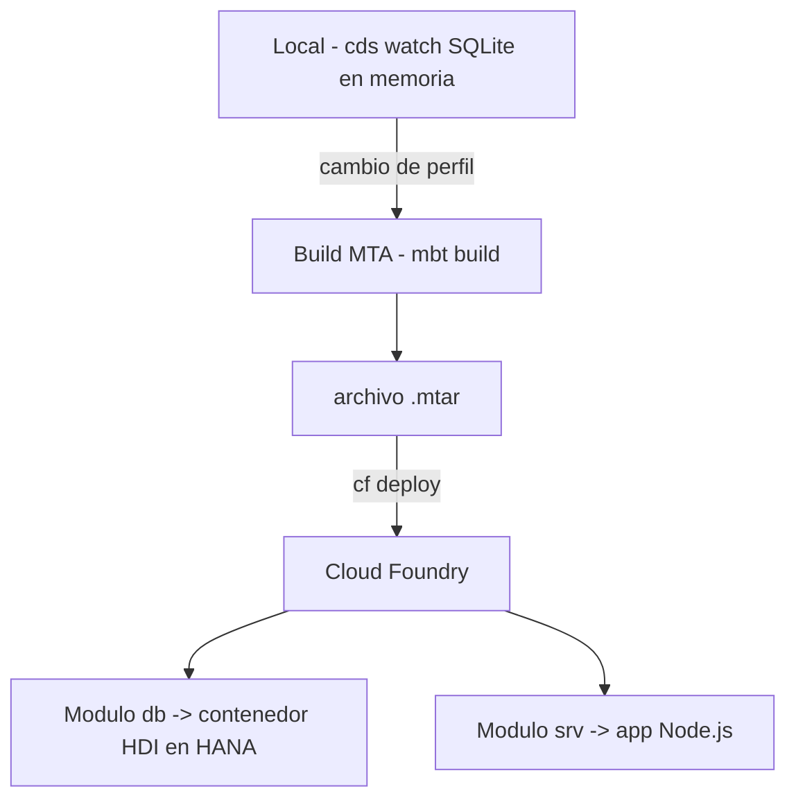

En tu portatil, `cds watch` levanta el proyecto con una base SQLite en memoria y todo funciona en segundos. Ese es exactamente el problema: **la facilidad local esconde todo lo que cambia al desplegar en BTP**. El salto a Cloud Foundry no es un `push` mas; es pasar de un proceso a varios modulos que hay que orquestar.

## Lo que cambia entre local y produccion

- La base deja de ser SQLite en memoria y pasa a ser **HANA Cloud** con un contenedor **HDI** (HANA Deployment Infrastructure).
- El proyecto deja de ser una carpeta y pasa a ser una **aplicacion MTA** (Multi-Target Application) con varios modulos.
- La conexion a la base ya no esta en `default-env.json` local, sino en un **service binding** de Cloud Foundry.



## El mta.yaml: quien depende de quien

El `mta.yaml` es el fichero que declara los modulos y sus dependencias. Sin el, Cloud Foundry no sabe que el servicio necesita la base antes de arrancar:

```yaml
modules:
  - name: products-srv
    type: nodejs
    path: gen/srv
    requires:
      - name: products-db
      - name: products-uaa

  - name: products-db-deployer
    type: hdb
    path: gen/db
    requires:
      - name: products-db

resources:
  - name: products-db
    type: com.sap.xs.hdi-container
  - name: products-uaa
    type: org.cloudfoundry.managed-service
    parameters:
      service: xsuaa
      service-plan: application
```

Fijate en el `requires`: el modulo `srv` depende del `db` y del `uaa`. Ese grafo es lo que garantiza el orden de despliegue. Si lo omites, tu servicio arranca antes de que exista la tabla y revienta en el primer request.

## Perfiles: la misma app, dos configuraciones

CAP resuelve el "en local una cosa, en produccion otra" con perfiles en `package.json`. Cambias el `kind` de la base a `hana` sin tocar codigo:

```json
{
  "cds": {
    "requires": {
      "db": { "kind": "hana" }
    }
  }
}
```

En desarrollo usas SQLite; el perfil de produccion apunta a HANA. La misma base de codigo, dos destinos. Eso es lo que te deja probar rapido en local sin mentirte sobre lo que corre en la nube.

## El error clasico del primer despliegue

Compilar y hacer `cf push` de la carpeta `srv` a pelo, sin build MTA. Funciona el arranque, falla el primer acceso a datos: no hay contenedor HDI, no hay binding, no hay tablas. El despliegue de CAP no es empujar una carpeta, es construir el `.mtar` (`Build MTA Project`) y desplegar la aplicacion completa con sus dependencias.

> El `cds watch` es tu amigo para iterar. El `mta.yaml` es tu contrato con la nube. Confundir uno con el otro es el origen del 90% de los despliegues fallidos.

En el proximo post: servicios remotos e integracion con S/4HANA sin traerte medio ERP a la BTP.
