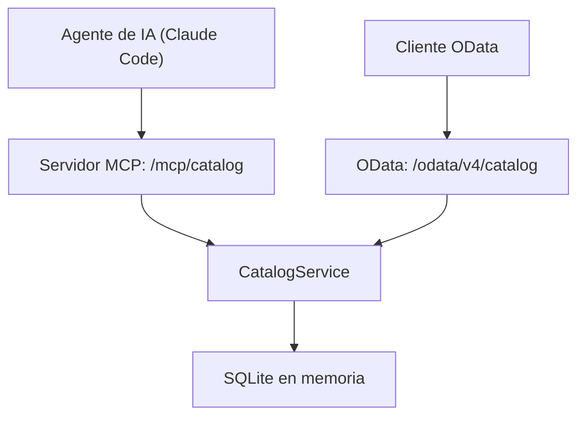

Publicar un servicio SAP CAP para un agente de IA cuesta una anotación. Con el plugin oficial de SAP `@cap-js/mcp`, la línea `@protocol: ['odata', 'mcp']` sirve el mismo servicio por OData y por Model Context Protocol (MCP), sin escribir código de servidor. En las pruebas, el agente respondió correctamente preguntas de negocio en español con consultas CQL que construyó él mismo.

Lo evidente sería dar el trabajo por terminado ahí. Las pruebas mostraron tres sorpresas que conviene conocer antes de usarlo:

1. **El plugin modifica la configuración global de Claude Code.** En el perfil de desarrollo, por defecto escribe su entrada en `~/.claude.json`, si ese archivo existe, y la borra al parar el servidor.
2. **El agente no ve todo lo que se documenta en el modelo.** Los comentarios `/** ... */` y los `@title` con texto literal no llegan a la herramienta `describe`, aunque la documentación oficial indica que se usan.
3. **El agente propone una vía que no funciona.** Ante una petición de escritura se negó correctamente, pero sugirió un `PATCH` por OData que el servicio rechaza con un 405.

Este artículo abre una serie sobre SAP CAP y agentes de IA con MCP. Esta primera parte monta un servicio de demostración, lo publica por MCP, explica cada sorpresa y qué hacer con ella, y fija los límites de la lectura. Todas las pruebas se hicieron en local, el 06-10-2026 y el 07-10-2026, con datos inventados.

## Entorno de la prueba

| Componente | Versión |
|---|---|
| Node.js | 24.19.0 |
| npm | 11.17.0 |
| `@sap/cds-dk` (global) | 10.1.2 |
| `@sap/cds` | 10.1.1 |
| `@cap-js/mcp` | 1.5.0 |
| `@cap-js/sqlite` | 3.1.1 |
| `express` | 5.2.1 |
| Claude Code (cliente MCP) | 2.1.276, modelo `claude-sonnet-5` |

El plugin `@cap-js/mcp` lo publica el equipo de CAP de SAP en [github.com/cap-js/mcp](https://github.com/cap-js/mcp), con licencia Apache 2.0. Su documentación oficial es la guía [Model Context Protocol Adapter](https://cap.cloud.sap/docs/guides/ai/cap-mcp). El README del paquete 1.5.0 todavía enlaza a una dirección anterior que devuelve 404.

Arquitectura de la prueba: el mismo servicio se sirve a la vez por OData y por MCP.



## Del proyecto CAP al servidor MCP

### Creación del proyecto

```bash
cds init cap-mcp
cd cap-mcp
npm i @cap-js/mcp @sap/cds express
npm i -D @cap-js/sqlite
```

Con `@sap/cds-dk` 10.1.2, `cds init` no genera `package.json`: lo crea el primer `npm i` con las dependencias. El nombre del proyecto, los scripts `start` y `watch` y la sección `cds` se añaden después a mano.

### Modelo de datos

El modelo es un almacén con dos entidades. Las anotaciones `@description` tienen un papel importante, como se verá más adelante: son lo que el agente lee para entender cada campo.

```cds
namespace demo.almacen;

using { cuid, managed, Currency } from '@sap/cds/common';

@description: 'Familias de productos del almacén.'
entity Categorias : cuid {
  nombre    : String(60) @mandatory;
  productos : Association to many Productos on productos.categoria = $self;
}

@description: 'Artículos a la venta con su precio y su nivel de stock.'
entity Productos : cuid, managed {
  nombre       : String(100) @mandatory;
  descripcion  : String(500);
  categoria    : Association to Categorias;
  precio       : Decimal(9, 2)  @description: 'Precio unitario sin impuestos';
  moneda       : Currency;
  stock        : Integer default 0 @description: 'Unidades disponibles en el almacén';
  stockMinimo  : Integer default 0 @description: 'Umbral de reposición: por debajo de este valor hay que pedir más unidades';
}
```

Los datos de prueba, en `db/data/*.csv`, son 3 categorías (Portátiles, Periféricos y Monitores) y 7 productos con precios en euros. Tres productos están por debajo del stock mínimo: Base USB-C (0 de 6), Portátil 16 pulgadas (3 de 4) y Teclado mecánico (8 de 10).

### El servicio: una anotación

```cds
using { demo.almacen as db } from '../db/schema';

@protocol: ['odata', 'mcp']
service CatalogService {
  @readonly entity Productos  as projection on db.Productos;
  @readonly entity Categorias as projection on db.Categorias;
}

annotate CatalogService with @mcp.instructions: 'Catálogo de productos de un almacén de demostración. Usa describe para conocer las entidades y query para consultar productos, categorías y niveles de stock. Un producto tiene stock bajo cuando stock < stockMinimo.';
```

La única línea nueva respecto a un servicio CAP normal es `@protocol: ['odata', 'mcp']`. Con ella, el servicio se publica por MCP en `/mcp/<servicio>` además de por OData. La anotación `@mcp.instructions` es opcional: su texto llega al agente como instrucciones del servidor en la inicialización del protocolo, lo que se comprobó en la respuesta a `initialize`.

### Arranque

```text
[cds] - serving CatalogService {
  at: [ '/odata/v4/catalog', '/mcp/catalog' ],
  decl: 'srv\\catalog-service.cds:4',
  impl: 'node_modules\\@sap\\cds\\srv\\app-service.js'
}
[cds] - server listening on { url: 'http://localhost:4004' }
[cds] - server v10.1.1 launched in 2309 ms
```

El primer arranque, en frío, tardó 30,4 s. Las recargas posteriores tras cambiar el modelo tardaron entre 1,8 y 2,1 s, y el arranque con `npx cds watch` del 07-10-2026, 2,3 s.

## Autowire: el plugin modifica la configuración global de Claude Code

Antes de conectar el agente conviene revisar un comportamiento por defecto del plugin. En el perfil de desarrollo, `@cap-js/mcp` registra el servidor por su cuenta en los clientes que encuentra:

- escribe la entrada del servidor (clave `cds:CatalogService`) en `~/.claude.json`, la configuración global del usuario de Claude Code, si ese archivo ya existe;
- hace lo mismo en la configuración de OpenCode, si existe;
- borra la entrada al parar el servidor.

El código está en `lib/clients.js` del paquete. Es cómodo, pero toca un fichero global del usuario que afecta a todos sus proyectos. En esta prueba se desactivó en `package.json`:

```json
"cds": {
  "mcp": { "autowire": false }
}
```

y el servidor se registró solo para el proyecto, con un fichero `.mcp.json` en su raíz:

```json
{
  "mcpServers": {
    "almacen": {
      "type": "http",
      "url": "http://localhost:4004/mcp/catalog"
    }
  }
}
```

## Las herramientas MCP que recibe el agente

El plugin no publica una herramienta por entidad, sino dos herramientas genéricas:

| Herramienta | Qué hace |
|---|---|
| `describe` | Devuelve el modelo del servicio: entidades, campos, tipos, descripciones y acciones. |
| `query` | Ejecuta una sentencia CQL. Solo admite `SELECT`. |

Si el servicio tiene acciones o funciones, el plugin añade una tercera herramienta, `call`. La documentación oficial presenta las tres juntas, pero en este servicio, sin acciones, `tools/list` devolvió solo `describe` y `query`.

La descripción de `query` indica al agente que primero use `describe` para conocer los campos, y le explica que CQL admite expresiones de ruta para seguir asociaciones sin escribir JOIN.

### Prueba directa con curl

Antes de usar el agente, el protocolo se probó con curl. Esta consulta sigue la asociación `categoria` con una expresión de ruta:

```sql
SELECT nombre, stock, stockMinimo, categoria.nombre as categoria FROM Productos WHERE stock < stockMinimo ORDER BY stock
```

La respuesta llega en formato TOON, compacto para modelos de lenguaje:

```text
count: 3
data[3]{nombre,stock,stockMinimo,categoria}:
  Base USB-C,0,6,Periféricos
  Portátil 16 pulgadas,3,4,Portátiles
  Teclado mecánico,8,10,Periféricos
```

Un `DELETE FROM Productos` enviado a `query` se rechaza antes de llegar a la base de datos, en la compilación de CQL:

```text
Error executing CQL: CDS compilation failed
In 'DELETE FROM Productos' at 1:1-7: Error: Mismatched ‹Identifier›, expecting ‘(’, ‘select’
```

La lectura es segura por diseño: con `query` no se puede escribir. Para escribir hay que exponer acciones CDS, que el agente invoca con la herramienta `call`.

## Qué descripciones llegan al agente

El agente solo sabe de cada campo lo que le devuelve `describe`, y en esta versión no todas las formas de documentar el modelo llegan a esa salida. Se comprobó el 07-10-2026 sobre una copia del proyecto:

| Forma de documentar | Aparece en `describe` |
|---|---|
| `@description` en entidades y campos | Sí |
| `@title` con clave i18n (`'{i18n>NombreProd}'`) | Sí |
| `@title` con texto literal | No |
| Comentarios de documentación `/** ... */` | No, ni con `"cdsc": { "docs": true }` |

Las descripciones «Created On» y «Changed On» que aparecen en los campos de `managed` salen precisamente de `@title` con clave i18n. La documentación oficial indica que los comentarios de documentación también se usan, pero en esta prueba no aparecieron.

Lo más fiable es describir con `@description` los campos cuyo significado no sea evidente. En el modelo de la prueba, el caso claro es `stockMinimo`: sin la descripción, el agente solo ve un entero.

## Tres preguntas en lenguaje natural

Con el servidor en marcha y registrado en `.mcp.json`, se hicieron tres preguntas en español a Claude Code. Las trazas de cada ejecución se guardaron completas.

### Pregunta 1: productos bajo mínimos

«¿Qué productos tienen el stock por debajo del mínimo y cuántas unidades habría que pedir de cada uno para llegar al mínimo?»

El agente llamó a `describe` para la entidad `Productos` y después construyó él mismo la consulta:

```sql
SELECT from Productos { ID, nombre, stock, stockMinimo } where stock < stockMinimo order by nombre
```

| Producto | Stock | Mínimo | Unidades a pedir |
|---|---:|---:|---:|
| Base USB-C | 0 | 6 | 6 |
| Portátil 16 pulgadas | 3 | 4 | 1 |
| Teclado mecánico | 8 | 10 | 2 |

Respuesta correcta, en 7,7 s.

En una segunda ejecución con la misma pregunta y los mismos datos, en la extensión de Claude Code para Visual Studio Code, el agente calculó las unidades a pedir en la propia consulta (columna `aPedir`), añadió la categoría y dio el total: 9 unidades. Las cifras de cada producto coinciden con las de la primera ejecución y con los datos de prueba.


### Pregunta 2: valor del inventario por categoría

«¿Cuál es el valor total del inventario (precio por stock) en cada categoría? Ordénalo de mayor a menor.»

El agente consultó `describe` para `Productos` y `Categorias`, y generó una consulta con una expresión de ruta y una agregación:

```sql
SELECT categoria.nombre as categoria, sum(precio * stock) as valorTotal FROM Productos GROUP BY categoria.nombre ORDER BY valorTotal DESC
```

| Categoría | Valor total (EUR) |
|---|---:|
| Portátiles | 15.285 |
| Monitores | 3.401 |
| Periféricos | 2.057,5 |

Las cifras se verificaron a mano:

- Portátiles: 899 × 12 + 1499 × 3 = 15.285.
- Monitores: 329 × 7 + 549 × 2 = 3.401.
- Periféricos: 29,90 × 45 + 89 × 8 + 119 × 0 = 2.057,5.

Respuesta correcta, en 8,8 s.

### Pregunta 3: una petición de escritura

«La Base USB-C ha recibido 10 unidades. Actualiza su stock a 10.»

En la primera ejecución, el agente llamó a `describe`, localizó el producto con una `query` y no modificó nada. Explicó que `query` solo admite `SELECT` y que no hay ninguna herramienta de escritura, y propuso otras vías: la interfaz de la aplicación CAP, una herramienta de administración de la base de datos o exponer una acción de escritura en el servicio. Tardó 14,5 s.

En la segunda ejecución, en Visual Studio Code, la respuesta fue la misma en el fondo, pero el agente buscó antes en los ficheros del proyecto y propuso tres alternativas concretas.


**La primera alternativa, el `PATCH` por OData, no funciona en este servicio.** Las entidades están proyectadas con `@readonly`, así que `PATCH /odata/v4/catalog/Productos(<ID>)` con `{"stock": 10}` devuelve `405 Method Not Allowed`:

```json
{"error":{"message":"Entity \"CatalogService.Productos\" is read-only","code":"ENTITY_IS_READ_ONLY","@Common.numericSeverity":4}}
```

El stock de la Base USB-C siguió en 0. El agente acertó al negarse a escribir, pero su primera sugerencia no tuvo en cuenta `@readonly`. La búsqueda `Glob` que aparece en la captura es sobre los ficheros del proyecto, no una herramienta MCP: en Visual Studio Code el agente ve también el código, no solo el servidor MCP.

### Lo que muestran las tres preguntas

- En las tres preguntas, el agente usó primero `describe` para conocer los campos y después escribió la consulta él mismo.
- El agente usa CQL de CAP, incluidas las expresiones de ruta por asociaciones (`categoria.nombre`) y las agregaciones con `GROUP BY`.
- Con los mismos datos, la forma de la respuesta cambia entre ejecuciones (consulta, columnas, total), aunque las cifras se mantienen.
- Las sugerencias que el agente no ha ejecutado hay que comprobarlas, como demuestra el `PATCH` rechazado.

## Límites de esta primera parte

- **Solo lectura.** `query` no escribe, y el servicio está marcado `@readonly`. La escritura controlada mediante acciones es el tema de la siguiente entrega.
- **Autenticación simulada.** En local, CAP usa la autenticación `mocked`. Autenticación y roles quedan para una parte posterior de la serie.
- **Sin despliegue.** Todo se ha probado en local; el despliegue en SAP BTP queda fuera de esta parte.

## Conclusiones

Publicar un servicio SAP CAP como servidor MCP cuesta una anotación, `@protocol: ['odata', 'mcp']`, y el agente puede responder desde ese momento preguntas de negocio con consultas CQL que construye él mismo. Lo que requiere atención no es el plugin, sino lo que lo rodea:

1. Desactivar `autowire` si no se quiere que el plugin modifique la configuración global de Claude Code, y registrar el servidor por proyecto con `.mcp.json`.
2. Documentar con `@description` los campos que el agente no puede interpretar por su nombre.
3. Revisar lo que el agente propone y no ha ejecutado.

Para repasar los fundamentos de CAP que usa este artículo, el blog trata cómo se separan [el modelo CDS y los servicios](/blog/cap-modelo-cds/) y cuándo hacen falta [handlers en Node.js](/blog/cap-servicios-handlers/). La formación completa de CAP está en el [curso de SAP CAP de Logali Tech](/courses/sap-cap-cloud-application-programming-model/).

**En la parte 2:** escritura segura mediante acciones CDS. A partir de la limitación vista en la pregunta 3, se expone una acción en el servicio para que el agente pueda modificar el stock con la herramienta `call`, de forma controlada.
