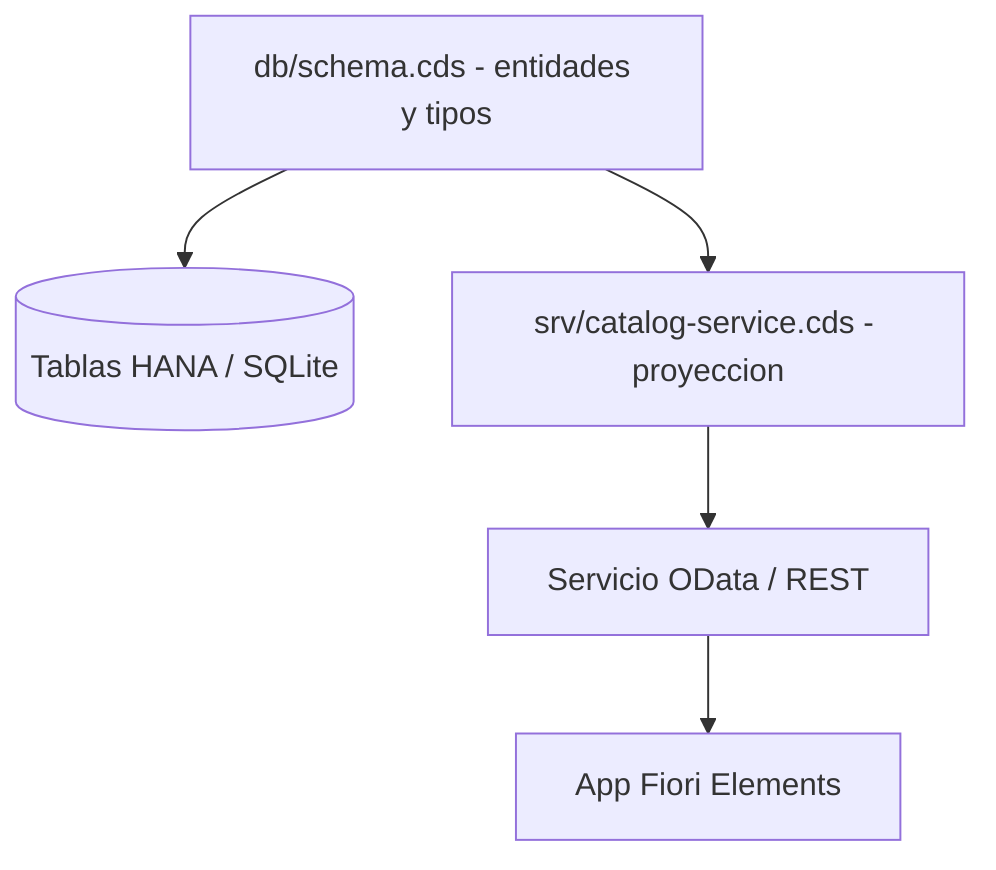

CAP (Cloud Application Programming Model) tiene una idea buena escondida en su estructura de carpetas: **el modelo de datos y los servicios son cosas distintas y viven separadas**. Cuando `cds init` genera un proyecto, te crea `db/` y `srv/` por una razon, no por convencion decorativa. El dia que ignoras esa separacion es el dia que tu esquema y tu API quedan atados con alambre.

## Dos capas, dos ficheros

- **`db/schema.cds`**: el modelo de dominio. Entidades, tipos, claves, asociaciones. Esto se convierte en tablas cuando haces `cds deploy`.
- **`srv/catalog-service.cds`**: el servicio. Proyecta las entidades del esquema, las renombra, las restringe y decide que sale al mundo por OData.

La regla que separa un proyecto sano de uno que se pudre: **el servicio nunca redefine el dominio, lo proyecta**. Si tu `catalog-service.cds` declara entidades desde cero en vez de proyectar las de `schema.cds`, ya has perdido.



## El esquema: dominio puro

En `db/schema.cds` defines el dominio con su espacio de nombres, sin pensar todavia en la API:

```cds
namespace com.logali;

entity Products {
  key ID          : UUID;
      Name        : String not null;
      Description : String;
      Price       : Decimal(16,2);
      Category    : Association to Categories;
      Supplier    : Association to Suppliers;
      Reviews     : Association to many ProductReview on Reviews.Product = $self;
}

entity Categories {
  key ID   : String(1);
      Name : String;
}
```

Fijate en que aqui no hay ni una anotacion de UI ni un renombrado. Solo dominio: claves UUID, `not null`, asociaciones administradas. Esto es lo que sobrevive a los cambios de pantalla.

## El servicio: proyeccion, no copia

En `srv/catalog-service.cds` haces `using` del esquema y proyectas:

```cds
using com.logali from '../db/schema';

service CatalogService {
  entity Products as select from com.logali.Products {
    ID,
    Name as ProductName,
    Description,
    Price,
    Category.Name as Category,
    Supplier,
    Reviews
  };
}
```

El `Name as ProductName` y el `Category.Name as Category` son decisiones de API, no de dominio. Viven aqui precisamente para que puedas cambiar la cara publica del servicio sin tocar una sola tabla.

## El error que veras en todos los proyectos

Un unico fichero `.cds` con las entidades, las asociaciones, las anotaciones de UI y la logica de servicio, todo mezclado. Compila, funciona en la demo y es imposible de evolucionar. En cuanto marketing pide renombrar un campo, acabas tocando el esquema y rehaciendo el `cds deploy`.

> Separar `db` de `srv` cuesta cero: ya viene hecho. Volver a juntarlos en un mismo fichero cuesta cada cambio de aqui a produccion.

En el proximo post: los handlers en Node.js y por que el 80% de tu CAP no necesita que escribas ni una linea de JavaScript.
