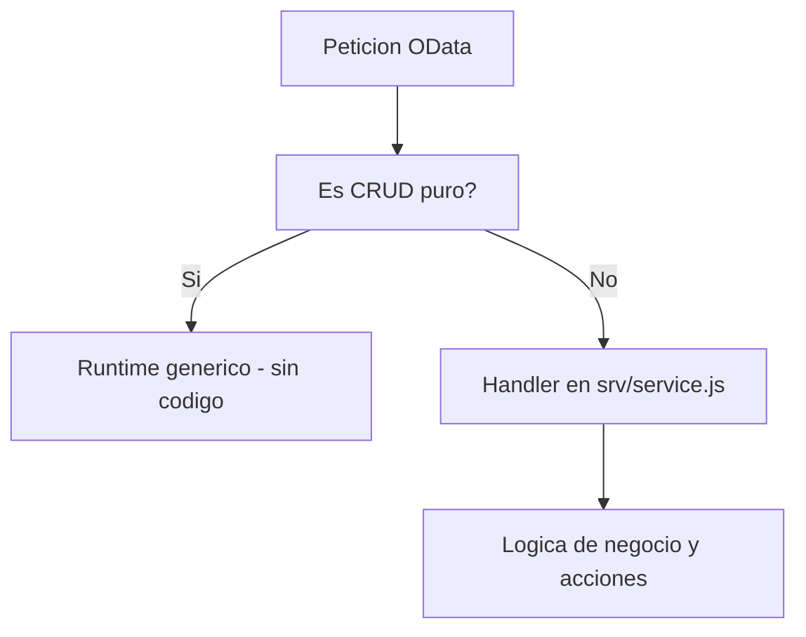

El malentendido mas caro con CAP es creer que hay que programar cada operacion. No. El **runtime generico** de CAP ya sirve create, read, update, delete, paginacion, filtros `$filter`, expansiones `$expand` y hasta value helps, todo derivado del modelo CDS. Si estas escribiendo un handler para un READ que solo lee la tabla, lo estas haciendo mal.

## Donde acaba el modelo y empieza el codigo

Los handlers en Node.js son para lo que el modelo **no** puede declarar:

- Validaciones de negocio que dependen del estado (no de un `@mandatory`).
- **Acciones** y **funciones**: operaciones que no son CRUD.
- Efectos colaterales: enviar un correo, llamar a un servicio externo, recalcular.



## Funciones y acciones: se declaran en CDS

Primero declaras el contrato en el `.cds`, ligado a la entidad:

```cds
extend service CatalogService with {
  function getClientTaxRate(clientEmail : String(65)) returns Decimal(4,2);

  action cancelOrder(clientEmail : String(65)) returns {
    status  : String enum { Succeeded; Failed; };
    message : String;
  };
}
```

Fijate en la distincion que CAP toma en serio: una **funcion** (`getClientTaxRate`) lee y no cambia estado; una **accion** (`cancelOrder`) modifica. No es cosmetica: OData mapea la funcion a GET y la accion a POST.

## El handler: solo la logica que importa

En `srv/catalog-service.js` implementas el comportamiento con la API `srv`:

```javascript
module.exports = (srv) => {
  const { Orders } = srv.entities;

  srv.on('cancelOrder', async (req) => {
    const { clientEmail } = req.data;
    const order = await SELECT.one.from(Orders).where({ clientEmail });

    if (!order) return req.error(404, 'Pedido no encontrado');
    if (order.Status === 'A') {
      return { status: 'Failed', message: 'El pedido ya estaba aprobado' };
    }

    await UPDATE(Orders).set({ Status: 'C' }).where({ ID: order.ID });
    return { status: 'Succeeded', message: `Cancelado para ${order.FirstName} ${order.LastName}` };
  });
};
```

Tres cosas que hacen bien este handler:

1. Usa **CQL** (`SELECT`, `UPDATE`) en vez de SQL crudo: agnostico de la base de datos.
2. Devuelve errores con `req.error`, no lanza excepciones sueltas.
3. No reimplementa el CRUD de `Orders`: solo la regla de cancelacion. Todo lo demas lo sigue sirviendo el runtime.

## El anti-patron habitual

Handlers `srv.on('READ', ...)` que hacen un `SELECT` y devuelven exactamente lo que el runtime ya devolveria. Eso no aporta nada y te quita paginacion y filtrado gratis. Si tu handler no anade una regla que el modelo no puede expresar, borralo.

> En CAP el mejor handler es el que no existe. El segundo mejor es el que cabe en quince lineas porque solo contiene la regla de negocio.

En el proximo post: CAP contra RAP, cuando cada uno, sin bandos.
