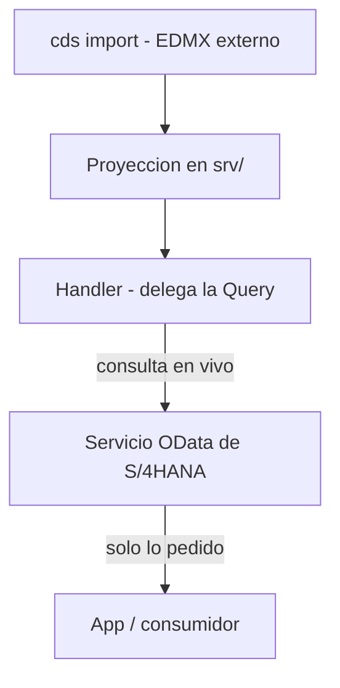

La tentacion, cuando tu app CAP necesita datos de S/4HANA, es replicarlos: un job nocturno que copia tablas a HANA Cloud y a rezar para que no se desincronicen. Casi siempre es un error. CAP tiene un mecanismo mejor: **importar el servicio OData externo, proyectarlo como si fuera tuyo y delegar la consulta al backend en tiempo real**.

## El flujo: importar, proyectar, delegar

- **Importar**: `cds import` toma el metadata del servicio externo (el EDMX) y lo mete en tu proyecto como un modelo mas.
- **Proyectar**: defines una entidad tuya como proyeccion de la entidad remota. Tu API no expone la del proveedor, expone la tuya.
- **Delegar**: en el handler reenvias la query al servicio remoto. El dato nunca se copia, se lee al vuelo.



## Proyectar el servicio externo

Tras importar, declaras tu entidad como una lectura de la remota. Aqui expones `Incidents` a partir de `IncidentsSet` del servicio de S/4:

```cds
using { YSAPUI5_SRV as ext } from './external/YSAPUI5_SRV';

service RemoteService {
  entity Incidents as projection on ext.IncidentsSet;
}
```

Tu consumidor ve `Incidents`, no `IncidentsSet`. Eso te da una capa de aislamiento: si el proveedor renombra su entidad, tocas una linea, no toda la app.

## Delegar la query, no traer todo

La clave del rendimiento esta en el handler: reenvias al backend **la misma query** con sus filtros y su ordenacion, para que S/4 devuelva solo lo pedido, no la tabla entera:

```javascript
module.exports = (srv) => {
  const ext = await cds.connect.to('YSAPUI5_SRV');

  srv.on('READ', 'Incidents', async (req) => {
    // se desglosa la Query: where + orderBy viajan al backend
    return ext.run(req.query);
  });
};
```

El `ext.run(req.query)` es lo que separa esto de un proxy tonto: el `$filter` y el `$orderby` que llegan del cliente se traducen y viajan a S/4HANA. Nada de traerte diez mil incidencias para filtrar tres en Node.

## El anti-patron: replicar por comodidad

Copiar el dato a HANA Cloud "para tenerlo cerca" parece rapido y sale caro: te compras un problema de sincronizacion, datos rancios y una tabla que mantener. Replica solo cuando de verdad necesitas el dato offline o joins masivos locales. Para lecturas puntuales, delega.

> Un servicio remoto bien proyectado es una fachada, no una copia. El dia que el proveedor cambia algo, quieres tocar una proyeccion, no reconciliar dos bases de datos.

En el proximo post: autenticacion y autorizacion en CAP con XSUAA, donde las anotaciones se vuelven permisos.
