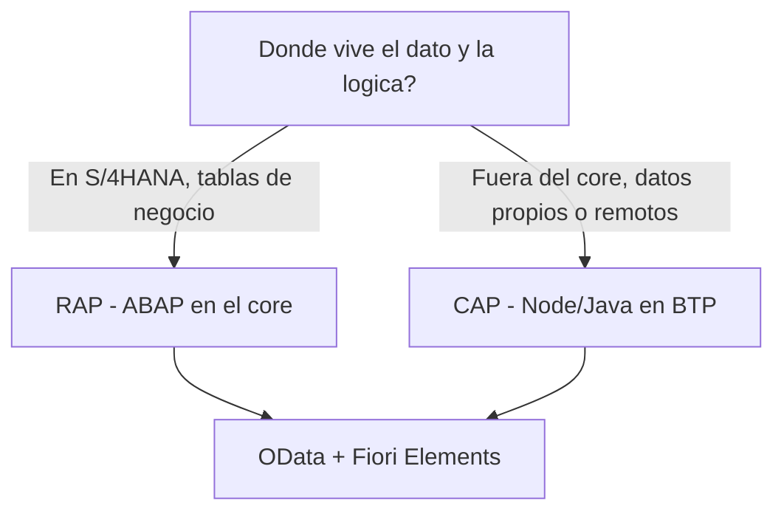

Cada vez que alguien pregunta "CAP o RAP" espera una respuesta de bando. No la va a tener. Los dos son el mismo patron (modelo CDS, servicio OData, app Fiori) desplegado en dos sitios distintos. La pregunta correcta no es cual es mejor, sino **donde vive tu logica y donde vive tu equipo**.

## La diferencia que de verdad decide

- **RAP** (ABAP RESTful Application Programming): tu logica corre en **ABAP dentro del stack S/4HANA**. Behavior definitions, behavior implementations en clases ABAP, transacciones sobre las tablas de negocio del propio sistema.
- **CAP**: tu logica corre en **Node.js o Java sobre BTP**, contra una base de datos propia (HANA Cloud) o consumiendo servicios remotos. El modelo se escribe en CDS/CDL y los handlers en el lenguaje del runtime.



## Cuando RAP

RAP gana cuando la logica **es** el core: creas o modificas objetos de negocio de S/4HANA, necesitas el bloqueo, la determinacion y la validacion pegados a las tablas, y tu equipo es ABAP. Extender un objeto estandar o construir una app transaccional sobre datos que ya viven en el sistema: territorio RAP.

## Cuando CAP

CAP gana cuando la aplicacion vive **al lado** del core, no dentro:

```cds
using { API_BUSINESS_PARTNER as bp } from './external/API_BUSINESS_PARTNER';

service RemoteService {
  entity BusinessPartners as projection on bp.A_BusinessPartner;
}
```

Aqui CAP proyecta un servicio remoto de S/4 sin tener el dato en casa. Es el escenario tipico: una aplicacion nueva en BTP que combina datos propios con lecturas de S/4HANA, con un equipo comodo en JavaScript o Java. Side-by-side extensibility de manual.

## El error de eleccion mas comun

Elegir por moda. Un equipo ABAP puro montando CAP en Node.js "porque es lo moderno" acaba peleando con npm, async y un runtime que no domina, para construir algo que en RAP habria salido en la mitad de tiempo. Y al reves: forzar RAP para una app que solo agrega datos de tres sistemas externos te ata al ciclo de release del core sin necesidad.

> CAP y RAP no compiten por ser el mejor framework. Compiten por responder una pregunta distinta: cerca del core o al lado del core.

En el proximo post: como se despliega un CAP en BTP de verdad, con mta.yaml y Cloud Foundry.
