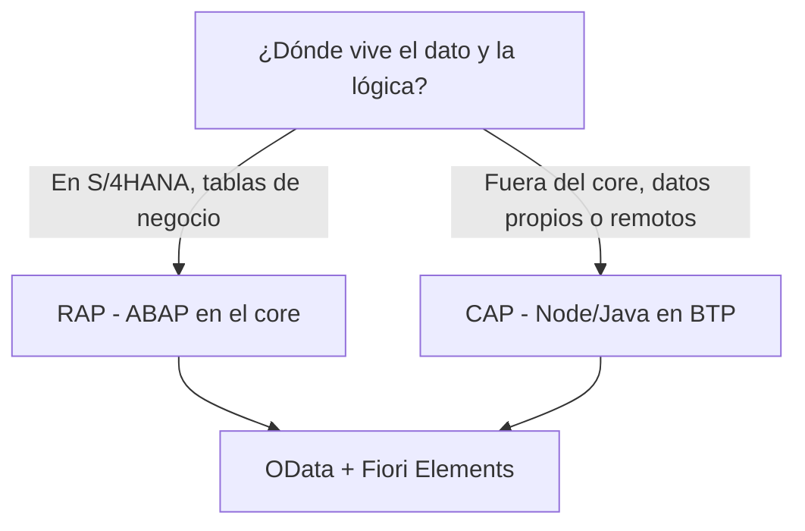

Cada vez que alguien pregunta "CAP o RAP" espera una respuesta de bando. No la va a tener. Los dos son el mismo patrón (modelo CDS, servicio OData, app Fiori) desplegado en dos sitios distintos. La pregunta correcta no es cuál es mejor, sino **dónde vive tu lógica y dónde vive tu equipo**.

## La diferencia que de verdad decide

- **RAP** (ABAP RESTful Application Programming): tu lógica corre en **ABAP dentro del stack S/4HANA**. Behavior definitions, behavior implementations en clases ABAP, transacciones sobre las tablas de negocio del propio sistema.
- **CAP**: tu lógica corre en **Node.js o Java sobre BTP**, contra una base de datos propia (HANA Cloud) o consumiendo servicios remotos. El modelo se escribe en CDS/CDL y los handlers en el lenguaje del runtime.


```mermaid
flowchart TD
 Q["¿Dónde vive el dato y la lógica?"] -->|"En S/4HANA, tablas de negocio"| RAP["RAP - ABAP en el core"]
 Q -->|"Fuera del core, datos propios o remotos"| CAP["CAP - Node/Java en BTP"]
 RAP --> F["OData + Fiori Elements"]
 CAP --> F
```

## Cuándo RAP

RAP gana cuando la lógica **es** el core: creas o modificas objetos de negocio de S/4HANA, necesitas el bloqueo, la determinación y la validación pegados a las tablas, y tu equipo es ABAP. Extender un objeto estándar o construir una app transaccional sobre datos que ya viven en el sistema: territorio RAP.

## Cuándo CAP

CAP gana cuando la aplicación vive **al lado** del core, no dentro:

```cds
using { API_BUSINESS_PARTNER as bp } from './external/API_BUSINESS_PARTNER';

service RemoteService {
  entity BusinessPartners as projection on bp.A_BusinessPartner;
}
```

Aquí CAP proyecta un servicio remoto de S/4 sin tener el dato en casa. Es el escenario típico: una aplicación nueva en BTP que combina datos propios con lecturas de S/4HANA, con un equipo cómodo en JavaScript o Java. Side-by-side extensibility de manual.

## El error de elección más común

Elegir por moda. Un equipo ABAP puro montando CAP en Node.js "porque es lo moderno" acaba peleando con npm, async y un runtime que no domina, para construir algo que en RAP habría salido en la mitad de tiempo. Y al revés: forzar RAP para una app que solo agrega datos de tres sistemas externos te ata al ciclo de release del core sin necesidad.

> CAP y RAP no compiten por ser el mejor framework. Compiten por responder una pregunta distinta: cerca del core o al lado del core.

En el próximo post: cómo se despliega un CAP en BTP de verdad, con mta.yaml y Cloud Foundry.
