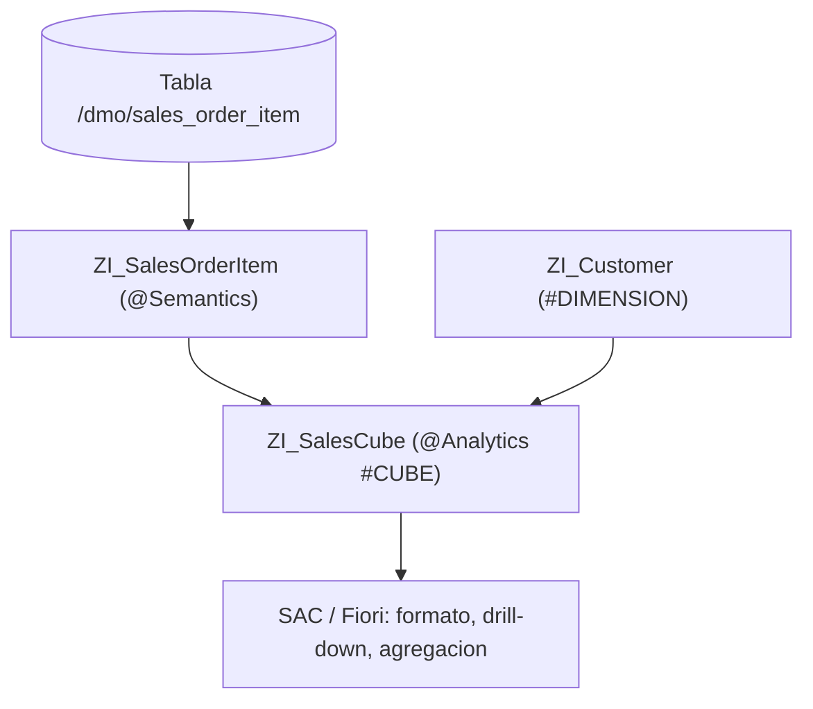

Puedes escribir una CDS perfecta a nivel SQL y aun así entregarle a Fiori un campo `net_amount` que la herramienta no sabe si es dinero, en qué moneda, ni cómo alinearlo. Las anotaciones semánticas y analíticas son el contrato que hace que las herramientas downstream se comporten solas.

## Un decimal no es un importe

Sin `@Semantics`, Fiori muestra `120 1234.56 2025-06-15 USER_X`: sin formato, sin unidades, sin saber si esa fecha es técnica o de negocio. Con las anotaciones, todo eso se resuelve sin código de UI:

```sql
@EndUserText.label: 'Sales Order Items - Enriched'
@AccessControl.authorizationCheck: #CHECK
define view entity ZI_SalesOrderItem
  as select from /dmo/sales_order_item as Item
{
  key Item.sales_order_id,
  key Item.item_position,

      @Semantics.amount.currencyCode: 'CurrencyCode'
      Item.net_amount        as NetAmount,      // es un importe...
      @Semantics.currencyCode: true
      Item.currency_code     as CurrencyCode,   // ...en esta moneda

      @Semantics.quantity.unitOfMeasure: 'QuantityUnit'
      Item.ordered_quantity  as OrderedQuantity,
      @Semantics.unitOfMeasure: true
      Item.quantity_unit     as QuantityUnit,

      @Semantics.businessDate.from: true
      Item.delivery_date     as DeliveryDate,   // fecha de negocio
      @Semantics.systemDate.lastChangedAt: true
      Item.last_changed_at   as LastChangedAt   // timestamp tecnico
}
```

El detalle que se paga solo: `systemDate.*` son timestamps de "cuándo se cambió la fila", `businessDate.*` son fechas de "cuándo el dato es válido". Confundirlas rompe las consultas time-travel. Y lo mejor es que estas anotaciones **se propagan**: si las declara la `I_*`, todas las `C_*` que la consumen las heredan sin repetirlas.

## De campo a cubo: las anotaciones analíticas

Para reporting, la CDS deja de ser una tabla y se convierte en parte de un esquema en estrella. Ahí entra `@Analytics.dataCategory`:

```sql
@AccessControl.authorizationCheck: #NOT_REQUIRED
@EndUserText.label: 'Cubo de ventas'
@ObjectModel.usageType:{ serviceQuality: #X, sizeCategory: #S, dataClass: #MIXED }
@Analytics.dataCategory: #CUBE
define view entity ZI_SalesCube
  as select from ZI_SalesOrderItem
    association [0..*] to ZI_Customer as _Customer
      on _Customer.CustomerId = $projection.CustomerId
{
  key SalesOrderId,
  key ItemPosition,
      @Semantics.calendar.yearMonth: true
      PostingPeriod,
      @DefaultAggregation: #SUM
      NetAmount,
      _Customer
}
```

Dos ideas clave:

- **`@Analytics.dataCategory`** define el papel: `#CUBE` para los hechos, `#DIMENSION` para los datos maestros que dan contexto, `#FACT` para el centro sin redundancia.
- **`@DefaultAggregation: #SUM`** (o `#AVG`, `#MIN`, `#MAX`, `#COUNT_DISTINCT`) le dice a la herramienta cómo agregar por defecto, sin necesidad de `GROUP BY` explícito: no son agregaciones SQL, son metadatos que consume SAC.



## Búsqueda difusa casi gratis

Para las consumption con búsqueda, HANA regala tolerancia a errores tipográficos con tres anotaciones:

```sql
@Search.searchable: true
define view entity ZC_CustomerSearch as select from ZI_Customer
{
  @Search.defaultSearchElement: true
  @Search.ranking: #HIGH
  @Search.fuzzinessThreshold: 0.8   // acepta ~80% de similitud
  CustomerName,
  ...
}
```

Un `fuzzinessThreshold` de 0.8 encuentra coincidencias aproximadas, útil cuando el usuario escribe "Mueller" y el dato dice "Müller".

## Por qué esto no es opcional

> Tres líneas de anotación en la vista correcta ahorran decenas de líneas de código de UI y decisiones manuales en Fiori y SAC. La alternativa es que cada consumidor reinvente el formato, la moneda y la agregación, mal y de forma distinta.

Una CDS bien anotada no describe solo qué datos hay: describe qué significan. Y ese significado es lo que hace que las herramientas trabajen para ti en lugar de contra ti.
