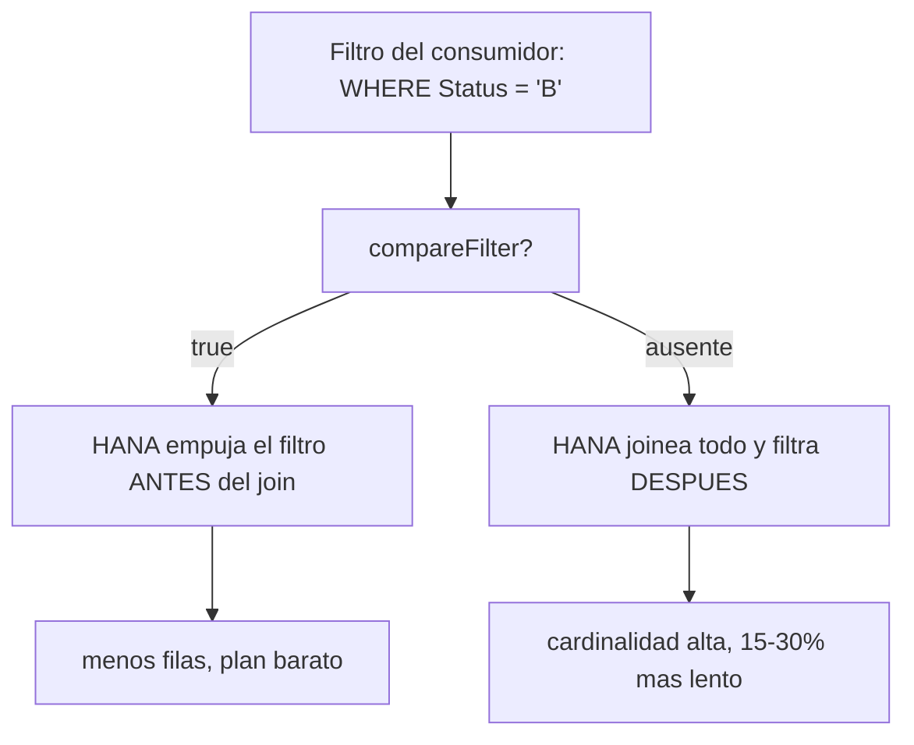

Una CDS sin anotaciones de optimización compila igual, se activa igual y funciona igual el día de la demo. El problema aparece en producción, con volumen real, cuando el filtro del usuario llega tarde y HANA joinea de más. Estas anotaciones no son decoración: son instrucciones al compilador.

## El bloque mínimo

Toda vista de lectura productiva debería empezar por algo parecido a esto:

```sql
@AbapCatalog.viewEnhancementCategory: [#NONE]
@AbapCatalog.compiler.compareFilter: true
@AccessControl.authorizationCheck: #CHECK
@ClientHandling.algorithm: #SESSION_VARIABLE
@EndUserText.label: 'Reservas con cliente'
@VDM.viewType: #COMPOSITE
define view entity ZI_BookingWithCustomer
  as select from /dmo/booking as B
    inner join /dmo/customer as C on B.customer_id = C.customer_id
{
  key B.booking_id     as BookingId,
      B.booking_status as Status,
      C.last_name      as CustomerLastName
}
```

Qué hace cada una, en una frase:

- **`compareFilter: true`**: habilita el pushdown de filtros comparados (igualdad, rangos, IN). Sin ella, el `WHERE` del consumidor se aplica después de los joins. Con ella, HANA lo empuja hasta abajo y reduce la cardinalidad. Su olvido cuesta entre un 15 y un 30 por ciento en vistas con joins selectivos.
- **`authorizationCheck: #CHECK`**: evalúa los Access Controls (DCL) de la vista. Sin ella, la vista devuelve todo, sin filtrar por autorización. No es rendimiento: es una fuga de datos.
- **`clientHandling.algorithm: #SESSION_VARIABLE`**: el filtro de mandante se resuelve con la sesión SQL actual, no con un literal, y viaja empujado con el resto de filtros.
- **`VDM.viewType`**: declara la capa (Basic, Composite, Consumption). No acelera nada directamente, pero deja que el ATC valide la arquitectura y documenta la intención.
- **`EndUserText.label`**: etiqueta legible en catálogo, OData y Fiori. Sin ella, tus consumidores ven solo el nombre técnico.



## La anotación que puede mentirte

`@AbapCatalog.preserveKey: true` le dice al compilador que la clave declarada de la vista sigue siendo única tras todos los joins, y activa optimizaciones de "single record lookup". El problema es que **CDS te cree**.

```sql
-- CORRECTO: la clave sigue siendo unica
@AbapCatalog.preserveKey: true
define view entity ZI_Booking
  as select from /dmo/booking
{ key booking_id, ... }

-- INCORRECTO: el join 1:N multiplica filas, la clave ya NO es unica
@AbapCatalog.preserveKey: true   -- mentira al optimizador
define view entity ZI_BookingWithSupplements
  as select from /dmo/booking          as Booking
    inner join /dmo/booking_supplement as Supp
      on Booking.booking_id = Supp.booking_id
{ key Booking.booking_id, ... }   -- hay N supplements por booking
```

En el segundo caso puedes obtener registros perdidos o duplicados en optimizaciones que asumen unicidad, y ningún error salta.

> Declara `preserveKey: true` solo si tras los joins la clave sigue siendo técnicamente única. En la duda, no lo pongas: perder algo de rendimiento es preferible a devolver datos incorrectos sin saberlo.

## El checklist de code review

Antes de aprobar cualquier CDS productiva: `compareFilter` presente, `authorizationCheck` explícito, `clientHandling` declarado, `label` no vacío, `viewType` coincidiendo con la capa real, y `preserveKey` solo si la unicidad está verificada, no por defecto. Cinco minutos de revisión que se pagan solos en la primera consulta con volumen.
