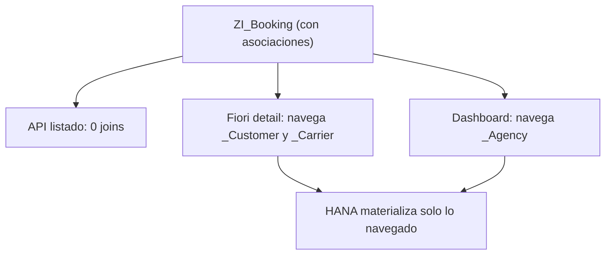

En el post anterior prometimos una cosa: explicar por qué las asociaciones no son azúcar sintáctico sobre los joins, sino una decisión que cambia el plan de ejecución en HANA. Vamos a ello, sin rodeos.

## La diferencia que casi nadie mira

Un **JOIN se ejecuta siempre**, aunque tu `SELECT` no lea ni una columna del lado derecho. Una **asociación solo se materializa cuando el consumidor navega** por la path expression (`_Cliente.Nombre`). Ese matiz, invisible en el editor, es lo que separa una vista que escala de una que arrastra peso muerto en cada llamada.

La regla práctica:

- **JOIN** cuando la relación es siempre necesaria y todos los consumidores la quieren materializada.
- **Asociación** cuando la relación es opcional o se sigue de forma selectiva, sobre todo si la vista la consumen varios canales con necesidades distintas.

## El caso que lo deja claro

Imagina una `ZI_Booking` que junta `Customer`, `Carrier` y `Agency`, con tres consumidores: una API de listado que solo quiere el ID y el estado, una detail de Fiori que quiere todo, y un dashboard que agrega por agencia. Con joins explícitos, los tres pagan los tres joins:

```sql
-- Coste constante para todos, aunque solo lean 3 campos
define view entity ZI_Booking_BadDesign
  as select from /dmo/booking as Booking
    inner join /dmo/customer as Customer on Booking.customer_id = Customer.customer_id
    inner join /dmo/carrier  as Carrier  on Booking.carrier_id  = Carrier.carrier_id
    inner join /dmo/agency   as Agency   on Booking.agency_id   = Agency.agency_id
{
  key Booking.booking_id     as BookingId,
      Booking.booking_status as Status,
      Customer.last_name     as CustomerLastName,
      Carrier.name           as CarrierName,
      Agency.name            as AgencyName
}
```

Con asociaciones, cada consumidor paga solo lo que navega:

```sql
-- El coste lo asume quien realmente navega
define view entity ZI_Booking
  as select from /dmo/booking as Booking
    association [1..1] to /dmo/customer as _Customer
      on Booking.customer_id = _Customer.customer_id
    association [1..1] to /dmo/carrier  as _Carrier
      on Booking.carrier_id  = _Carrier.carrier_id
    association [0..1] to /dmo/agency   as _Agency
      on Booking.agency_id   = _Agency.agency_id
{
  key Booking.booking_id     as BookingId,
      Booking.booking_status as Status,
      _Customer,   // expone la asociación, no la materializa
      _Carrier,
      _Agency
}
```

Ahora la API de listado ejecuta cero joins, la detail joinea solo Customer y Carrier, y el dashboard solo Agency. En vistas muy reutilizadas, este detalle recorta entre un 30 y un 80 por ciento la transferencia de datos.



## La cardinalidad no es decorativa

Al declarar `association [min..max]` le estás diciendo al optimizador qué esperar: `[1..1]` permite asumir un INNER JOIN al materializar, `[0..1]` fuerza LEFT OUTER, `[0..*]` sirve para navegación inversa. Pero cuidado:

> CDS no verifica la cardinalidad en runtime: solo la usa para el plan. Si declaras `[1..1]` y en los datos reales hay filas sin match, los registros pueden desaparecer al navegar, sin que salte ningún error.

## Cuándo el JOIN sigue ganando

Si **filtras siempre** por una columna del lado derecho (no solo la proyectas), la asociación no aporta nada: el `WHERE` fuerza la materialización en todas las llamadas. Ahí un inner join explícito es igual o mejor, y más honesto sobre lo que hace la vista.

La pregunta no es "asociación o join" por dogma. Es: "¿esta relación la quiere todo el mundo, siempre?". Si la respuesta es no, tu vista no debería obligar a pagarla. En el próximo post: las anotaciones de optimización que deciden si HANA empuja tus filtros o los aplica tarde.
