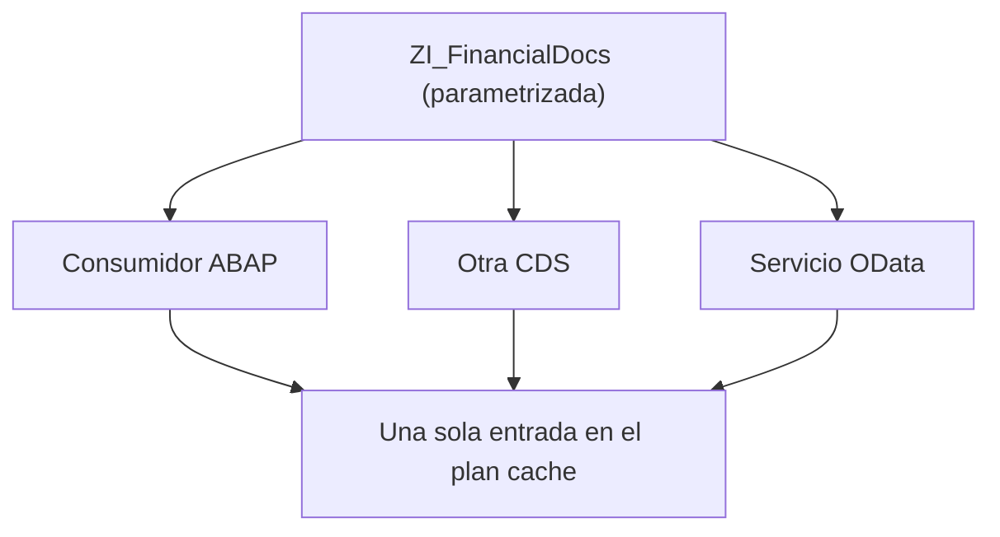

Hay un anti-patrón que se repite en todos los proyectos de reporting: una vista `ZI_FinancialDocs_2024_ES` con el año y la sociedad quemados en el `WHERE`. Funciona. Y en cuanto alguien pide otro año o entra un módulo nuevo, empieza la fiesta de clonar la vista.

## El coste real de hardcodear el filtro

```sql
-- Vista util solo para "este anio, esta sociedad"
define view entity ZI_FinancialDocs_2024_ES
  as select from I_JournalEntryItem
{ key Ledger, key CompanyCode, key FiscalYear, ... }
where FiscalYear  = '2024'
  and CompanyCode = '1010'
```

Tres problemas encadenados:

- **No es reutilizable.** Otro año o sociedad significa una vista nueva.
- **Mantenimiento explosivo.** ¿Un módulo más? ¿Clonas la vista doce veces?
- **Plan cache hostil.** HANA cachea por literal SQL. Cada vista hardcodeada tiene su propio plan y multiplica entradas.

## El patrón canónico: parámetros tipados

```sql
@AbapCatalog.compiler.compareFilter: true
@AccessControl.authorizationCheck: #CHECK
define view entity ZI_FinancialDocs
  with parameters
    P_FiscalYear  : abap.numc(4),
    P_CompanyCode : t001-bukrs
  as select from I_JournalEntryItem
{ key Ledger, key CompanyCode, key FiscalYear, ... }
where FiscalYear  = $parameters.P_FiscalYear
  and CompanyCode = $parameters.P_CompanyCode
```

Una sola vista, reutilizable por cualquier combinación, con una entrada parametrizada en el plan cache. Y el consumidor expresa su intención sin ambigüedad, sea cual sea el canal:

```abap
" Desde ABAP
SELECT * FROM zi_financialdocs( p_fiscalyear = @lv_year,
                                p_companycode = @lv_company )
  INTO TABLE @DATA(docs).
```

Desde otra CDS se pasa igual (`ZI_FinancialDocs( P_FiscalYear: '2024', P_CompanyCode: '1010' )`) y desde OData el parámetro viaja como key de la entidad parametrizada.



## El tipo importa más de lo que parece

No es lo mismo `t001-bukrs` que `abap.char(100)`:

```sql
-- El optimizador conoce el dominio, 4 chars, valor de check
with parameters P_CompanyCode : t001-bukrs

-- El optimizador asume lo peor: 100 chars sin restriccion
with parameters P_CompanyCode : abap.char(100)
```

El tipo del diccionario afecta al plan cache, a la conversión, a la ayuda de búsqueda F4 en Fiori y a la documentación. Tiparlo bien es gratis y se nota en todas partes.

## Cuándo NO usar un parámetro

No todo filtro merece serlo. Si la vista, por su naturaleza, solo cubre un caso (una `ZI_OnlyActiveCustomers` que filosóficamente solo trata clientes activos), el `WHERE Status = 'ACTIVE'` es parte de la definición conceptual, no un parámetro: dejarlo literal aclara la intención. Y para el mandante ya existe `@ClientHandling.algorithm`, no lo parametrices.

## La trampa: la recompilación

Un parámetro cuya cardinalidad cambia mucho según el valor (filtrar por una sociedad pequeña frente a otra de millones de filas) puede hacer que HANA quiera un plan distinto cada vez.

> El síntoma es `state = RECOMPILED` en `M_SQL_PLAN_CACHE`. Si lo ves, la parametrización te está ayudando en reutilización pero castigando en compilación. Ahí toca decidir a mano, no confiar en el default.

Parametrizar es la regla; conocer sus dos excepciones es lo que separa al que copia el patrón del que entiende por qué existe.
