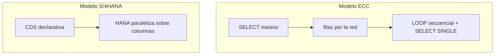

El mayor cambio de S/4HANA no es la interfaz de Fiori ni la tabla ACDOCA. Es un principio: **la lógica se ejecuta donde están los datos**, no al revés. Quien no interioriza eso escribe CDS con sintaxis nueva y mentalidad de ECC, y se pregunta por qué no van rápidas.

## El hábito que hay que desaprender

El patrón clásico de ECC era traer datos al servidor de aplicación y procesarlos ahí:

```abap
" Patron ECC: traer filas y procesarlas en el AppServer
SELECT * FROM vbak INTO TABLE @DATA(orders)
  WHERE erdat IN @date_range.

LOOP AT orders INTO DATA(order).
  SELECT SINGLE name1 FROM kna1 INTO @DATA(name)
    WHERE kunnr = @order-kunnr.       " N+1 queries, el pecado capital
  " formatear, calcular totales...
ENDLOOP.
```

Cada fila viaja por la red, el LOOP es secuencial y el `SELECT SINGLE` dentro es el clásico N+1. En S/4HANA el mismo resultado se declara y se ejecuta en HANA:

```sql
-- Patron S/4HANA: logica en CDS, ejecucion en HANA
define view entity ZI_PremiumOrders
  as select from I_SalesDocument as Order
    inner join I_Customer as Customer
      on Order.SoldToParty = Customer.Customer
{
  key Order.SalesDocument,
      Order.CreationDate,
      Customer.CustomerName,
      Order.TotalNetAmount
}
where Customer.CustomerName like '%PREMIUM%'
  and Order.CreationDate between $session.system_date - 90
                            and $session.system_date
```

Una sentencia, paralelizada por HANA, sobre columnas comprimidas. En queries OLAP la diferencia no es de porcentajes: es de órdenes de magnitud, minutos que pasan a segundos.



## Tres reflejos de ECC que sobran

- **`FOR ALL ENTRIES` defensivo.** Era la herramienta para esquivar joins lentos. En HANA el join nativo en CDS es siempre más rápido y más simple.
- **`UP TO N ROWS` como cortafuegos.** Con filtros bien expresados rara vez hace falta un límite artificial; cuando hace falta, HANA lo aplica eficientemente.
- **"En ABAP tengo más control."** Tienes más control superficial y peores planes: el optimizador de HANA suele elegir mejor que tú a mano.

## El detalle que arruina el pushdown: funciones en el ON

Puedes tener todo en CDS y aún así matar el plan si aplicas una función de string en la condición de join:

```sql
-- NO: padding en la ON clause, se evalua por fila y el indice no aplica
define view entity ZI_BadJoinFunctions
  as select from /dmo/booking as Booking
    inner join /dmo/customer as Customer
      on lpad( booking.customer_id, 10, '0' ) = customer.customer_id
{ ... }
```

`LPAD`, `CONCAT`, `UPPER`, `SUBSTRING` en el `ON` impiden el uso de índices, dejan fuera al HEX Engine y hacen que el optimizador no estime bien la selectividad. Sobre millones de filas, una query de 1 segundo se puede ir a 60. El patrón correcto: aplicar la función una vez en una vista previa y joinear después sobre la columna derivada.

```sql
-- Capa Basic: la funcion se aplica UNA vez por fila
define view entity ZP_BookingPadded
  as select from /dmo/booking
{ key booking_id,
      lpad( customer_id, 10, '0' ) as PaddedCustomerId, ... }

-- Interface: equi-join puro sobre la columna ya derivada
@AbapCatalog.compiler.compareFilter: true
define view entity ZI_BookingWithCustomer
  as select from ZP_BookingPadded as Booking
    inner join /dmo/customer as Customer
      on Booking.PaddedCustomerId = Customer.customer_id
{ ... }
```

La función se evalúa N veces (una por fila del lado izquierdo), no N×M, HANA vuelve a usar el índice y el HEX Engine entra.

## Dónde sí manda ABAP

Pushdown no es absolutismo. La lectura masiva y la transformación van a CDS; la decisión con muchas ramas, los side effects (escrituras, llamadas externas, mensajes) y los algoritmos que no son SQL (parseo, criptografía) se quedan en ABAP.

> La regla en una línea: lectura y transformación a CDS, decisión y orquestación en ABAP. El resto es discusión de detalle.

Escribir CDS rápidas no va de trucos, va de dejar de pensar en filas y empezar a pensar en conjuntos.
