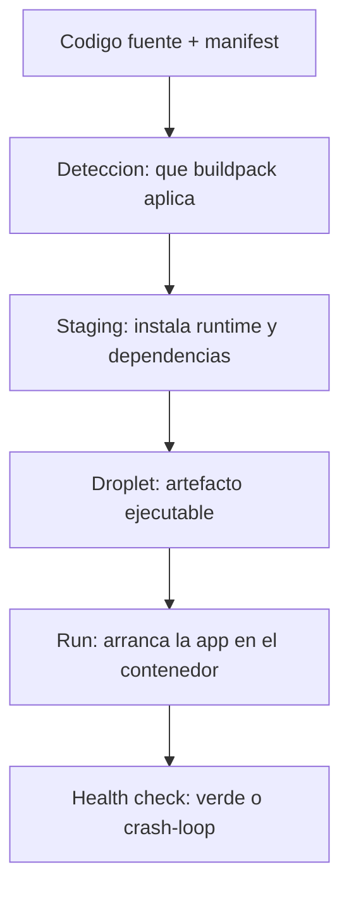

Haces `cf push`, esperas, y la app arranca. Entre esos dos momentos hay una fase que casi nadie mira hasta que algo falla: el **staging**. Es donde el buildpack coge tu código fuente y lo convierte en algo ejecutable. Entender esta fase es la diferencia entre depurar un fallo de arranque en dos minutos o en dos horas.

## Qué es un buildpack

Un buildpack es el componente que **detecta el lenguaje de tu app, instala el runtime y las dependencias, y monta un artefacto ejecutable** (el droplet). No escribes el buildpack: eliges uno. En BTP los que más vas a tocar son `nodejs_buildpack` (para servicios CAP en Node y para el deployer HDI) y los buildpacks de Java o de contenido estático.

Lo declaras en el módulo del `mta.yaml` o directamente en el `cf push`:

```yaml
modules:
  - name: projectcap-srv
    type: nodejs
    parameters:
      buildpack: nodejs_buildpack
      memory: 256M
```

## Las fases: de código a droplet

El ciclo tiene tres momentos claros. El staging es el intermedio, y es donde se rompe casi todo:



- **Detección**: el buildpack decide si tu app es suya (un `package.json` grita "Node").
- **Staging**: instala el runtime y las dependencias declaradas, compila lo que haya que compilar.
- **Run**: arranca el droplet en un contenedor con la memoria asignada.

## Por qué la memoria del staging importa

El error clásico en cuentas Trial: asignas `256M` y el staging se queda sin memoria instalando dependencias, o la app arranca pero entra en crash-loop porque el runtime no cabe. La cuota de memoria del módulo no es un adorno del `mta.yaml`: **es lo que decide si el staging termina**.

```bash
# ver el estado y el consumo de memoria
cf app projectcap-srv

# si arranca y se cae, el log de staging tiene la respuesta
cf logs projectcap-srv --recent
```

Cuando el staging falla, el mensaje casi siempre está en esas líneas: una dependencia que no resuelve, una versión de Node incompatible, o memoria insuficiente. No adivines: léelo.

## Un antipatrón concreto

Empaquetar `node_modules` dentro del artefacto "para ir más rápido". El buildpack está para instalar dependencias durante el staging; si le metes las tuyas precompiladas, acabas con incompatibilidades entre tu máquina y el contenedor de CF. Deja que el buildpack haga su trabajo: declara dependencias en `package.json`, no las lleves a mano.

> El staging es la fase invisible hasta que revienta. El día que revienta, agradeces haber asignado memoria con criterio y haber dejado que el buildpack instale lo que tiene que instalar.

En el próximo post cerramos la serie: desplegar una app CAP full-stack de punta a punta, juntando todo lo anterior.
