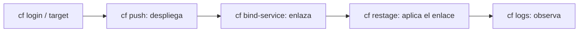

La `cf CLI` es la interfaz de línea de comandos que administra aplicaciones y servicios en Cloud Foundry. Tiene un catálogo enorme de comandos, pero seamos honestos: **el 90% de tu trabajo diario son tres verbos**. Desplegar, enlazar un servicio y mirar los logs cuando algo revienta. El resto lo consultas cuando lo necesitas.

## La anatomía de un comando cf

Todo comando `cf` sigue la misma estructura: la herramienta, el comando, los argumentos y las opciones. Un ejemplo mental antes de la práctica:

- **cf**: invoca la herramienta.
- **command**: la acción principal (`push`, `bind-service`, `logs`).
- **arguments**: valores requeridos, como el nombre de la app.
- **command options**: modificadores con guion, como `-f` para forzar o `-t` para target.



## push: subir la aplicación

`cf push` sube y arranca una aplicación. Puedes pasar los parámetros en línea o, mejor, en un `manifest.yml`:

```bash
# desplegar leyendo el manifest del directorio
cf push

# o explicito: nombre, memoria y buildpack
cf push mi-app -m 256M -b nodejs_buildpack

# ver el estado de lo que hay desplegado
cf apps
```

## bind: enlazar servicios

Una app sin datos no sirve. `bind-service` conecta una instancia de servicio (HANA, XSUAA) a la aplicación, inyectando sus credenciales. El enlace **no surte efecto** hasta que la app se re-prepara:

```bash
# crear la instancia de servicio
cf create-service hana hdi-shared mi-hdi

# enlazar la instancia a la app
cf bind-service mi-app mi-hdi

# aplicar el enlace: la app reinicia con las nuevas credenciales
cf restage mi-app

# listar los servicios del espacio
cf services
```

El `restage` es el paso que todo el mundo olvida el primer día. Enlazas, no pasa nada, y pierdes media hora hasta entender que el binding se materializa al re-preparar la app.

## logs: ver qué pasa de verdad

Cuando la app no arranca o devuelve un 503, los logs son la única fuente de verdad:

```bash
# seguir los logs en vivo
cf logs mi-app

# volcado reciente sin quedarte enganchado al stream
cf logs mi-app --recent
```

> El operador que no lee logs adivina. El que adivina despliega tres veces lo que se resolvía leyendo una línea de `cf logs --recent`.

En el próximo post: qué hay dentro de `VCAP_SERVICES` y por qué las credenciales nunca deberían estar en tu código.
